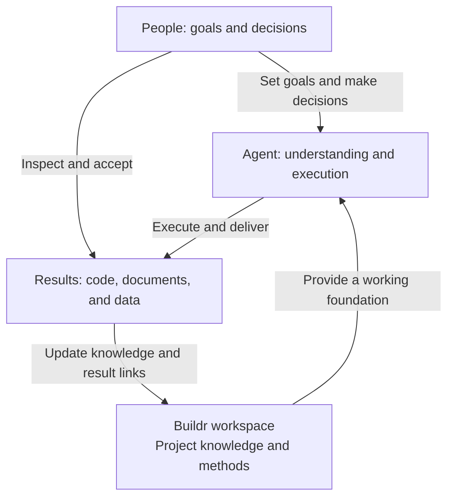

# Buildr

[中文](README.md) | English | [Documentation](docs/README.md)

## Shared work infrastructure for people, organizations, and agents

Buildr brings together project knowledge, code locations, and proven working methods. People set goals, make decisions, and accept results. Agents use that foundation to understand and carry out the work. Buildr lets you configure your work, inspect materials and results, and participate in collaboration.

Keep using your familiar agent tool. The knowledge, methods, and results belong to you or your organization and remain useful across tasks, contributors, and agents.

## Why Buildr

**Owning documents, code, and data does not automatically make them easy to put to work.** Background gets scattered across files and conversations; useful methods stay in someone's memory. A new task, contributor, or tool can mean explaining everything again.

Buildr makes those accumulated materials available for future work. Agents work from current sources and maintain relevant results and confirmed methods in the workspace, giving the next task a better starting point.

| Who it serves | What they gain |
| --- | --- |
| Individuals | Set goals, make key decisions, configure work visually, and inspect progress and results with less repeated organization and handoff work |
| Organizations and teams | Retain ownership of project knowledge, code relationships, and professional methods so experience can be passed on and reused |
| Agents | Discover relevant knowledge, methods, and tools; check the current state; continue work within explicit boundaries |

## What you can do

- **Move from an idea to delivery.** Discuss requirements, develop a plan, implement, verify, and deliver using the same accumulated knowledge and methods.
- **Collaborate across roles from shared sources.** Product, design, development, and testing participants maintain the materials they own; later work continues from those updated sources.
- **Keep methods that work.** Turn proven release procedures, testing experience, or business practices into reusable Skills.

## What stays useful

- **Project knowledge:** goals, business materials, and code locations.
- **Working methods:** reusable Rules and Skills grounded in experience.
- **Work results:** code, documents, data, and outcomes that others can inspect, locate, and continue.

Results are delivered to people and become part of the workspace's and project's working foundation. As work is completed, the agent maintains relevant materials, result locations, and necessary records, without asking users to manually copy everything again. Code and business data stay in their own locations. Experience worth reusing is assessed before becoming a method; the next task starts from the updated results.

## Mission and direction

**Mission:** Organize scattered work materials and professional methods so people and agents can work from shared evidence and get work done.

**Vision:** Help individuals expand their capabilities with agents and help organizations turn accumulated experience into lasting, growing organizational capability.

The near-term focus is on starting work, finding useful materials, delivering results, and continuing after interruptions. Later directions include connecting more work systems and improving reuse across projects, guided by real needs. See [future directions](projects/product/knowledge/docs/directions.md); these are possibilities, not claims of available features.

Buildr currently focuses on local work. File-based materials can be shared through Git; local work records do not automatically synchronize across machines. See [About Buildr](projects/product/knowledge/docs/overview.md) for current capabilities and boundaries.

## Get started

### 1. Ask your agent to install Buildr

Share this project link with your agent:

> Use https://github.com/BuildrAI/Buildr to install Buildr and its launcher for me. Explain workspaces, projects, services, and repositories, then open Buildr and guide me through configuration.

The official package is `@buildr-ai/buildr`. Your agent follows the [installation reference](projects/product/services/buildr/docs/cli-reference.md#首次使用) and handles environment preparation. Regular users do not need to clone this repository or learn commands first. The launcher currently supports macOS and Windows; other platforms open Buildr in a browser.

### 2. Configure your work

With your agent's guidance, configure your workspace, projects, services, and repositories in Buildr. Fill in what your work needs. You can also continue asking the agent to help configure them through conversation.

### 3. Open the workspace in your agent tool

Open the configured directory in your agent tool, state your goal, and work as usual. The agent reads project materials and applicable methods; you can inspect progress and results in Buildr.

When the work is complete, ask the agent to close it out and finish authorized delivery and cleanup.

### Updating later

In the relevant workspace, tell your agent:

> Update Buildr and the workspace. Once the updates are complete, close out the work.

Your agent updates the product, checks its launch entry, and synchronizes the workspace's work assets and the current agent's entry points.

## Self-bootstrapping: this repository is a workspace

**Buildr uses itself to organize development.** This repository is a working Buildr workspace. Its `projects/product/` project holds product knowledge, designs, and specifications and connects two services:

- `projects/product/services/buildr/`: the package, CLI, and local runtime.
- `projects/product/services/buildr-web/`: the current product interface.

The repository's Rules, Skills, knowledge, and code support everyday development and show how Buildr organizes real work.

To contribute, open the repository root in your agent tool and say:

> I want to contribute to Buildr. Read the repository rules and product development documentation, then prepare the development environment.

This workspace already exists; do not initialize it again. Development uses the repository's `projects/product/buildr` entry. See [product development](projects/product/README.md) and [contributing](CONTRIBUTING.md).

## Learn more

| Your goal | Start here |
| --- | --- |
| Get started and work day to day | [Documentation directory](docs/README.md) · [Getting started](projects/product/knowledge/docs/guides/getting-started.md) · [Daily use](projects/product/knowledge/docs/guides/usage.md) |
| Understand the product | [About Buildr](projects/product/knowledge/docs/overview.md) · [Future directions](projects/product/knowledge/docs/directions.md) |
| Install and maintain with an agent | [Buildr Skill](projects/product/services/buildr/resources/runtime/skills/buildr/SKILL.md) · [Installation and commands](projects/product/services/buildr/docs/cli-reference.md) · [Adapters](projects/product/services/buildr/docs/agent-runtime-adapters.md) |
| Contribute | [Product development](projects/product/README.md) · [Current knowledge](projects/product/knowledge/README.md) · [Contributing](CONTRIBUTING.md) |

[Issues](https://github.com/BuildrAI/Buildr/issues) · [Security reporting](SECURITY.md) · [MIT License](LICENSE)
