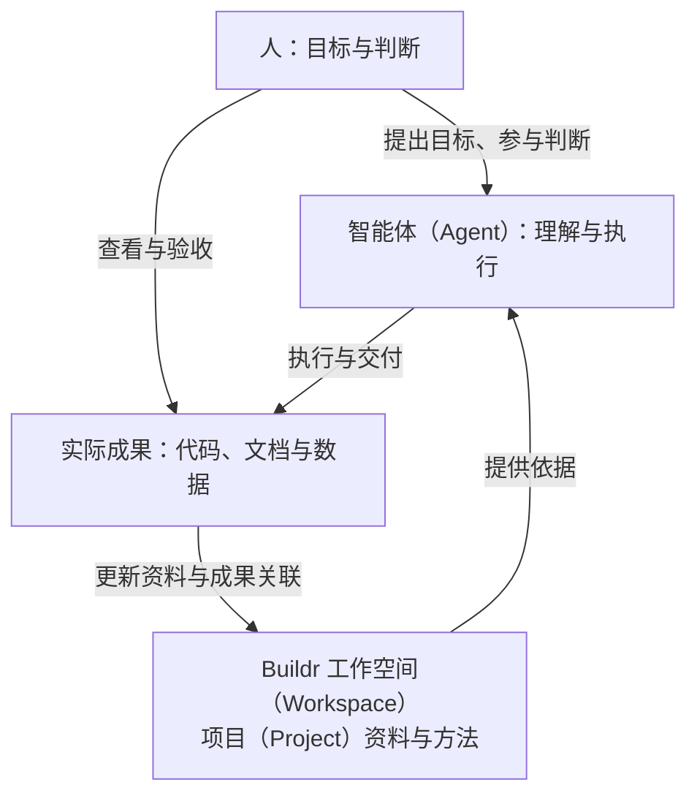

# Buildr

中文 | [English](README.en.md) | [文档](docs/README.md)

## 人、企业与智能体（Agent）共同工作的基础设施

Buildr 把项目资料、代码位置和经过验证的工作方法组织在一起。人表达目标、参与判断并验收成果，智能体（Agent）据此理解目标、选择方法并推进工作；你可以在 Buildr 中配置工作范围、查看资料与成果、参与协作。

你继续使用熟悉的智能体（Agent）工具。积累下来的事实、方法和成果由个人或企业掌握，可以跨任务、跨参与者、跨智能体（Agent）复用，减少反复解释背景和从头摸索的成本。

## 为什么需要 Buildr

**拥有文档、代码和数据，不等于能够持续用好它们。** 项目背景散落在资料和对话中，关键方法留在个人经验里，换一次任务、参与者或工具，就容易重新整理和解释。

Buildr 让这些积累成为后续工作的依据。智能体（Agent）基于当前资料开展工作，也把新成果和经过确认的方法维护回工作空间（Workspace），让下一次工作有更好的起点。

| 服务谁 | 可以获得什么 |
| --- | --- |
| 用户 | 表达目标、作出关键判断，在 Buildr 中配置工作范围、查看进展与成果，减少重复整理和交接 |
| 企业与团队 | 掌握自己的项目资料、代码关联和专业方法，使经验能够留存、传承和复用 |
| 智能体（Agent） | 发现与当前目标相关的资料、方法和工具，核对真实工作状态，并在明确边界内接续工作 |

## 可以怎样用

- **从想法推进到交付。** 与智能体（Agent）讨论需求、形成方案，再完成实现、验证和交付；各阶段都使用已有资料和方法。
- **让不同岗位基于同一份资料协作。** 产品、设计、开发和测试人员维护各自负责的内容，后续工作依据更新后的资料继续。
- **把做成事情的方法留下来。** 将经过验证的发布步骤、测试经验或业务处理方式整理成技能（Skill），供后续任务和参与者复用。

## Buildr 帮你留下什么

- **项目依据**：目标、业务资料与代码位置，减少反复解释背景。
- **工作方法**：可复用的规则（Rule）与技能（Skill），让经过验证的方法继续发挥作用。
- **工作成果**：可查看、可关联、可接续的代码、文档、数据和工作结果。

成果交付给用户，也成为工作空间（Workspace）和项目（Project）的后续依据。智能体（Agent）在完成工作时维护相关资料、成果位置和必要记录，用户无需再手工搬运一遍。代码和业务数据仍保存在各自所属位置，值得复用的经验经判断后再沉淀为方法；下一项工作从更新后的实际成果继续。

## 目标与方向

**使命：** 组织分散的工作资料与专业方法，让人和智能体（Agent）基于共同依据协作，把工作做好。

**愿景：** 让个人借助智能体（Agent）拓展能力，让企业把积累转化为能够传承、持续成长的组织能力。

近期先把开始工作、查找资料、交付成果和中断后接续做顺。后续根据真实需求连接更多工作系统、完善跨项目协作与方法复用。具体想法见[后续方向](projects/product/knowledge/docs/directions.md)，其中的方向不代表已经提供的功能。

Buildr 当前以本机使用为主。文件资料可以通过 Git 协作，本机工作记录不会自动跨机器同步；当前能力与边界见[了解 Buildr](projects/product/knowledge/docs/overview.md)。

## 开始使用

### 1. 让智能体（Agent）安装 Buildr

把本项目链接交给正在使用的智能体（Agent）：

> 请参考 https://github.com/BuildrAI/Buildr 帮我安装 Buildr 和启动器，解释工作空间、项目、服务和代码库，然后打开 Buildr，引导我完成配置。

官方包名为 `@buildr-ai/buildr`。智能体（Agent）按[安装参考](projects/product/services/buildr/docs/cli-reference.md#首次使用)处理环境与安装；普通使用不需要克隆本仓库或先学命令。启动器（Launcher）目前支持 macOS 和 Windows，其他平台通过浏览器打开 Buildr。

### 2. 配置你的工作

跟随智能体（Agent）的解释，在 Buildr 中配置工作空间（Workspace）、项目（Project）、服务（Service）和代码库（Repository）。按实际需要填写即可，也可以继续让智能体（Agent）在对话中协助配置。

### 3. 在智能体（Agent）中打开工作空间（Workspace）

配置完成后，在智能体（Agent）工具中打开对应目录，像平时一样提出目标、开始任务。智能体（Agent）会读取项目资料与适用方法；你可以在 Buildr 中查看进展与成果。

工作完成后说“收尾”，由智能体（Agent）完成已授权的交付与整理。

### 以后如何更新

在对应工作空间（Workspace）中告诉智能体（Agent）：

> 更新 Buildr 和工作空间，更新完成后再收尾。

智能体（Agent）更新产品、核对启动入口，并同步工作空间（Workspace）中的工作资产与当前智能体（Agent）入口。

## Buildr 自举（Self-Bootstrapping）：本仓库就是一个工作空间（Workspace）

**Buildr 也用自身组织开发。** 你正在查看的仓库就是一个实际工作空间（Workspace），其中的 `projects/product/` 是 Buildr 产品项目（Project），保存产品资料、设计与规范，并关联两个服务（Service）：

- `projects/product/services/buildr/`：安装包、命令行工具（CLI）与本机运行能力。
- `projects/product/services/buildr-web/`：当前产品界面的实现。

本仓库中的规则（Rule）、技能（Skill）、知识与代码共同支撑日常研发，也展示了 Buildr 如何组织真实工作。

参与开发时，在智能体（Agent）工具中打开本仓库根目录，告诉它：

> 我想参与 Buildr 开发，请阅读仓库规则和产品开发说明，准备开发环境。

这是已有的工作空间（Workspace），无需重新初始化。开发使用仓库内的 `projects/product/buildr`；具体说明见[产品开发入口](projects/product/README.md)和[贡献指南](CONTRIBUTING.md)。

## 深入了解

| 你想了解什么 | 阅读入口 |
| --- | --- |
| 开始与日常使用 | [文档目录](docs/README.md) · [使用指南](projects/product/knowledge/docs/guides/getting-started.md) |
| 深入了解产品 | [产品说明](projects/product/knowledge/docs/overview.md) · [后续方向](projects/product/knowledge/docs/directions.md) |
| 智能体（Agent）安装与维护 | [Buildr 入口技能（Skill）](projects/product/services/buildr/resources/runtime/skills/buildr/SKILL.md) · [安装与命令参考](projects/product/services/buildr/docs/cli-reference.md) · [工具适配](projects/product/services/buildr/docs/agent-runtime-adapters.md) |
| 参与开发 | [产品开发入口](projects/product/README.md) · [当前知识](projects/product/knowledge/README.md) · [贡献指南](CONTRIBUTING.md) |

[反馈问题](https://github.com/BuildrAI/Buildr/issues) · [安全报告](SECURITY.md) · [MIT License](LICENSE)
