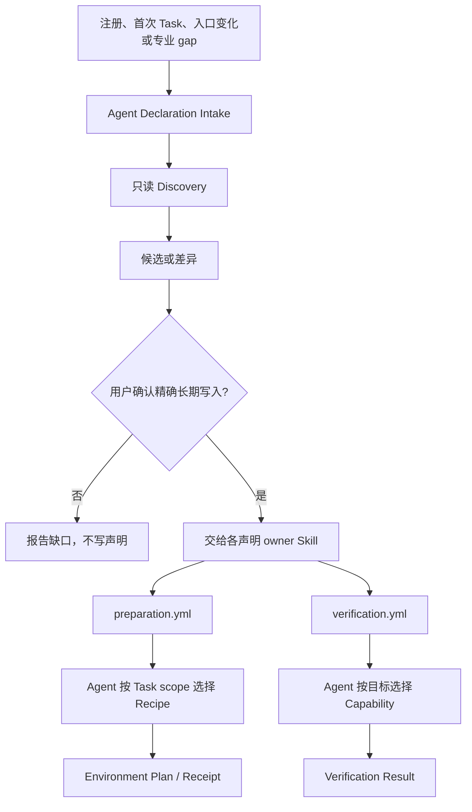

# Buildr 项目声明体系

本文说明 Buildr 如何发现、维护和消费 Project 的环境准备与任务验证声明。它面向需要理解或维护这套体系的人和 Agent；规范性行为仍以 OpenSpec specs 为准。

## 一句话模型

> Project 长期声明怎么准备、怎么验证；Agent 按本次 Task scope 选择；Environment 与 Verification 分别执行并在各自 authority 留证；Declaration Intake 只负责发现候选和取得长期写入授权。

## 两类声明

| 声明 | 回答的问题 | 长期文件 | Task 级事实 |
|---|---|---|---|
| Project Environment Preparation Declaration | 这个 Project 或 Service 有哪些已知、可重复的环境准备 Recipe | `projects/<project>/preparation.yml` | Environment Plan + Environment Receipt |
| Project Verification Capability Declaration | 这个 Project 已有哪些可调用、可证明事实的验证能力 | `projects/<project>/verification.yml` | Verification Result；完整执行输出只作 transient evidence |

`preparation.yml` 不是 Environment 状态声明。它只声明准备方法；`ready / blocked`、实际执行根、Step identity 和恢复事实属于 Workspace SQLite 中的 Environment Receipt。

`verification.yml` 也不是测试结果。它只声明已有能力；本次目标执行了什么、得出什么事实，属于 Workspace SQLite 中的 Verification Result。

## 总体流程



Intake 是 Agent 编排入口，不是新的 Application、schema、store 或 writer。两类声明仍独立演进、独立校验、独立消费。

## Declaration Intake 做什么

Intake 只处理以下触发：

| Trigger | 只读检查重点 |
|---|---|
| Project 注册 | Project-wide Preparation 与 Verification 基线 |
| Service 注册 | 所属 Project 及该 Service 的 Recipe/Capability scope |
| 首次 Task 使用某 scope | 当前 Task 是否有可选择的准备与验证事实 |
| 依赖、构建或测试入口变化 | 已有声明是否需要调整 |
| Environment declaration/Recipe gap | Preparation 候选或 task-inline 方案 |
| Verification coverage gap | 已存在能力能否形成声明；没有能力则继续保留 gap |
| 用户显式初始化或刷新 | 两类文件的当前状态与候选 diff |

Discovery 只读取已登记 Project/Service、当前声明、明确 wrapper、lockfile/配置、CI、规则和项目文档。它不递归扫描整个仓库，不按目录名或技术栈惯例猜事实。

输出固定包含 trigger、scope、两类声明现状、候选/diff、证据、外部诊断和待授权文件。用户未确认时不创建、修改或删除任何声明。

## Writer 与 authority

| 事实 | Owner / writer | 保存位置 |
|---|---|---|
| Preparation Recipe | `task-environment` Skill，经用户授权维护 | Project `preparation.yml` |
| 本次 Task 的 Recipe 选择 | Task Environment Application | Workspace SQLite Environment Plan |
| 环境执行与恢复事实 | Task Environment Application | Workspace SQLite Environment Receipt |
| Verification Capability | `task-verification` Skill，经用户授权维护 | Project `verification.yml` |
| 本次目标的验证事实 | Task Verification Application | Workspace SQLite Verification Result |
| 声明候选与 diff | 无持久 authority | 当前 Agent 对话/临时工作上下文 |

Task Record 只保存 Task 的 intent 与 Project/Service scope，不保存声明、Plan、Receipt 或 Result。Buildr Web 只读取各专业 current；GET 不发现、探测、修复或回写声明。

## Environment 如何消费 Preparation

```text
preparation.yml
  → Agent按完整Task scope选择Recipe
  → resolved Environment Plan（Task执行快照）
  → prepare执行或幂等恢复
  → Environment Receipt记录Declaration/Recipe/Step identity与状态
```

- Recipe 可以是 Project-wide，也可以绑定一个 Service。
- 每个 Task Project/Service scope 都必须显式选择 Recipe 或 `not-applicable`。
- 没有长期声明时，Agent可为当前 Task 显式提交 `task-inline` Recipe；Buildr不会静默回写 Project。
- `prepare` 可以执行缺失或漂移的 Step；任一 required Step 失败，整体 Environment blocked。
- `inspect` 严格只读，只观察已保存 Plan 的输入、输出和 executable identity。
- Declaration 或 Recipe identity 变化后，旧 Plan/Receipt 不再保持假 `ready`。

Recipe 使用明确 executable、args、相对 cwd、inputs 和 outputs。Node 可以调用受管 npm，Python、Go、Rust或其他技术栈可以调用 Project/Service 已有 wrapper或明确 executable；Buildr 不为每种技术栈增加 adapter。

## Verification 如何消费 Declaration

```text
verification.yml
  → Agent按Task scope、目标和适用条件选择Capability
  → command runner或bounded Agent operation产生transient evidence
  → Task Verification Application保存精炼Result
```

- Declaration 只登记已经存在且团队确认可调用的能力，不借声明初始化开发测试。
- 没有声明或适用能力时，Result 如实记录 Project/Service coverage gap。
- coverage gap 会返回 Declaration Intake next action，但不会改写当前 Result。
- Declaration identity 或 Content Target 变化后，旧 Result 派生为 `stale`。
- Result 只保存 portable facts 和结论，不保存 stdout/stderr、耗时、临时路径或 Environment Receipt。

## Project-only、多 Service 与非 Node

Project-only 用户直接声明 Project-wide Recipe 和 Project scope Capability，不需要创建虚假 Service。

多 Service 用户在同一 Project 文件中分别声明 scope。例如 `buildr` 与 `buildr-web` 各有自己的 npm-ci Recipe；Task 只选择 scope 内需要的根，不安装无关 Service，也不把一个 Service 的 readiness 复制给另一个。

非 Node 项目不需要 Buildr 适配器。Project 只要提供稳定 wrapper，例如 `./tools/prepare`、`./gradlew` 或受管工具的明确入口，Recipe 就能记录其输入、输出和恢复 identity。缺少外部 CLI 交给 Commands/Doctor；缺少 Skill/provider 交给 Capability 体系。Intake 不安装它们。

## 只读边界

以下动作都不得写长期声明：

- 自动 trigger 与 Intake Discovery；
- Project/Service 注册事务本身；
- Buildr Web GET；
- Doctor、sync 的诊断阶段；
- Environment `inspect`；
- Verification `inspect`；
- Task Finish。

只有用户确认精确文件和 diff 后，owner Skill 才可写入。写完由各自 schema/Doctor 校验；Intake 不复制 writer，也不改写已有 Task 专业结果。

## 维护判断

维护这套体系时依次确认：

1. 变化是长期的准备/验证事实，还是仅本次 Task 的选择或结果？
2. scope 是 Project-wide、某个 Service，还是多个 Service 分别声明？
3. 候选是否来自明确 wrapper、配置和项目事实，而不是仓库递归猜测？
4. 用户是否确认了精确长期文件与 diff？
5. 写入是否由对应 owner 完成，Task 级事实是否仍只进各自 SQLite authority？
6. 声明变化后，旧 Plan/Receipt/Result 是否按专业契约 blocked 或 stale？

这套边界让 Agent 保留对具体技术栈和任务需求的判断，同时让长期事实可审计、Task 执行可恢复，并避免 Buildr 演变成所有技术栈的包管理框架。
