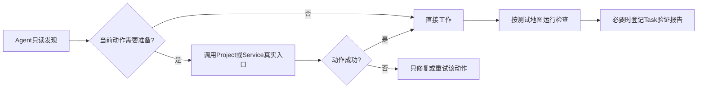

# Buildr 项目声明体系

本文说明 Buildr 如何发现、维护和消费 Project 的准备入口与任务验证声明。规范性行为以 OpenSpec specs 为准。

## 一句话模型

> Project长期说明“需要时怎么准备”和“有哪些测试”；Agent按当前目标直接调用真实入口，Buildr不为每个Task生成准备计划或统一环境状态。

## 两类声明

| 声明 | 回答的问题 | 长期文件 | Task级事实 |
|---|---|---|---|
| Project准备入口 | 这个Project或Service需要时如何安装依赖、生成代码或准备运行时 | `projects/<project>/preparation.yml` | 不保存；从文件、输出和后续命令重新观察 |
| Project测试地图 | 这个Project有哪些稳定测试体系、如何发现和完整执行 | `projects/<project>/verification.yml` | 开发完成后的Task验证报告 |

没有额外准备的Project不需要`preparation.yml`。有声明时，它应指向Project或Service拥有的真实wrapper，不复制package manager语义，也不形成`ready / blocked`许可。

`verification.yml`不是测试结果。它只声明测试体系、发现范围、完整入口和适用要求；本次实际执行了什么、结果和未覆盖项属于Task验证报告。

## 使用方式

Agent每次从实际工作根读取声明和真实入口。多Project或多仓任务分别在各自根处理，不要求形成统一准备闭包。Node、Maven、Python、Go、Rust等技术栈继续由Project自己的构建入口负责。

## Declaration Intake

Declaration Intake只做只读发现：

- Project或Service注册、首次使用、构建/依赖/测试入口变化时检查现状；
- 对照明确wrapper、lockfile、CI、规则和项目文档给出候选差异；
- 缺少当前动作必需的准备入口时，只阻塞该动作；
- 用户确认精确长期变更后，由Agent维护Project拥有的`preparation.yml`，验证声明仍由Task Verification指导维护。

它不创建Application、schema、store、Task Plan或执行结果。

## Writer与authority

| 事实 | Owner | 保存位置 |
|---|---|---|
| Project/Service准备入口 | Project/Service，经用户授权由Agent维护 | `preparation.yml` |
| 当前准备结果 | package manager、生成器、文件系统或进程 | 不在Buildr重复保存 |
| Project测试地图 | Task Verification指导Agent维护 | `verification.yml` |
| 开发完成后的验证事实 | Task Verification Application | Workspace SQLite Task验证报告 |
| 声明候选与diff | 无持久authority | 当前Agent工作上下文 |

Task Record只保存目标、scope、关系、顶层状态与结果。Buildr Web和Doctor不探测、执行或回写准备入口。

## 安全边界

- 不从技术栈、目录名、manifest或旧记录猜准备步骤；
- 不把凭证、完整stdout/stderr、临时路径或探测结果写入长期声明；
- 不为无准备需求的Task创建空Plan；
- 局部准备失败不阻止无关编辑、审查、验证或交付；
- Project声明变化后重新读取当前文件，不维护旧Task快照或双读schema。
