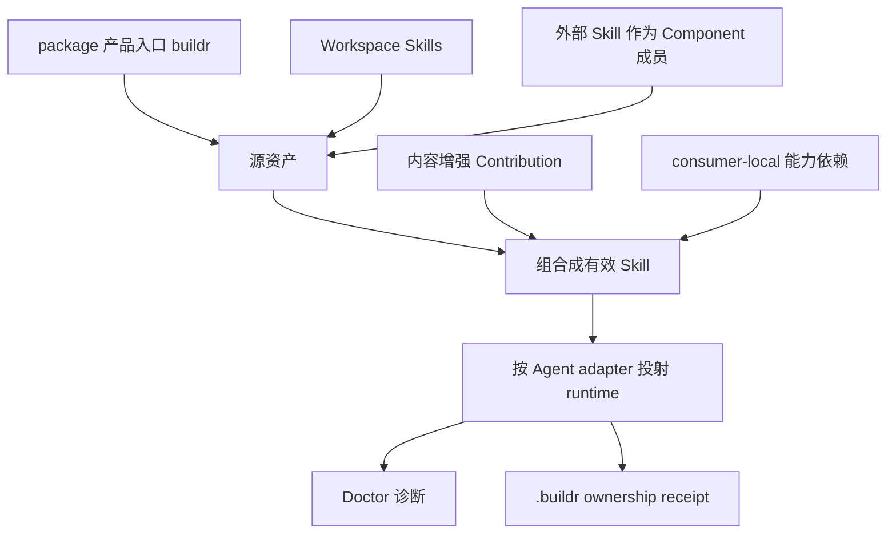
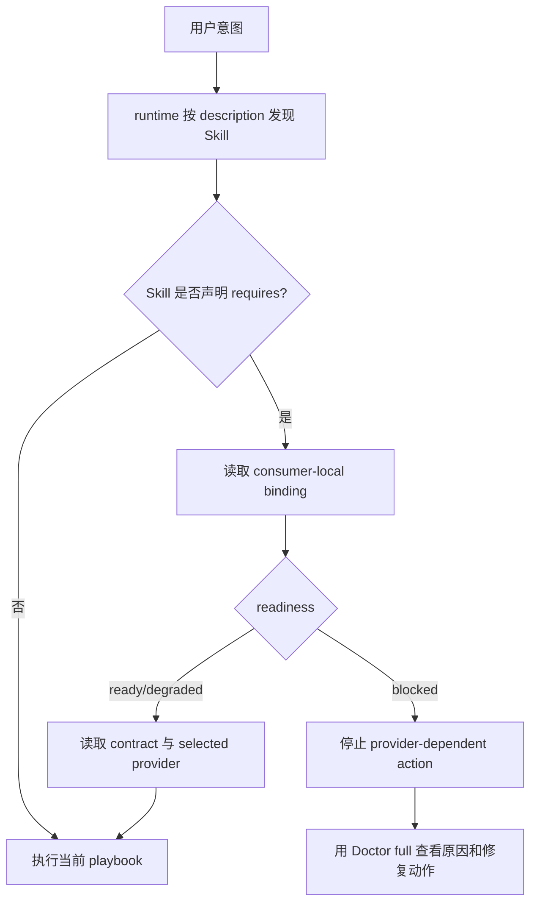

# Buildr 技能体系

本文说明 Buildr 如何管理、组合并投射 Skill，以及每类信息应该出现在哪里。它面向需要理解或维护 Buildr 技能体系的人和 Agent；规范性行为仍以 OpenSpec specs 为准。

## 一句话模型

> Buildr 从 Workspace 读取源技能；Component 可以添加内容增强和能力依赖；统一 renderer 再根据 Agent adapter 生成 runtime Skill，并用 Doctor 和 receipt 管理诊断与投射所有权。产品入口 `buildr` 是唯一特殊来源，但不是全局 dispatcher。

## 五个对外概念

| 概念 | 回答的问题 | 主要位置 |
|---|---|---|
| 源技能 | 原始 playbook 从哪里来 | `skills/manifest.yml`、`skills/<skill-id>/` 或 package 产品入口 |
| 组件 | 哪些资产作为一组安装、更新、卸载 | `components/manifest.yml`、`component.yml` |
| 内容增强 | 哪段正文要插入哪个 Skill | Component `skillFragments` |
| 能力依赖 | 当前 Skill 安全继续前需要什么稳定保证 | contracts、`provides`、`requires`、bindings |
| 运行时投射 | 当前 Agent 最终能发现和读取什么 | adapter runtime Skills root、`.buildr` receipts、Doctor |

`contract`、`provider`、`consumer`、`binding` 是“能力依赖”的内部展开。普通使用者不需要先理解这些词；只有在替换工作方式、依赖受阻或做诊断时才需要展开。

## 三层管线



### 1. 源资产

runtime 中看到的 Skill 只有两条来源路径：

1. package 直接提供的产品入口 `buildr`；
2. Workspace Skills，包括 Buildr builtin、本地 Skill，以及安装后成为 Component 成员的外部 Skill。

外部 OpenSpec Skill 不是第三套投射机制。它先成为 Workspace Component 成员，再和其他 Workspace Skill 走同一套组合与 renderer。

Workspace 是普通 Skill 的唯一 source authority。Project `capabilities.yml` 只表达 requirement、binding 和 applicability，不保存 Project Skill 副本。runtime 目录始终是可重建派生物，不是编辑入口。

一个完整源 Skill 目录可以包含：

- `SKILL.md`
- `agents/`
- `assets/`
- `examples/`
- `references/`
- `scripts/`
- `templates/`

除 `SKILL.md` 会参与受管组合外，随附文件按原始字节和可执行位投射。

### 2. 组合

组合有两种不同机制，不应混为一谈。

#### 内容增强

内容增强把 Component 管理的一段正文插入目标 Skill：

```text
目标源 SKILL.md
+ prepend / append / slot fragment
= runtime playbook
```

它适合 Sidebar、额外约束和外部 Skill 的 Buildr 衔接说明。增强只改变 runtime 派生正文，不改写上游源 Skill。

#### 能力依赖

能力依赖表达稳定协作边界：

```text
Consumer declares requires
        ↓
Contract defines minimum guarantees
        ↓
Binding selects a compatible Provider
        ↓
Consumer runtime receives its local entry
```

Provider 正文不会复制进 Consumer。Agent 在执行 provider-dependent action 前读取 contract 和 selected provider。`ready` 只说明结构可路由，不证明 provider 行为或本次执行成功。

只有真正声明 `requires` 的 Skill 才进入 consumer dependency graph。正文提到另一个 Skill、Agent 在一次任务中读取多个 Skills、产品入口内部路由，都不自动形成 dependency edge。

### 3. 运行时投射

统一 renderer 的处理顺序是：

```text
源 SKILL.md
→ 内容增强
→ 当前 consumer 的 capability bindings
→ 非身份型 adapter context（仅有明确消费需要时）
→ generated marker
→ runtime Skill 目录
```

所有支持 filesystem Skills primitive 的 adapter 使用相同 Skill inventory 和组合结果，只改变 runtime root、诊断 identity 与 activation metadata。
投射 adapter 只说明 Buildr 写入目标，不证明读取 Skill 的宿主身份。产品入口 Buildr Skill 保持 adapter-neutral；当前 `<agent>` 只能来自宿主明确身份或用户明确指定的维护目标，Skill 路径、marker、receipt 和 Doctor 投射字段都不能提供默认值。

## runtime Skill 应该包含什么

runtime `SKILL.md` 是 Agent 命中 Skill 后读取的 playbook，也应该让人可以直接审阅。因此它只保留执行当前 Skill 所需的信息：

- 源 Skill 正文；
- 对当前 Skill 生效的内容增强；
- 当前 consumer 自己的 capability identity、mode、readiness/reason；
- contract 路径、selected provider 及其 runtime 路径/scope；
- required dependency blocked 时的 safety stop；
- 必要的非身份型 adapter context 和 generated marker。

它不承载：

- 完整 workspace capability graph；
- 其他 consumers 或其他 scopes 的 routes；
- contract SHA-256；
- 完整 binding provenance、候选 providers 或文件 inventory；
- receipt、Doctor dump 或安装回执。

这是信息分层，不是删掉证据。

## 产品入口 `buildr` 的边界

Agent runtime 首先根据 Skill description 和用户目标发现入口 Skill。`buildr` 只在 Buildr 管理意图命中后加载；它不会在所有用户 prompt 之前运行，也不负责预先分发其他专业 Skill。

`buildr`源正文维护自己实际支持的少量产品入口，例如workspace Git更新和能力适配。Task Retrospective不再使用内部Driver或独立capability；用户明确要求时由纯Skill组合Task Record与现有工具，并写入本机Markdown。

因此：

- `buildr` 不接收全 workspace routing dump；
- `buildr` 不作为依赖全部 capabilities 的 manifest consumer；
- 某一项产品内部 route blocked，只阻止该项动作，不阻止 init、doctor 或其他无关管理动作；
- 普通 consumer 直接从自己的 runtime binding block 进入 provider，不需要先经过 `buildr`。

## Doctor 与 receipt

### Doctor：当前全局诊断图

默认 Doctor JSON 保持紧凑，只提供健康、findings 和后续动作。需要检查完整能力关系时使用 full detail：

```bash
buildr doctor --agent <agent> --target <workspace> --json --detail full
```

full 结果包含 contracts、contract digests、bindings、consumers、selected/candidate providers、readiness、reason 和 nextActions。它是当前 workspace 的只读诊断 read model，不写回 Skill。

### Receipt：投射所有权和局部机器证据

Workspace destination 的 Skill projection receipt 位于：

```text
<workspace>/.buildr/agent-runtime/workspace/<adapter>/skill-projection-ownership-receipts/
```

User destination 则位于 user home 的 `.buildr/agent-runtime/user/<adapter>/...`。receipt 记录 source/render identity、受管文件 inventory、文件 integrity 和 executable 状态；consumer receipt 还记录本次局部 capability binding 的 contract digest、provenance、readiness 与 selected provider 快照。

receipt 是 Buildr 本机控制状态：

- 不放进 runtime Skill 目录；
- 不作为源技能；
- 不要求人日常阅读；
- workspace 的 `.buildr/agent-runtime/` 由根 `.gitignore` 排除，不进入 Git 交付。

## Agent 如何使用



产品入口是一个特殊入口，但遵循相同原则：先由 description 命中，再只解析当前意图需要的 route。

## 维护判断

维护 Skill 体系时优先问：

1. 变化是否只属于单个 Skill 内部？是则直接维护 Skill，不创建空 contract。
2. 是否需要把一段行为说明插入另一个 Skill？使用内容增强。
3. 另一个 Skill 是否依赖稳定保证或结果证据才能安全继续，或是否需要替换 provider？使用能力依赖。
4. 信息是 Agent 当前执行所需，还是诊断/完整性证据？前者进入 runtime playbook，后者进入 Doctor/receipt。
5. 是否正在编辑 source authority？不要直接维护 runtime 派生副本。

这套边界的目标不是让 runtime 文件“越短越好”，而是让每一段内容都出现在真正消费它的地方。
