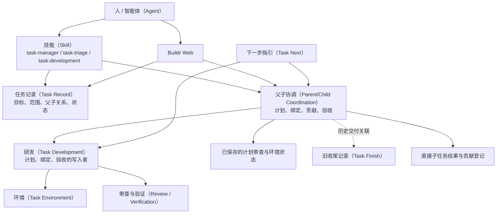

# 父子任务改造前梳理

> 2026-08-30，改造前基线 `eea6d5c4801e2632e43a643fe14ab2d4d9d3a0da`。本篇保存历史结构；当前设计见[父任务协调](../../openspec/knowledge/flows/task-parent-coordination.md)。

**原模型用父任务协调多个独立交付，但把协调计划、子任务分工和总体验收嵌入了研发流程。完成入口缺少独立的用户授权检查。**

## 1. 总体结构

下图实线表示调用或读取，虚线表示结果关联。

普通父子关系与专用父计划是两条路径；专用路径并非每个有子任务的父任务都使用。

## 2. 产品中有哪些东西

| 内容 | 当前作用 | 当前保存位置 |
|---|---|---|
| 任务目标、范围、规范引用 | 说明独立工作要完成什么 | `tasks` 及关联表 |
| 直接父子关系 | 一个子任务只归属一个直接父任务，禁止循环 | `tasks.parent_task_id` |
| 父计划（Parent Plan） | 总目标、架构决定、贡献项、依赖、最终验收标准 | 研发记录中的 `parentPlan` |
| 贡献项（Contribution） | 尚未创建任务也可规划的独立成果 | 父计划中的 `contributions` |
| 预计子任务 | 人类可读的预期实施单元，不是真实任务 | `expectedChild` |
| 真实贡献绑定 | 真实子任务承担哪些贡献项 | 子任务研发记录中的 `plannedContributions` |
| 计划审查及采用 | 审查父计划，再把审查结果登记到研发记录 | `task_review_current` 与研发 `gates.planning` |
| 贡献交接（Contribution Handoff） | 计划、实际交付、额外范围、剩余、替代、影响及下一步 | 旧研发交接，或独立贡献登记 |
| 总体验收 | 声明当前父计划的整体成果通过验收 | 研发记录中的 `parentAcceptance` |
| 父任务完成 | 把顶层状态改为 `completed` 并保存总结 | 任务记录 |
| 当前进度 | 组合任务关系、绑定和贡献证明 | 只读推导，不持久化 |

## 3. 功能和流程

### 建立与规划

`task create --parent` 创建真实子任务关系。专用父计划则使用 `task parent record`，要求父任务已准备环境并建立研发记录。计划字段固定包含目标、架构决定、结构化贡献项、依赖与验收标准。计划变更必须通过 `reconcile`，不能删除仍被绑定或交接引用的贡献项。

### 启动子任务

专用路径依次检查父任务活跃、环境就绪、研发记录存在、计划审查通过、审查已被采用。之后只把依赖已交付且尚未分配的贡献项列为可启动。子任务再建立自己的环境和研发记录，绑定贡献项，维护独立规范变化。

### 交付与协调

子任务结果和父任务进度彼此独立。新收尾已允许直接完成子任务，再通过 `reconcile-child-delivery` 明确登记成果映射；不再要求旧收尾或候选证明。但登记仍要求父计划、贡献结构、结果版本和归属一致。旧交接与旧收尾关联保留只读。

### 总体验收与完成

专用计划的全部贡献有明确处置后，`task parent accept` 保存总体验收；它本身不完成父任务。`task complete` 对专用计划检查验收是否匹配，但不检查用户是否明确授权父任务完成。只有父子关系、没有专用计划的父任务不进入该验收分支。

### 展示

Buildr Web 展示专用计划的贡献看板、子任务绑定、贡献结果和技术摘要。普通父子关系没有同等的协调面板。任务完成弹窗只有总结与是否无变更，没有父任务整体范围、逐子任务结果和单独的完成授权。

## 4. 当前状态不是一个状态

| 维度 | 当前值或来源 | 不能替代什么 |
|---|---|---|
| 顶层任务状态 | `todo / active / completed / abandoned` | 真实交付及用户授权 |
| 模式 | `ordinary / legacy / child / parent-plan` | 是否拥有独立完成授权 |
| 计划预期 | `expected / none` | 子任务已创建 |
| 可启动性 | `eligible / waiting-dependency / not-eligible` | 允许自动启动 |
| 实际贡献 | `unassigned / bound / active / delivered / residual / superseded / unproven` | 父任务总体验收 |
| 验收记录 | 匹配当前计划或缺失 | 父任务完成授权 |

## 5. 与用户问题直接相关的事实

`refactor-task-system` 的任务目标明确收窄为极简收尾与设计方法沉淀，两个子任务均完成，父任务当前为完成，记录最后更新时间是 `2026-08-30T10:05:13.863Z`。其名称仍像长期总路线，容易造成范围误读。

当前任务结果只保存总结与是否无变更，没有独立的授权来源或总体验收记录。因此能证明“何时记录为完成、当时记录了什么”，不能仅从任务记录证明用户何时授权。不能把这个信息缺口自动解读为已经取得授权。

## 6. 问题及改造判断

| 问题 | 影响 | 处理方向 |
|---|---|---|
| 纯协调也先建环境与研发记录 | 规划依赖不相关的执行条件 | 协调回到已有任务与文档能力 |
| 审查结果需再登记采用 | 重复状态与往返 | 退役固定采用链 |
| 普通关系与专用计划两套产品体验 | 同为父任务却有不同的完成保护 | 统一父任务身份与授权边界 |
| 完成检查没有授权事实 | 智能体可把验收或子任务完成误当完成授权 | 完成动作显式传递并保存授权来源 |
| 贡献结构重复表达目标和成果 | 子任务记录与专用交接之间需额外对账 | 直接读取子任务真实结果，语义覆盖由智能体判断 |
| 旧说明仍描述强制旧收尾 | 使用者无法判断当前职责 | 更新当前说明，历史材料显式标旧 |

保留：目标与范围、真实关系、独立交付、整体目标验收、版本冲突保护、历史可读及删除安全。退役的是协调流程和重复记录，不是这些边界。

## 7. 证据入口

以下入口指向实现文件；首次调查内容以篇首基线为准。同路径文件会随本次改造变化，不能把新实现当作旧行为的证据。

- [完成入口](../../services/buildr/src/task/application/task-record-application.ts)：`completeTaskRecord`。
- [协调应用](../../services/buildr/src/task/application/parent-coordination-application.ts)：`startupReadiness`、`recordParentPlan`、`acceptParentCoordination`。
- `services/buildr/src/task/persistence/parent-coordination-repository.mjs`（已删除，按本文基线回查）：任务、研发、审查、环境、旧收尾与贡献登记。
- [父子领域](../../services/buildr/src/task/domain/parent-coordination.ts)：计划与交接结构、依赖、身份。
- [界面](../../services/buildr-web/src/pages/task-detail/ParentCoordinationPanel.tsx)及[任务详情](../../services/buildr-web/src/pages/TaskDetailPage.tsx)。
- [现行收尾](../../openspec/knowledge/flows/task-closeout.md)与[总导航](../roadmap/task-system-dependency-audit.md)。

本审查读取了代码、规范、产品说明与实际任务记录；不把阅读测试代码称为测试通过，不从缺失记录补造历史授权。
