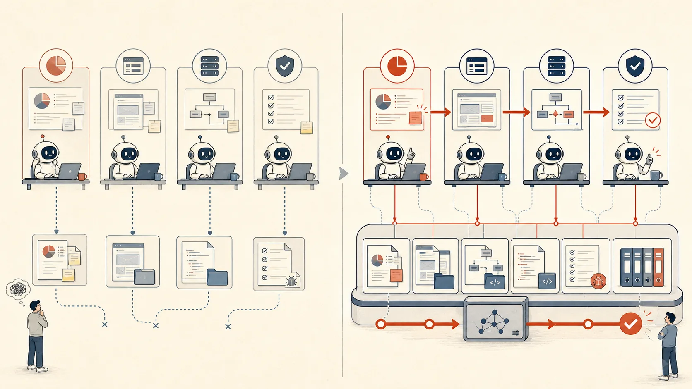

# Buildr：让 Agent 越做越多，越做越好

过去几年，我们一直在学习怎么把大模型用进工作。模型越来越会理解意图、调用工具、写代码、分析资料，甚至能把一个任务推进很远。

但真正开始用 Agent 做事后，我越来越强烈地感到：问题已经不只是“Agent 能不能完成一次任务”，而是它完成之后，下一步能不能接着做。

## 一项工作，不是一次对话

一项真实的工作，往往从一个模糊的想法开始，经过产品判断、方案设计、前后端开发、测试验证，最后才到发布。中间会涉及多个代码仓、历史决策、业务规则、外部工具和不同角色。

今天，产品可以让 Agent 做调研和文档；开发可以拿着产品结果完成前端和后端；测试也可以基于页面、接口和需求进行验证。但这些工作仍常常是割裂的：前后端各自推进，测试不知道该依赖哪些预期验证；开发中途改了功能，上下游又得靠会议、聊天和反复解释重新对齐。

如果需求、规则、实现和验证结果只留在聊天记录、个人经验、本机文件和零散文档里，每一次换人、换 Agent、换窗口，工作就会重新开始。Agent 很聪明，却常常像一个刚入职的同事：需要重新解释背景，重新确认规则，也可能重新踩一遍已经踩过的坑。

> 这不是模型能力的问题。这是工作没有被组织起来的问题。

## 只靠 Agent 还不够

Buildr 是我最近在做的一件事。它不是另一个 Agent，也不打算替 Agent 规划、思考或执行任务。它要补上的，是 Agent 之间、工作环节之间没有共同基础的问题。

Buildr 要做的，是把散落在个人经验、文档、仓库和不同工具中的内容，组织成 Agent 可发现、可选择、可使用的工作资产。人负责目标、业务判断和关键授权；Agent 负责理解任务、调用工具、推进工作；Buildr 让它们共同依赖的内容不必每次从零开始。

## 真正要积累的，不是提示词

当 Agent 开始参与真实工作时，真正值得长期留下来的通常有两类东西。

**工作事实：**我们在做什么，业务如何运转，哪些项目、服务、代码和规范彼此相关。

**工作方法：**我们应该怎么做，哪些边界不能碰，怎样测试、发布、排查和交接。

前者让 Agent 知道“这件事是什么”；后者让 Agent 知道“这件事该怎样稳妥地完成”。Buildr 不把所有资料塞进上下文窗口，而是让 Agent 在需要时，能够找到与当前任务相关的需求、约束、服务、变更和验证证据。

## 变更不再靠节点传递

真正考验协作的，往往不是第一次把功能做出来，而是中途发生变化之后。过去，一条需求调整需要沿着产品、开发、测试等节点逐一传递；每个岗位或责任范围收到信息后，再在自己的上下文里理解影响、实施调整，并由上下游继续验证。

当需求、实现、服务关系、验证方式和已有结果都被组织在同一套工作资产中，变更一旦产生，就不再只是等待传递的消息。Agent 可以直接基于共同事实识别它影响了什么、涉及哪些服务、需要调整哪些实现、补哪些验证，并继续沿着整条工作链推进。没有信息在节点间传递时的阻塞、延迟和遗忘，上下游也不必依靠转述猜测变化。

## 先让 Agent 真正把一件事做完

我不认为 Agent 时代最重要的体验只是“生成得更快”。更重要的是：能不能在一个窗口里，把一件真实的事从探索持续推进到交付；而它结束之后，调研、判断、实现和验证能不能成为下一次工作的起点。

> 让组织的工作方式，成为所有 Agent 的共同能力。

这样，Agent 才能越做越多：从局部任务走向一项完整工作；也才能越做越好：让每一次调研、实现、判断和验证，都成为下一次工作的起点。

这一篇先回答“为什么需要 Buildr”。接下来，我会继续写 Buildr 如何组织工作资产、怎样让变更穿过整条工作链，以及它在真实产品、开发和验证中的实践。
