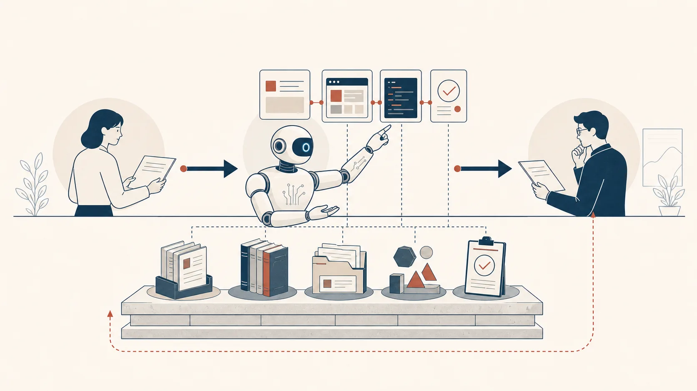

# Buildr：Agent 的工作基础设施

GitHub：[https://github.com/elevenching/Buildr](https://github.com/elevenching/Buildr)

当 Agent 开始进入真实工作，难题很快不再是“它能不能完成一项任务”，而是“它能不能接住前面已经完成的工作，并把结果交给下一步”。

产品、开发、测试都可以各自使用 Agent。但需求、设计判断、代码、服务关系、变更和验证结果一旦散落在不同文档、仓库、工具和人的记忆中，工作就会重新被切开。每一个 Agent 都能完成局部任务，却很难让整件事持续向前。

Buildr 不是另一个 Agent。它组织的是 Agent 完成工作时依赖的工作资产：一边是项目事实、需求、规格、服务与验证证据；另一边是规则、技能、测试和发布等工作方法。人负责目标和关键判断，Agent 负责理解任务与推进工作，Buildr 让这些内容成为可以共享、持续演进的共同基础。

这意味着，变化不必再靠岗位间逐节点传递。只要变更进入共同工作资产，相关 Agent 就可以基于同一份事实识别影响、调整实现、补齐验证，并沿着整条工作链继续推进。

> 让组织的工作方式，成为所有 Agent 的共同能力。

这个合集会记录 Buildr 的产品思考、核心模型、设计取舍和真实实践：怎样组织工作资产，怎样让产品、开发与验证持续对齐，以及怎样让 Agent 越做越多，越做越好。

本文在墨问中与[《Buildr：让 Agent 越做越多，越做越好》](buildr-agent-more-and-better.md)互相关联。
