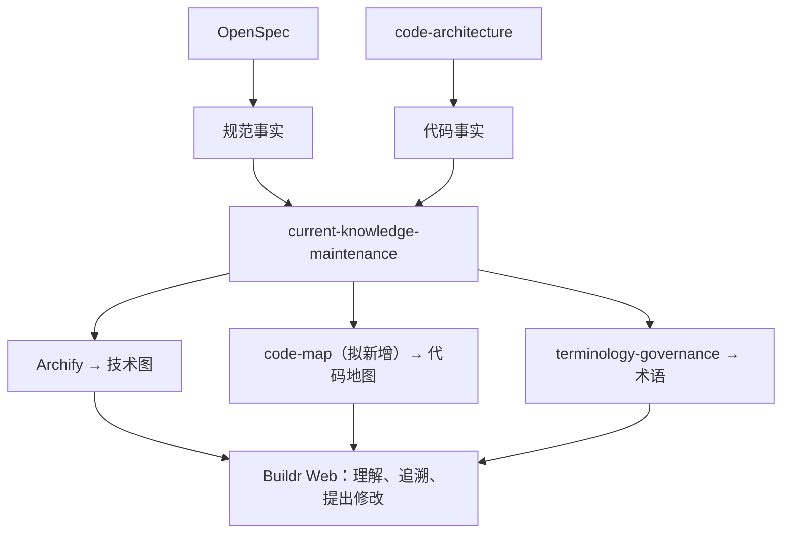

# 知识建设与维护能力试点方案

状态：2026-09-19 完成 33 项实施与适用验证，用户已要求本试点收尾；规范已同步并归档，详见[验证结果](../../openspec/changes/archive/2026-09-19-pilot-skill-projection-knowledge/verification.md)。实际 Git 交付、自举与清理结果见任务 `pilot-skill-projection-knowledge`；父任务 `refactor-code-architecture-and-current-state-model` 保持进行中。

## 目标与首个对象

首个建设对象为“知识建设与维护能力”（Knowledge Construction and Maintenance）：从规范与代码的建设，到用户映射的维护，再到 Buildr Web 的阅读与反馈。它是跨技能（Skill）、文件与应用的业务能力，不预设必须对应一个同名代码模块。

用户先读架构解释文档，从文中打开独立技术图（Technical Diagram）与有职责上下文的代码地图（Code Map）。项目下另有技术图（Technical Diagram）列表，项目级全景代码地图（Code Map）暂缓。用户可以在页面中理解这套关系，点击查看指导方法、事实依据、生成成果与必要验证，并能提出带有对象上下文的建设意见。代码地图（Code Map）范围从项目根到文件，当前不建设独立方法导航。

## 职责分工

| 能力 | 建设与维护职责 |
|---|---|
| OpenSpec | 指导规范建设、变更及收敛，维护应当具备的行为承诺 |
| `code-architecture` | 指导代码的模块、分层、依赖与文件职责，结合实际技术栈建设事实代码 |
| `current-knowledge-maintenance` | 核对规范与实现，定位影响，组织专业制作，维护跨成果关联并检查一致性 |
| Archify | 依据已核实的关系制作、渲染和检查技术图（Technical Diagram） |
| `code-map`（拟新增） | 依据真实代码结构与职责建设、更新和检查代码地图（Code Map），使用同一代码架构原则解释组织方式 |
| `terminology-governance` | 核对术语含义、名称、别名和作用域，处理同义与歧义 |
| Buildr Web | 按对象与视角呈现同一批成果、技能（Skill）、来源及验证依据；承接用户反馈上下文 |

实际执行由智能体（Agent）负责。新增 `code-map` 先提供专业建设方法；是否需要独立确定性程序或新的能力协作约定，按实际调用保证决定，不机械新增。

上图是拟建设职责关系，不能冒充全部已实现的调用关系。配置、清单和运行观察在相关范围补充事实；规范表示承诺，代码表示实现，两者不一致时显式报告。专题解释按问题引用三种基础映射，不强制固定生成顺序。

## 面向用户的上下文

每个对象用最小信息关联：身份与范围、职责、来源、相关成果。沿用项目（Project）、服务（Service）身份；模块、流程等按真实语义关联文件，一对多关系允许存在。指导关系、实现关系、来源关系明确区分；同屏出现多个技能（Skill）不自动构成它们之间的调用或依赖。

| 用户选择 | 呈现内容 |
|---|---|
| 看全貌 | 当前能力的目的、组成关系、跨服务协作与关键过程；拟建设部分有明确标识 |
| 看技术图（Technical Diagram） | 项目、服务及相关模块范围下已有的组成、流程、数据等图示，节点能进入对应对象 |
| 看代码地图（Code Map） | 按职责解释项目、服务、模块到目录与文件的组织，说明实际结构与指导要求的关系 |
| 看术语 | 就近解释定义、别名与作用域，也可进入统一术语入口 |
| 看建设方法 | 相关技能（Skill）的用途、职责、适用范围及正文，标明来源与当前选择；未创建的 `code-map` 明确为规划项 |
| 看事实与验证 | 对应规范条目、源代码或配置文件，以及与当前范围有关的实际验证结果 |
| 提出修改 | 带上当前对象、已观察版本与明确相关引用，复用已有智能体（Agent）动作入口 |

主阅读区保持项目、服务和能力上下文，次阅读区用于技能（Skill）、规范、代码和证据对照。同类阅读位置复用，返回时保留对象与阅读位置。原始代码文件只读展示，支持必要定位与高亮；不把它扩展为完整编辑器。仅读取当前已选工作空间（Workspace）、代码库实例（Repository Instance）及分支范围内可访问的文件，不混入其他副本或敏感文件。

来源缺失、引用失效或映射尚未核对时如实提示，不能显示空白后假装成功，也不能把静态快照当作实时运行事实。页面直接读取成果和关联，避免硬编码业务正文或复制成另一套知识事实。

## 同步维护过程

新增、修改或删除代码、规范及相关配置时，由执行工作的智能体（Agent）通过 `current-knowledge-maintenance` 核对实际语义影响，定位相关成果，按需调用专业能力并更新关联。补建限于已有授权范围，来源含义没有变化时不重画、不机械改名。

完成后检查路径、来源、术语范围、关系、图源与展示及页面引用。程序负责可确定检查；职责和业务语义由智能体（Agent）依据事实判断，不把文本存在检查冒充语义一致。未解决冲突或未覆盖内容保持具体说明，只影响相应结果。

本轮“自动维护”指在已授权开发过程中主动处理影响，无需用户逐份催更；不预设后台监听。其他入口改变事实后，继续阅读或维护时重新观察，相关内容未核对就显示实际状态。术语更新依赖已确认含义，不能只从文件名推导业务定义。

## 首轮实施范围与验收

以知识建设与维护能力本身贯通一条真实路径：相关规范与实现、指导技能（Skill）、三种映射、说明与网页阅读。只建设这个范围的必要关联和内容读取能力，保持文件可独立维护；不要求先完成全项目普查、跨项目搜索或通用知识数据库。

| 场景 | 可观察的验收结果 |
|---|---|
| 看懂关系 | 在 Buildr Web 中分清谁指导代码、谁指导规范、谁维护表达、谁负责专业制作及展示；当前与拟建设部分不混淆 |
| 追溯与对照 | 从一个节点进入相关技能（Skill）、规范、代码文件和验证依据，文件与版本对应当前范围，返回仍保留对象 |
| 真实增改删 | 在隔离样例或已授权真实变更中，新增一项关联、修改一项职责或路径、删除一项来源，相关映射和页面随之更新或明确提示失效，不能靠手改原型证明 |
| 保留未受影响内容 | 选择一个没有改变关系语义的修改，证明确认后保留无关图示和检查，不全盘重建 |
| 接收建设意见 | 用户对当前对象提出意见，接续工作能取得相同对象、引用和必要版本；没有冒充用户批准或实际执行 |

每次同步只保留实际修改、关联核对和必要视觉/交互证据。页面可读与自动检查通过不自动等同用户已理解或接受；用户试用反馈分别记录。

## 当前基础与后续

现有方法入口：[代码架构指导](../../services/buildr/resources/workspace/skills/buildr/code-architecture/SKILL.md)、[当前知识维护](../../services/buildr/resources/workspace/skills/buildr/current-knowledge-maintenance/SKILL.md)、[术语治理](../../services/buildr/resources/workspace/skills/buildr/terminology-governance/SKILL.md)。这些是现有基础，不表示独立 `code-map` 或完整网页联动已实现。

[既有原型](../../openspec/changes/archive/2026-09-19-pilot-skill-projection-knowledge/prototype/knowledge.html)及其[验证说明](../../openspec/changes/archive/2026-09-19-pilot-skill-projection-knowledge/prototype/README.md)保留为已做的阅读实验；它们以技能投射和静态目录快照为内容，不能证明本方案的真实同步能力。后续仍应阅读其中可复用的交互选择，本次首个建设对象及到文件为止的范围以此方案为准。

正式材料：[提案](../../openspec/changes/archive/2026-09-19-pilot-skill-projection-knowledge/proposal.md)、[设计](../../openspec/changes/archive/2026-09-19-pilot-skill-projection-knowledge/design.md)、[实施清单](../../openspec/changes/archive/2026-09-19-pilot-skill-projection-knowledge/tasks.md)。[新版原型](../../openspec/changes/archive/2026-09-19-pilot-skill-projection-knowledge/prototype/maintenance.html)保留新的关系表达与上下文阅读实验；专业能力与正式 Buildr Web 已实施并验证。本次收尾不完成父任务。
