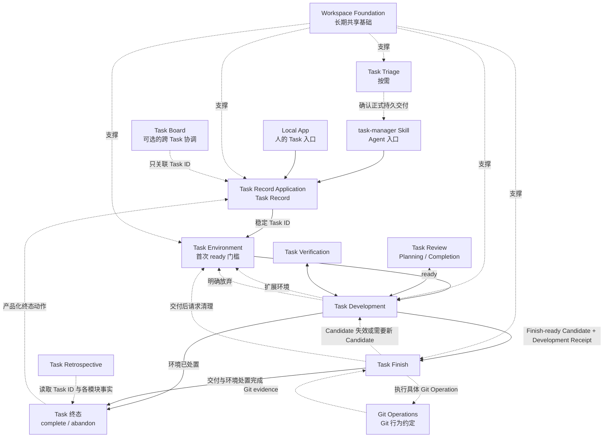
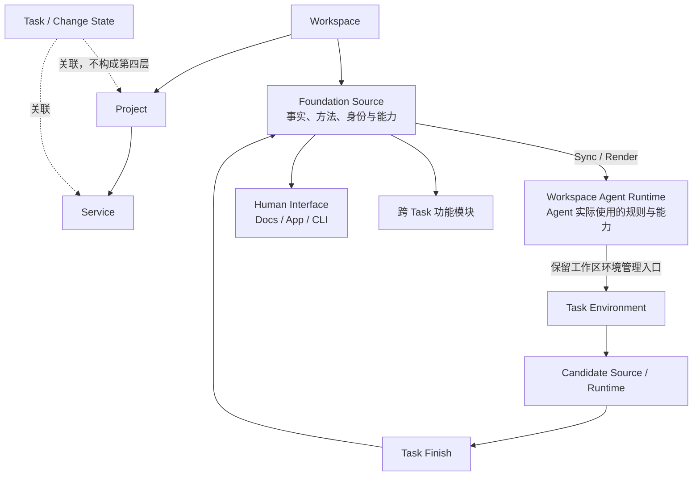
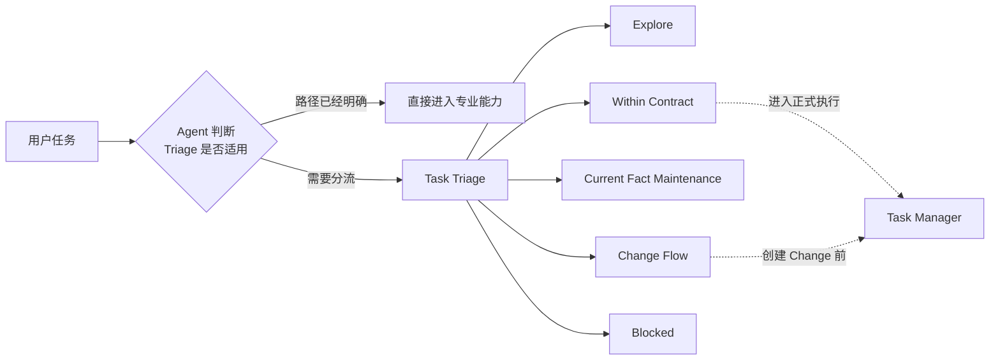

# Buildr 任务生命周期架构讨论稿

> Roadmap 草稿，不代表当前产品事实或已批准方案。本文同时作为初步的额外交付跟踪文档；只有已经实现、验证、集成并投射到 retained runtime 的内容才标记为“已交付并生效”。

## 核心原则

> 人负责表达意图并保有最终决策权；Agent 负责理解、判断和研发；Buildr 提供宽而薄的流程支持、确定性边界与证据。能够稳定固化的记录动作、校验、状态转换和路由约束应进入产品功能，不依赖 Agent 每次重新推理。

## 阅读约定

本文保留稳定英文标识，面向人的说明优先使用中文。下表只解释本 Roadmap 的目标术语，不代表这些能力已经实现，也不提前替换当前规范术语表（canonical glossary）或规范（specs）：

| 中文名称 | 稳定英文标识 | 本文含义 |
|---|---|---|
| 正式任务 | Task | 准备产生持久交付变更并完成闭环的执行单元 |
| 任务记录 | Task Record / `task.yml` | 任务身份、意图、业务范围、Change 引用和顶层结果的最小事实来源 |
| 任务管理器 | Task Manager / `task-manager` | Agent 创建、读取、更新和结束 Task Record 的薄 Skill；不管理任务环境或专业阶段 |
| 任务记录应用 | Task Record Application | `task.yml` 的唯一产品 writer；同时服务 Task Manager/CLI 与 Local App |
| 任务环境 / 环境回执 | Task Environment / Environment Receipt | 可执行、可核验、可清理的任务环境及其本机控制记录 |
| 保留工作区 Buildr 环境管理器 | Retained Buildr Environment Manager | 从 canonical retained Workspace 提供受信 Buildr 执行入口，管理 Task Environment；现有 `controller` 只是内部字段名，不是产品实体 |
| 任务研发 / 研发回执 | Task Development / Development Receipt | 从环境就绪到形成交付候选之间的研发编排事实 |
| 交付候选 / 候选代次 | Candidate / generation | 研发交给收尾的冻结交付身份，以及顺序递增的交接代次 |
| 任务审查 / 审查结果 | Task Review / Review Result | 对方案和完成候选的专业审查及轻量证据 |
| 任务验证 / 验证结果 | Task Verification / Verification Result | 可执行检查、政策上下文、结果和推进决定 |
| 任务收尾 / 收尾回执 | Task Finish / Finish Receipt | 交付、交付效果记录和环境清理交接，不拥有 Task 顶层终态 |
| 结构化任务看板 | Structured Task Board | 跨 Task 的规划、依赖和协调事实 |
| 任务复盘 | Task Retrospective | 任务终态后的非阻塞复盘和未来改进候选 |
| 任务元数据发布 | Task Metadata Publication | 后续将 Task-owned 记录精确纳入 Git 共享的独立边界 |
| 工作区元数据存储 | Workspace Metadata Store / `.buildr/` | Buildr 以文件承载的工作区数据库边界；源码 clean 判定与精确 Git 发布分别处理 |
| 交付目标前进 | Target Advancement | Candidate 交付期间目标分支或目标位置出现了更新；不是 Task Environment 自动更新事件 |
| 生命周期权威 | lifecycle authority | 对某类生命周期事实拥有唯一写入和最终解释责任的模块 |
| OpenSpec 变更 | OpenSpec Change | 可选的正式需求和契约变更承载，不是任务身份 |

## 系统与任务主线



主线图表示会形成持久交付变更和 Candidate 的正式 Task。Task Record Application 只维护 Task Record；`task-manager`/CLI 只接收 Task Record 内容，Local App 则在同一 Task 详情中组合各模块的只读投影。P0.2 已增加独立“环境”页签，但 Environment、Development、Review、Verification、Finish、Board 或 Retrospective 内容都不写入 Task Record。已经创建 Task、但在产生交付变更前确认无需修改时，可以直接 `complete --no-change`，不虚构专业记录。

## 系统基础

| 模块 | 核心目的 | 状态 |
|---|---|---|
| Workspace Foundation | 为人和 Agent 提供跨任务共享的工作基础 | 已确认 |

## 任务主线模块

| 模块 | 核心目的 | 状态 |
|---|---|---|
| Task Manager / Task Record / Local App | 通过共享 Application 创建、展示和维护正式 Task 的最小顶层记录 | P0.1 已交付并生效（2026-08-01） |
| Task Triage | 判断任务应走什么路径 | 已确认；P0.1 接入 Task Manager |
| Task Environment | 建立并维护可执行、可核验、可清理的任务环境 | P0.2 已交付并生效（2026-08-02） |
| Task Development | 对形成交付变更的正式 Task，在 ready environment 中围绕已对齐 Task Intent 推进研发并形成 Candidate | 已确认 |
| Task Finish | 对 Candidate 编排适用交付路径，维护 Finish Receipt，并请求 Task Environment 完成清理 | 已确认 |

## 辅助与横切能力

| 能力 | 作用 |
|---|---|
| Task Review | 通过 Planning Review 与 Completion Review 分别审阅方案和完成候选 |
| Task Verification | 在研发过程中按需执行可执行验证，并在 handoff 前核对 current Candidate evidence |
| Git Operations | 定义单项 Git 行为、安全默认值、硬边界和最小 evidence；不负责流程编排 |
| Task Board | 在 Workspace 范围组织多个 Task 的整体目标、规划、依赖和跨 Task 决策 |
| Task Retrospective | 在任务中按高价值线索持续观察，并在任务终态后形成面向未来工作的复盘结论与改进候选 |
| Local App | P0.1 提供 Task 最小列表、详情和受控管理；P0.2 增加当前机器的只读“环境”页签；P1 再增加 Structured Board 与其他专业结果投影 |

## Workspace Foundation

### 定位

> Workspace Foundation 是任务生命周期之外、由 Buildr 持续建设的共享工作基础。

它帮助人和 Agent 回答四个问题：

| 问题 | Foundation 提供的内容 |
|---|---|
| 我在哪里？ | Workspace、Project、Service 的范围、身份与关系 |
| 现在是什么？ | 当前事实及其权威来源 |
| 应该怎么做？ | 规则、方法与工作约束 |
| 可以用什么？ | Agent 能力、工具与跨任务功能模块 |

### 组织与运行关系



### 核心边界

- Foundation 是长期系统基础，不是任务步骤；不单独建设 Skill、CLI 或状态机，也不要求每个任务执行完整 preflight。
- `Workspace → Project → Service` 是稳定组织骨架；Task 可以关联多个 Project、Service，并按需关联 `0..N` 个 OpenSpec Change，不构成第四级目录层。P0.1 的 Change 引用只保存 `project/change` 并在当前 Task Record 内去重，不提前建立跨 Task ownership。
- Foundation 组织长期共享的事实、方法和发现入口，不接管所有代码、数据库、网页或用户输入。
- 人和 Agent 共用同一 Source Authority；Agent Runtime 是实际运行面，但不是第二份事实源。
- Task Environment 由保留工作区 Buildr 环境管理器执行准备、恢复、资源登记和清理。task worktree/branch 中的 Rule、Skill、contract、功能模块和 package 都是候选变更，可以在隔离目标测试；只有实现完成并集成到 retained checkout 后，才从 retained Product source sync/render 对应 Agent runtime 并确认生效。
- Task Finish 第一版只编排适用的 Git / 非 Git 交付并请求环境清理，不把 sync/render 纳入核心动作。候选交付到 Foundation Source 后，相关能力继续按 Workspace 事实完成必要投射；以后出现稳定需求时再考虑由 Finish 组合。
- Foundation 可以提供跨 Task、跨 Change 的功能模块；具体状态由对应模块管理。
- Buildr 保证身份、结构、边界和投射，不裁决业务事实，也不替 Agent 构造完整 Task Context。

## Task Triage

### 定位

> Task Triage 是新任务的语义分流入口；Task Manager 是正式 Task Record 的管理入口。二者不能互相代替。



### 语义入口

| 入口 | 含义 |
|---|---|
| Explore | 目标或范围尚未收敛，继续讨论 |
| Within Contract | 在已有契约内实现、修复或优化 |
| Current Fact Maintenance | 让 Knowledge 等说明追上已经成立的事实 |
| Change Flow | 改变外部行为或长期契约 |
| Blocked | authority、授权或关键语义存在冲突 |

### 职责边界

Task Triage 只负责核对任务事实、识别治理 Project 与已知影响面、选择语义入口并给出下一动作。它仍由 Agent 进行语义判断，不持久化任务状态，也不准备环境、执行验证、维护看板或编排收尾。

当 Triage 已确认工作即将进入正式持久交付时，它必须先通过 selected `buildr.task-record/v1` provider 创建或恢复 Task Record，再进入 Environment 或 OpenSpec/实现写入。路径已经明确而不需要重新 Triage 的正式执行，同样先确保 Task Record 存在。Task Manager provider 不 ready 时只阻塞首次交付写入，不抹去已确认的语义结论。

纯讨论、只读探索、单次测试、临时服务、API 调用和已有 Task lifecycle metadata 维护不创建新 Task Record。Triage 不把 Agent host task/thread id、worktree 名称或未来 Change 名称当作 Task ID。

### 建设形态

Task Triage 继续保持 **Skill-only**，不建设自己的 CLI、receipt 或状态机；P0.1 只为它增加对 Task Record capability 的条件依赖。Task Manager 和 Task Environment 都是独立能力，分别拥有顶层记录与环境事实。

## Task Environment

### 定位

> Task Environment 在正式 Task 进入持久交付变更前，建立并核验可归属、按需隔离、可执行、可核验、可清理的环境，并通过同一份 Environment Receipt 维护其完整生命周期。

当前 Workspace 本身也是一种 environment；没有创建 worktree 不等于没有环境。正式 Task 修改交付物，或在研发中构建、测试、启动 Task-owned 持久进程前，必须先取得 `ready` 的 Environment Receipt。各生命周期 Skill 在 canonical Workspace 维护 Receipt、Result 和复盘记录属于 Workspace 任务元数据写入，不要求为写记录重新激活已经清理的 Task Environment。

Task Environment 只管理已经存在的正式 Task，不是所有 Agent 本地操作的强制入口。Task 外的单次测试、临时启动服务、调用 API 等操作由 Agent 直接执行；临时资源在当前操作中按用户意图停止或保留，不创建 Task 或 Environment Receipt。用户要求保留的 Task 外进程必须如实披露当前事实和清理方式，但第一版不承诺跨 Agent session 自动恢复管理；以后确有需要时再单独设计 Workspace 级运行资源管理能力。

Task Environment 不是只执行一次的线性阶段：生命周期图中的节点表示首次 `ready` 门槛，Skill 与 receipt 继续服务于 Development、Verification 和 Finish。

### 生命周期

| 时点 | Task Environment 的动作 |
|---|---|
| 首次进入持久交付变更 | 以 Task ID 创建 receipt，再准备执行根、Runtime / CLI、依赖等适用资源，完成最小真实探测后返回 `ready` 或 `blocked` |
| Development / Verification | 正式 Task 新增相关 repo，或登记 Local App Preview、dev server 等动态资源 |
| 跨 Agent session 恢复 | 通过 Task ID 串行找回同一份 receipt，重新执行最小环境探测；不得按 cwd 或 branch 猜测，也不得把恢复理解为多窗口并发推进 |
| Finish / 明确放弃 | 根据同一份 receipt 清理资源并解除占用；未清理完成时保留现场 |

Task Triage 是可选上游。无论是否经过 Triage，正式 Task 首次修改交付物或创建 Task-owned 环境效果前的 `ready` receipt 才是硬门槛；Task 外临时操作不套用此门禁。

### Environment Receipt

每个 Task ID 只维护一份 Environment Receipt。它是 Workspace 本机状态中的动态资源清单和控制记录，由 Task Environment Application 独占写入，使用 `buildr.task-environment-receipt/v2` 并保存在 canonical Workspace 的 `.buildr/tasks/<task-id>/environment.json`，该文件不进入 Git；同一 Workspace 的共享执行根、task worktree 和不同 Agent session 必须能解析到同一份记录。不同 Task 不共用 receipt 或 Task-owned 资源归属；它们只有在实际使用同一执行根、Git repository 或其他共享写入面时才产生共享边界。文件写入遵守下文统一的“最低文件写入纪律”。Receipt 不是 Source Authority 或 Task Context，也不代替对真实环境的核验。

Task Environment Receipt 是 Task 级环境事实的唯一汇总入口。长期保留的 Git 证据使用新的窄 `buildr.git-worktree-evidence/v1`，只记录 repository、checkout、branch、HEAD、clean 和 Git effects，并由 Git worktree provider 维护。旧 worktree-centric v1 receipt 只用于一次性迁移输入：匹配正式 Task 的活跃环境转换为 v2 Receipt 与窄 Git evidence；无 Task 的 live worktree 只保留窄 Git evidence；无真实资源的陈旧 receipt 删除；identity/ownership 冲突则原样保留并阻止 authority 切换。旧 receipt 不作为永久兼容 reader 或第二套 authority 留下。

| 信息 | 最小内容 |
|---|---|
| Task 绑定 | Task ID、canonical Workspace identity / root |
| 执行位置 | 每个工作范围的 Project / Service 引用、执行根或任务验证 Workspace 根、共享与占用事实、清理责任；Git 仓库按需记录 checkout、branch / HEAD 等 Git 事实 |
| 执行基础 | 保留工作区 Buildr 环境管理器 identity、适用的语言 Runtime（如 Node）、Workspace CLI、workspace-scoped Agent runtime 的 source/projection identity、package manager / lockfile、依赖就绪结果及最小事实指纹 |
| 动态资源 | Local App Preview、dev server、端口、容器、临时数据库等持久资源及其清理信息 |
| 最新结果 | `ready` / `blocked`、失败原因和最终清理结果 |

Receipt 不保存 Agent session 上下文、任务计划、开发进度、完整测试结果、runtime 生成文件副本、`node_modules` 内容或凭证。它只登记完成恢复、真实探测和清理所需的 runtime source/projection identity 与本机事实；实际行为验证属于 Task Verification。环境管理器 fingerprint 只证明执行环境动作的 Buildr source/CLI 与最近一次成功核验的管理入口一致，不是 Task source baseline、Candidate identity 或 retained target revision，也不因自身变化自动要求任务吸收 retained Workspace 的新代码。

只有正式 Task 中会持续存在、需要 Task Environment 清理或影响并发的资源才登记；正常退出的一次性进程和验证结果不登记。正式 Task 的资源创建者必须立即通过 Task Environment 写入 receipt，登记失败时清理刚创建的资源。

### 环境准备

- Task Environment 根据当前 Workspace、Project、Service 的权威事实准备环境；事实缺失或冲突时返回 `blocked`，不按惯例猜测，也不新增通用 environment 声明。
- Git 不是 Environment Receipt 或 `ready` 的前提。没有 Git 的 Workspace 或工作范围仍使用 Task Environment，只是不具备 Git worktree 提供的物理隔离和历史恢复能力。
- Git 仓库需要隔离时，可使用 Git worktree provider 创建、复用、检查和删除 worktree；provider 只返回路径、repository、branch、HEAD、clean 等 Git evidence。是否采用 worktree 由当前 Workspace 事实和任务需要决定，不由 Task Environment 硬编码。
- 自举 Workspace 使用 Git worktree provider 时，`.worktrees/` 是多个任务环境的容器；每个 `.worktrees/<task-id>` 是该 Task 的 checkout 与执行根，也可作为**任务验证工作区（Task Validation Workspace）**根。workspace-scoped Agent runtime 可以投射在这个根下面，用于独立验证候选能力；worktree 不是主 Workspace、retained Workspace、canonical metadata authority、Agent runtime 本身，也不称为“开发 Workspace”。
- 适用的 Runtime、Workspace 所需 CLI 和依赖由 Task Environment 在实际执行根中准备并登记。Node 项目的每个 task worktree 根据自己的 lockfile 独立准备 `node_modules`；只共享 package manager 下载缓存，不复用或链接其他 checkout 的 `node_modules`。
- Buildr 自举任务使用 Workspace Foundation 提供的保留工作区 Buildr 环境管理器创建、恢复和清理环境；worktree 内的 Buildr CLI 是 Development / Verification 的候选对象，不能负责创建、认领或清理自己的环境。环境 ready 后，候选 CLI 可以把候选 runtime 投射到 receipt 绑定的自身任务验证 Workspace，也可以在验证 Workspace 内使用隔离的模拟用户目录测试 user destination；但不能写入 retained Workspace、另一个 Task 的 worktree 或验证 Workspace 外的共享用户 runtime。模拟投射不等于真实 Agent runtime 已生效。
- `ready` 必须来自实际执行根中的最小真实探测，核验执行位置、适用的 Runtime / CLI 和依赖是否满足运行需要；Git 仓库再核验 checkout identity。`ready` 表示环境已知且可执行，不承诺已经物理隔离，也不代替项目测试。
- 当本次变更会改变 Agent runtime 的发现、加载或行为时，文件已渲染只证明 projection ready；需要真实采用证据时，应从该任务验证 Workspace 启动独立 Agent session，再由 Task Verification 绑定 source/projection/environment identity 记录结果。P0.2 只准备和恢复环境，不把该验证结论写进 Environment Receipt。
- Local App Preview 不是首次 `ready` 的前置条件。正式 Task 在 Development / Verification 中按需启动后，立即登记到 receipt，供后续清理。

### 来源基线与环境管理器 identity

- Task Environment 的实际来源基线是每个工作范围的 checkout/provider evidence，包括 start point、branch、HEAD、执行根及真实 Runtime、CLI、依赖和 projection probes；它不是保留工作区环境管理器的 fingerprint。
- retained target 或 canonical Workspace 前进，不会单独使 Task Environment 失效，也不会触发 Environment fetch、rebase、sync 或改写任务 checkout。Task 是否吸收新目标内容，由 Task Development 或 Task Finish 在 Git 交付边界显式决定；完成更新后再由 `prepare` 复核已经变化的 checkout 和执行基础。
- 环境管理器 source/CLI 发生变化时，`prepare` 可以在真实 probes 通过后刷新其执行 identity；这只确认后续环境动作使用哪个受信管理入口，不改写任务来源基线，也不自动废弃 Review / Verification evidence。变化是否影响某份 evidence，仍由对应 Result 的目标 identity 与适用性规则判断。具体 fingerprint 轮换协议由 Task Environment 的后续窄修正确定，不在 P0.3 建立通用漂移状态机。

### 隔离与并发

- 第一版假设同一 Task 同一时刻只有一个 active writer，不支持多个 Agent session、窗口或进程在彼此无感知时并发推进同一 Task。更换窗口或 Agent 只允许按 Task ID 串行恢复，不为尚未支持的同 Task 并发预先建设锁、CAS 或通用调度器。
- Agent 发现同一 Task 正由其他 writer 推进，或 Environment Receipt 已不同于自己读取时的事实，必须停止环境写入并返回 `blocked`，不得静默覆盖。这个最小失败边界不把 Task Environment 扩展成 Task Record 或通用并发协调模块。
- 不定义 `in-place`、`dedicated` 等顶层 mode；receipt 记录实际资源、执行位置、共享和清理事实，Buildr 从中判断隔离与并发边界。
- Worktree 等独占执行根可以提供确定性隔离。没有创建 worktree 或其他隔离环境时，同一个主 Workspace 执行根默认只允许一个修改型 Task 占用；只读工作不占用。没有 Git 的 Workspace 仍可以通过不同执行根并发多个 Task，但同一共享执行根不提供足够安全的并发写入边界。
- Git worktree 的隔离范围主要是工作树与 index；Git object/ref、端口、进程、容器、用户级 Skill/runtime、凭证和外部服务仍可能共享。Task Environment 必须按真实资源登记和协调，不能把不同目录等同于完整系统隔离。
- Buildr 的最小保证是让 Agent 看见 active receipts、共享执行根、已知占用与清理责任，并在需要时登记 Task-owned 写入范围。Agent 必须结合这些记录和真实文件系统维护各 Task 的修改边界与冲突。
- 共享执行根的占用跟随 Task receipt，不跟随 Agent session。session 结束、崩溃或超时不会自动释放；只有 Task 完成、明确放弃或迁移，且相关范围可安全复用时才解除。
- 使用共享执行根不以整个目录 clean 作为绝对前提，但 Agent 不得接管、暂存、覆盖或清理来源不明的既有改动。范围重叠或归属不清时先分析真实影响；涉及语义、授权、重大风险或无法安全恢复的决定时交给用户，无法证明归属时不得执行破坏性清理。
- 第一版不建设共享执行根的通用文件 write-set。Environment cleanup 只确定性停止已登记资源并解除占用；没有 provider evidence 能证明源码归属时保留共享源码，并在结果中明确标记 retained，不把“未删除”误报成自动回滚。

### 多 repo 扩展

- 一个 Task ID 仍使用一份 receipt，可以包含同一 canonical Workspace 管理的多个 repo 和执行目录。
- Development 只读看到新 repo 时不立即登记；一旦确认它属于当前 Task，必须先交给 Task Environment。Task Environment 根据实际事实选择适用的 environment provider，或登记已有共享执行根，并在写入、构建或测试前更新原 receipt。
- 一份 receipt 不跨多个独立 Buildr Workspace。需要进入另一个 Workspace 时，拆分为另一个 Task ID / receipt 并显式交接。

### 失败与清理

- 环境准备中途失败时，保留同一份 receipt，记录已创建资源和失败原因并返回 `blocked`；后续仍由 Task Environment 重试或清理。
- 正常完成时，Task Finish 完成适用的 Git 或非 Git 交付，并把交付结果与执行环境已可安全清理的事实交给 Task Environment；Task Environment 不执行交付动作，Task Finish 也不直接删除 worktree 或清理其他环境资源。
- Task Environment 按 receipt 编排清理，各资源 provider 执行具体动作。用户明确放弃 Task、且结束编排者已经处置需要保留的交付事实与关联 Change 后，可以不经过 Finish 直接清理该 Task 独占的环境，包括 dirty worktree，不再要求二次确认。
- 用户明确放弃 Task 本身构成清理 Task-owned 改动的授权。只有 Environment Receipt、Git evidence 或其他可靠事实能证明归属时，才可以清理共享执行根中的对应改动；没有 Git 时尤其不能假设能自动回滚源码。来源不明、混有其他 Task 改动或 ownership 无法证明时返回 `blocked`，不得扩大范围全部丢弃。
- 清理成功后只在原 Environment Receipt 中保留最小清理结果。
- Task Environment 不触发、不写入也不清理 Task Retrospective。它只返回环境处置事实；正常完成或放弃路径的结束编排者在 Task 到达稳定终态后另行请求最终复盘。

### 建设形态

第一版采用 **共享 Task Environment Application + 薄公共 CLI + Task Environment Skill**。Application 是唯一 Environment writer，确定性实现 `prepare`、`inspect`、内部资源登记/释放和 `cleanup`；公共 CLI 只开放 `buildr task environment prepare|inspect|cleanup <task-id>`，Skill 负责按任务意图调用它们。交接契约只定义 Task ID、`ready / blocked / unavailable / cleaned`、环境引用、资源处置和 cleanup 结果等跨模块必要事实。现在不建设独立 Task Core、通用状态机、锁、CAS、租约或环境调度器，也不把内部资源动作公开为 CLI。

## Workspace 中的 Task 记录

### Task ID

Task ID 是正式 Task 生命周期中人可读、稳定且在当前 Workspace 内唯一的主标识。正式 Task 是准备产生持久交付变更并完成交付闭环的执行单元，不等于普通对话、临时操作、Agent host task/thread 或 OpenSpec Change。

- 纯讨论、只读探索、单次测试、临时服务、API 调用和 Board 中尚未进入执行的规划不创建 Task ID。
- Environment Receipt、Development Receipt、Review Result、Verification Result、Finish Receipt、Retrospective、worktree 和任务分支都使用同一个 Task ID，但各自维护自己的事实。
- 一个 Task 可以关联 `0..N` 个已存在 OpenSpec Change；P0.1 只用 `project/change` 消除跨 Project 同名歧义并在当前记录内去重，不扫描其他 Task Records，也不声明跨 Task 唯一 ownership。
- Task ID 一旦创建就不因标题或意图微调而改名。是否需要新的 correction/continuation Task 由后续真实协作需求决定，v1 不保存 relations 或执行者 identity。
- Task Record Application 是唯一逻辑 writer；`task-manager`/CLI 与 Local App 只是客户端。第一版不支持多人协同编辑、自动合并、锁或租约；Local App 的陈旧页面只用不持久化的 `recordDigest` fail closed。

### Task Manager 与最小 Task Record

Task Record Application 是 `task.yml` 的唯一 writer。`task-manager` 是 Agent 创建、读取、更新和结束 Task Record 的 Skill；Local App 是人的列表、详情和受控管理入口。两者调用同一 Application，Task Manager 不是 Task Core、总调度器或专业记录索引，Local App 也不在 Web 层另建 writer。

每个 Task ID 在 canonical Workspace 中维护一份 `.buildr/tasks/<task-id>/task.yml`。v1 只包含：

```yaml
schemaVersion: buildr.task-record/v1
taskId: introduce-task-record
title: 建立任务记录基础
intent: 为正式 Task 建立稳定、最小、可恢复的顶层记录
scope:
  projects:
    - product
  services:
    - project: product
      service: buildr
changes:
  - project: product
    change: introduce-task-record
status: active
result: null
createdAt: 2026-08-01T10:00:00.000Z
updatedAt: 2026-08-01T10:00:00.000Z
```

| v1 保留 | 理由 |
|---|---|
| `schemaVersion` | 防止未来 writer 静默改写未知格式 |
| `taskId`、`title`、`intent` | 恢复 Task identity 与顶层目标 |
| Project/Service scope | 表达业务影响面并由 registry 校验 |
| `project/change` references | 表达 `0..N` 个真实 Change 并消除同名歧义 |
| `active / completed / abandoned` 与 result | 表达最小顶层处置；completed 可标记 `noChange` |
| `createdAt / updatedAt` | 基础审计和排序，由产品生成 |

首版明确不保存 `revision`、`recordDigest`、`workspaceId`、执行者、Board/Task relations、blocker、富文本 Overview，以及任何 Environment、Development、Review、Verification、Git、Finish、Board 或 Retrospective 内容与引用。P0.1 Local App 只展示这份最小 Task Record；后续再按已交付模块聚合专业 reader，不要求 Task Record 复制索引。

Task Manager 不读取 Environment Receipt，也不提供结构化字段记录 worktree、branch、runtime、CLI、依赖、进程、端口、资源、凭证、完整日志或专业 record revision。从 task environment 调用时，上游只向它提供已经确认的 canonical Workspace target；v1 不对 title/intent/result 做启发式文本扫描。

P0.2 保留 Task Record 的 closed-schema 和领域校验，但把“Change 是否存在于 retained Project”的位置判断替换为共享的**任务范围 Change 引用解析器（Task-scoped Change Reference Resolver）**。解析器只接收 canonical Workspace、Task ID 与 `project/change`，先读取匹配 Task Environment 的 Project 执行根，再回退 retained Project；它不是新的 authority，也不保存路径或来源到 Task Record。全局 Change 列表仍只索引 retained Project。

### 产品动作与客户端边界

通过 Agent 工作时，Agent 负责理解用户意图、判断是否已经形成正式 Task，并提供 title、intent、业务 scope 与真实 Change 引用；人也可以在 Local App 直接表达这些顶层事实。Buildr Application 对所有客户端固化以下动作：

- `create`：生成 active record、默认值和系统时间；
- `inspect`：只读返回最新记录；
- `update`：只对 active Task 应用明确的 title/intent/scope/change set/add/remove；
- `complete`：写入 completed、summary 与 `noChange: true|false`；
- `abandon`：写入 abandoned 与 reason。

Agent 不直接编辑 YAML，不提交完整 next-state document，也不推理系统字段和合法状态转换；Local App 同样不解析/render YAML 或自行实现状态迁移。终态不可重开或继续修改。

### P0.1 Local App

P0.1 把“任务”加入 Workspace 核心导航，提供：

- `/workspaces/:workspaceId/tasks`：Task 列表，展示 Task ID、标题、Intent、Project/Service scope、状态和更新时间；
- `/workspaces/:workspaceId/tasks/:taskId`：最小 Task Record 详情；
- 创建 Task、编辑 active Task 的 title/intent/scope/Change references；
- 明确确认后 complete 或 abandon，完成时明确选择是否 no-change；terminal Task 只读。

Local App 通过 Workspace-scoped API 调用 Task Record Application，继续只接受已登记 `workspaceId`，拒绝 `target/root/path`、未知字段和不可信写请求。完成/放弃确认必须说明“只更新顶层 Task 状态，不执行 Finish、Git、Verification 或 Environment cleanup”。P0.1 不显示专业阶段卡片、不建设 Board、不做批量操作或语义比较。

Application read model 返回当前 canonical bytes 的 `recordDigest`；Local App mutation 必须携带页面读取到的摘要。摘要变化时返回冲突并要求刷新，不覆盖、不自动合并。`recordDigest` 不是 `task.yml` 字段，也不是通用协同编辑协议。

### P0.2 Local App 环境页签

P0.2 在既有 Task 详情中增加独立、只读的“环境”页签。页面通过 Workspace-scoped API 调用 Task Environment Application `inspect`，展示当前机器的 `observedAt`、receipt 可用性、`ready / blocked / drift / unavailable`、scope/root、Runtime/CLI/依赖、runtime projection identity、Git provider evidence、动态资源与 cleanup 摘要。打开页签、页面重新获得焦点或手动刷新时执行一次有界 probe；首版不增加 WebSocket、后台持续轮询或 prepare/cleanup 按钮。

HTTP/Web 层只接收已登记的 `workspaceId` 与真实 Task ID，拒绝 `target/root/path` 和 receipt bytes，不直接解析 Environment Receipt，也不从 branch/worktree 名猜测环境。Environment 暂不可用时仍展示 Task Record，并明确显示本机不可用或下一动作；任何环境事实都不复制到 `task.yml`。

### 主 Workspace 存放边界

Task Record 与后续专业记录都位于 canonical Workspace，但每类记录有自己的唯一 writer：

```text
.buildr/
├── boards/
│   └── <board-id>.*
├── tasks/
│   └── <task-id>/
│       ├── task.yml
│       ├── environment.json
│       ├── development.*
│       ├── verification.*
│       ├── reviews/
│       │   ├── planning.*
│       │   └── completion.*
│       └── finish.*
└── retrospectives/
    └── <task-id>.*
```

Task Record Application 只维护 `task.yml`；Task Manager/CLI 与 Local App 只调用 Application。Task Environment、Development、Verification、Review、Finish、Board 与 Retrospective 分别独占自己的专业记录。task worktree 中出现同路径副本时不是 retained authority，生命周期 writer 不在副本中维护主 Workspace metadata，也不因 worktree cleanup 删除它。

`.buildr/` 作为**工作区元数据存储（Workspace Metadata Store）**处理：它以文件承载 Task、Board、receipt/result 与本机管理事实，整体不参与源码工作树的 global clean/readiness 判定。这个分类不等于把 `.buildr/` 加入 `.gitignore`、放弃 ownership 校验或停止共享；可移植记录仍由各 writer 维护，并由 Task Metadata Publication 按 exact owned paths 检查冲突、commit 和 push，本机 Environment/runtime 数据继续排除在发布之外。

### 首版文件写入纪律

第一版只保留低成本、确定性的文件安全：

- closed schema 和字段级校验由产品实现；
- Task Record repository 只拥有精确的 `task.yml`，不把整个 `.buildr/tasks/<task-id>/` 纳入 transaction、快照或回滚；
- `create` 不覆盖有效 Task；目录已存在但没有有效 `task.yml` 时返回 occupied/corrupt 诊断，并保留所有 sibling 文件；
- mutation 先读取最新文件、在内存形成完整合法记录，再使用现有 filesystem helper 只对 `task.yml` 做同目录临时文件和原子替换；
- Local App mutation 以不持久化的 `recordDigest` 拒绝已经陈旧的页面；
- 替换失败保留最后一份有效 `task.yml` 和所有专业 sibling；只清理可证明属于本次操作的临时文件，或本次排他创建且仍为空的目录；
- `completed / abandoned` 不得回到 `active`。

原子替换只是防止半写文件的内部实现；`recordDigest` 只拒绝可证明陈旧的页面。P0.1 不把 revision 写入 schema，不加入锁、租约、跨记录事务、自动合并或多人协同编辑。

### 无变更结束

正式 Task 创建后，如果在产生交付变更前确认无需修改，可以执行 `complete --no-change --summary <text>`：

- Task Record 如实保存 completed、summary 和 `noChange: true`；
- 没有 Environment 时不补造 receipt；
- 不创建 Development、Candidate、Review、Verification 或 Finish 占位记录；
- 如果已经创建或修改交付物，就不再使用 no-change，继续正常交付或明确 abandon。

### Git 与元数据发布边界

P0.1 只定义 Task Record 的内容禁区和 canonical path，不建立“portable / unpublished / local-only”状态模型，也不执行 Git add、commit 或 push。Task 是否已经共享不写入 Task Record。

P0.7 再根据届时真实记录类型设计 Task Metadata Publication，至少保持：只处理 canonical Workspace 中各 writer 声明的精确 owned paths，不读取或发布 `.worktrees`、Environment 本机状态或 task-scoped runtime；生命周期 metadata 不混入 Development Candidate；commit 与 push 分开；无明确授权不改写历史；主 Workspace 没有 Git 时记录继续留在本地。长期记录引用的 Project/Service/Change 后来被删除或归档时，是保留历史可读快照、提供 reference diagnostic，还是允许部分读取，也由 P0.7/对应历史 owner 基于真实需求决定，不扩张 P0.1 v1。revision、重试协议和具体 Git 实现是否必要，由 P0.7 Change 基于实际并发与发布需求决定。

## Task Board

### 定位

> Task Board 是 Workspace 级的多 Task 规划与协作对象，类似一次迭代、专项或持续交付计划；它不属于任何单个 Task 的生命周期。

Board 与 Task 可以分别创建、独立维护，再建立关联：可以先规划 Board、后续逐步创建 Task，也可以先推进独立 Task，在发现更长任务链后再创建 Board。一个 Task 不属于任何 Board 时仍能完整闭环。

### 身份与关联

- Board 创建时获得在当前 Workspace 内唯一、稳定的 Board ID；Task ID 与 Board ID 各自独立。
- 一个 Board 可以关联多个 Task；是否允许一个 Task 关联多个 Board 由 P1.1 根据真实协调需求决定。
- Task Record v1 不保存 `boardId`。Board writer 拥有 Board 内的 Task ID 关联、规划位置、排序、分组和依赖，不复制 Task status 或专业 Result。
- Board 可以先保存尚未 Task 化的规划描述；正式执行时先通过 Task Manager 创建 Task，再把真实 Task ID 放入 Board。
- Board 引用不存在的 Task ID 时只报告结构不一致，不能创建、覆盖或猜测修复 Task Record。

### Board Record

Structured Task Board 模块提供唯一的最小 Board record writer；Task Board Skill 与 Local App 都只是调用方。Local App 对 Board-owned 字段的保存必须复用该 writer，不能自行实现第二条文件写入路径。是否需要版本冲突字段由 P1.1 根据真实多 writer 需求决定，不在 P0.1 预设。Board record 只维护 Board 自身事实：

| 信息 | 最小内容 |
|---|---|
| 身份与目标 | Board ID、标题、整体目标和预期结果 |
| 当前状态 | `active / completed / abandoned` |
| 规划组织 | 尚未 Task 化的规划描述、内部 key、顺序与分组 |
| 关系与依赖 | Task ID 引用，以及规划或 Task 之间的依赖；尚未 Task 化的规划依赖通过内部 key 引用 |
| 跨 Task 决策 | 影响多个 Task 的业务策略、技术约束、范围、拆分、顺序和协作决定 |

Board 不复制单个 Task 的 Intent、业务或技术方案、关键实现、代码片段、状态或 evidence，也不拥有 Environment、Development、Review、Verification、Finish、Retrospective、Candidate 或 Receipt。需要完成跨 Task 的集成实现或整体验证时，创建真实 Task 执行。

Board 页面回答“这些 Task 是否组织合理、顺序与依赖是否清晰、整体工作是否健康”；Task 页面回答“这个 Task 是否理解、设计、实现、审阅、验证和交付正确”。Board 中的 Task 卡片只投影 Task Record 的 ID、标题、Intent、status/result，Board 自己的依赖，以及各专业模块可读取的 Review / Verification / Finish 摘要。

### 状态、依赖与终态

- Board 只有 `active / completed / abandoned` 三种状态。依赖未满足或关联 Task 被阻塞只是动态事实，不产生 Board 的 `blocked` 状态。
- Agent 开始、恢复或继续推进一个已关联 Board 的 Task 时，检查已声明依赖。尚未 Task 化的前置规划默认视为未满足；它创建并关联正式 Task 后，Task `completed` 只证明生产者任务已经结束，不自动证明依赖产物已经出现在消费者要求的 target ref 或持久位置。依赖必须记录最小可消费条件；只有前序 Task Intent 明确把 task-branch handoff 本身定义为最终结果时，Task `completed` 才可以直接满足该依赖。用户可以明确取消或覆盖依赖，原依赖事实与本次决定都必须保留；不为规划描述新增 `done` 等状态。
- Board 不因为当前所有 Task 已完成而自动 `completed`，也不因为某个 Task 终态而自动改变状态；用户或 Agent 根据整体目标明确判断。
- Agent 主动完成或放弃 Board 时，必须先提醒并列出仍然 active 的关联 Task、尚未 Task 化的规划描述和未满足依赖。用户明确接受遗留后仍可以进入终态；原 Task 和规划事实不被静默改写。
- Board 进入 `completed / abandoned` 不自动完成、放弃、转移或清理任何 Task。需要处置 active Task 时逐个作出决定。
- Board 的终态不能作为 Task 完成 evidence；Task 只有满足自身 Development、Finish、Environment 与记录收敛边界后才能进入终态。
- 第一版中 `completed / abandoned` 也是不可重新打开的 Board 终态。出现新的整体范围时创建新 Board，并按需引用原 Board；不修改原 Board 的结束事实。

Board 规划描述变化不会自动修改已关联 Task 的 Intent、方案、Candidate 或状态。Board 与 Task 在语义上是否偏离只能由 Agent 在开始或恢复 Task、修改相关规划或重新对齐 Intent 时判断；发现偏差后与用户重新对齐。Local App 不进行语义比较。

### Retrospective 与后续工作

Task Retrospective 的 `open` 候选不会自动进入 Board、创建 Task 或扩大当前范围。用户或 Agent 明确决定安排后续工作时，可以在 Board 中增加一个引用该候选的规划描述，或直接创建新的 Task；仅进入规划时候选仍保持 `open`，对应后续 Task 完成或用户明确关闭后再更新候选状态。Board 只保存引用，不复制 Retrospective 内容。

### Local App 与建设形态

P0.1 已交付最小 Task 列表、详情与 Task Record 管理，P0.2 已交付当前机器 Environment 的只读页签；P1 不重做这两部分。P1 采用 **Task Board Skill + Workspace structured record + Local App dynamic projection**：Board structured record 是唯一 Board source；Local App 在已有 Task 页面上增加 Board 页面，并按已交付模块增加 Development、Review、Verification、Finish 等其他专业 Result 的只读投影。页面打开不调用 Agent 重新生成 Task Overview，也不生成新的静态 HTML 事实源。

Local App 对 Task-owned 字段继续调用 P0.1 Task Record Application，对 Environment 继续调用 P0.2 Task Environment Application `inspect`；对 Board-owned 标题、目标、规划描述、顺序、分组和依赖调用 P1.1 Board writer。Environment、Development、Review、Verification、Finish 与 Retrospective facts 保持只读。保存成功后的 Task/Board 字段是用户明确提供的正式事实，不需要 Agent 再批准；但接受专业风险、判断 Board/Task 语义偏离或推进研发仍由人和 Agent 完成。任何写入发生冲突时要求刷新，不自动合并或猜测修复。

Task 外的临时测试、服务和 API 操作没有 Task ID、Receipt 或 Workspace 记录，因此不进入 Task / Board 页面，也不由 Local App 接管；用户要求保留的进程仍只由当前 Agent 在回复中披露事实和清理方式。

P1.1 同一个 Change 中停止所有新静态 HTML 写入，迁移必要入口并删除旧 generator/template/binding/mutation path；历史 HTML 是否保留只读只按真实读取需求决定。P1 不重建 Environment reader/API，也不建设 Board Environment、Review、Verification、Finish、Retrospective、数据库、独立执行器或通用状态机。Board 业务字段、文件扩展名、冲突保护，以及其他专业投影的页面交互由 P1 模块 Change 确定；不得重做 P0.1 Task writer 或 P0.2 Environment 投影。

## Task Development

### 定位

> 对形成交付变更的正式 Task，Task Development 是从 ready environment 到 Task Finish handoff 之间的必经薄层：围绕人与 Agent 已对齐的 Task Intent 推进研发，维护 Development Receipt，并形成可供 Finish 检查和交付的 Finish-ready Candidate。

Task Triage 可以按需使用，但任何会修改交付物的 Task 一旦进入实际研发，都必须先取得 `ready` 的 Environment Receipt，再进入 Task Development。纯讨论和只读探索不进入，也不创建 Development Receipt。

Task Development 不规定统一的分析、计划、编码或测试步骤。Agent 根据具体任务和人在过程中的实时指令选择方法、调用专业能力并推进实现；Task Development 只保证 Task Intent 不被静默改变、必要检查点被显式处理、关键交接事实可恢复。它不替 Agent 制定方案、实现或修复问题，也不承担提交、集成、推送和环境清理。

使用 OpenSpec Change 时，关联 Change 的创建、更新、重新对齐以及交付前适用的最终收敛、同步和归档都属于 Task Development。一个 Task 可以按同一 Task Intent 顺序处理多个 Change；已经归档的 Change 保留为历史，不再修改。Finish 返工需要调整需求或 Specs 时，仍 active 的 Change 可以继续更新；原 Change 已归档时，在同一 Task 中创建新的 Change 承载后续调整。Development handoff 的 Candidate 必须已经包含所有关联 Change 的实际处置；Task Finish 不创建、更新、同步或归档 Change。

### 研发主循环

| 时点 | Task Development 的动作 |
|---|---|
| 进入实际研发 | 核对 Task ID 和 `ready` Environment Receipt，创建 Development Receipt |
| 方案形成 | 对提案、方案、设计、计划及实际涉及的同类规划载体执行 Planning Review |
| 实现与修复 | Agent 在已对齐 Task Intent 内自主推进；新增 repo 或持久资源时调用 Task Environment 扩展原 Environment Receipt |
| 检查与收敛 | 按实际情况交错、重复执行 Task Verification 与 Review，并持续判断结果是否仍适用于当前方案或 Candidate |
| Change 处理 | 使用 OpenSpec 时，在形成 Candidate 前完成所有关联 Change 在当前 workflow 中所需的最终更新、同步、归档与真实处置；具体操作根据 OpenSpec 事实决定 |
| 准备 handoff | 形成 current Candidate identity，收拢适用 evidence、blocker 和用户风险决定，更新 Development Receipt |
| Finish 请求新 Candidate | Finish 只在 Finish Receipt 中把本次 handoff 记为失效并停止；普通 Finish 授权先取得用户同意，已有 Goal 级持续授权时可自主返回 Development。Development 恢复同一份 Receipt 后才把旧 Candidate 退出 current，修复实现或调整关联 Change，形成新 Candidate 并重新判断已有 evidence 的适用性 |
| 用户明确放弃 | 记录放弃决定，不再要求 Candidate 或补做检查点；存在关联 OpenSpec Change 时，先按实际能力完成并记录每个 Change 的最终处置，再请求 Task Environment 清理 Task-owned 环境与改动；环境完成处置或被明确保留后，才形成 `abandoned` 终态并请求最终复盘 |

### Task Intent 与 Agent 自主权

Task Intent 是人与 Agent 当前已对齐的统一目标、范围和预期结果，可以只是一句话，也可以关联 `0..N` 个 OpenSpec Change。多个 Change 可以对应不同阶段或 Project，但必须共同服务同一个 Task Intent。当前 Task Intent 的唯一 authority 是 `task.yml`；Development Receipt 不维护第二份可独立变化的当前 Intent，只保存本次研发读取的 title/intent/scope/change 快照及各 Change 处置。Task Record 这些字段变化后，Development 必须先重新读取和对齐，再继续形成 Candidate。

- Agent 可以自主修复不改变 Task Intent 的实现缺陷、逻辑问题、代码质量问题和测试问题，无需逐项询问用户。
- Candidate 已 handoff 给 Finish 后，普通 Finish 授权不包含重新修改内容形成新 Candidate；只有用户再次明确授权，或当前 Task 已有 Goal 级持续授权时，Agent 才能返回 Development 继续修复。
- 如果发现需要改变目标、需求、验收、范围或其他既有共识，Agent 必须停止相关实现、解释偏差并与用户重新对齐，不能让实现静默反向定义 Task Intent。
- 使用 OpenSpec Change 时，重新对齐后必须先更新仍 active 的 Change；原 Change 已归档时，在同一 Task 中创建并关联新的 Change，表达新的共识。随后执行 Planning Review 并继续实现，完成实现后也由 Development 收敛全部关联 Change，再形成 Candidate。
- Task Intent 改变后，原 Planning Review 不再有效；Verification、Completion Review 和 Candidate evidence 是否失效，按实际影响判断并如实记录。
- Intent 变化是否仍属于同一 Task，由 Agent 先分析并说明影响，用户最终判断。决定创建新 Task 时，重新判断 Triage 与 Environment，并使用新的 Task ID 和 Receipts。

### Development Receipt

每个 Task ID 只有一份 active Development Receipt。它由 `task-development` Skill 统一维护，保存在主 Workspace 的 `.buildr/tasks/<task-id>/development.*`，只包含可移植事实并进入主 Workspace Git；跨 Agent session 通过 Task ID 恢复。Task Review 与 Task Verification 分别产出专业结果和 evidence；Development Receipt 保存当前适用引用，并为每个已经正式 handoff 的 generation 保留一份最小不可变交接快照。Task Finish 只读取，不回写或改写研发事实。

| 信息 | 最小内容 |
|---|---|
| Task 绑定 | Task ID、Environment Receipt 的逻辑引用；不复制本机路径与资源事实 |
| 当前意图 | 读取的 title/intent/scope/change 快照，以及完整的 OpenSpec Change 引用列表与各自当前处置；没有 Change 时列表为空 |
| 验证政策决定 | Candidate 冻结前由 Development 形成的 Task 级适用性 / override 决定项、独立 decision identity、依据与适用范围；Task Verification 只返回建议或事实，不拥有该决定 |
| 当前候选 | 准备 handoff 时形成的 current Candidate identity；此前为空 |
| 检查点 | Planning Review Result、current Verification Result、Completion Review Result 的引用，以及是否仍适用 |
| 已交接代次 | 每个正式 handoff generation 的最小不可变快照：Candidate identity / generation、当时的 Task Intent/scope/change 快照、Change 处置、verification policy decision identity，Planning / Verification / Completion Result 的 identity 与最小结论，以及 `proceed / blocked` 和适用的用户风险决定 |
| 风险与阻塞 | 失败、未执行、blocker、用户明确接受的风险及其生效范围 |
| 推进决定 | 当前 `proceed / blocked`，以及所依据的检查结果和用户风险决定 |
| 当前处置 | 继续 Development、已 handoff 给 Finish，或 `abandoned` |

Receipt 只在这些交接事实变化时更新，不保存研发流水、普通进度、思考过程、聊天摘要、完整方案正文、代码 diff、测试输出或 Review 明细。Candidate 变化时更新 current identity，并引用对应专业能力对 current evidence 适用性的最新判断；失效结果不得继续显示为当前 Candidate 已通过。current Result 文件仍可按各自规则覆盖，但一旦某 generation 已经正式 handoff，它的最小交接快照只能保留、不能改写或删除；后续 generation 追加自己的快照，不建设完整 Result 历史库。

完成或放弃后只保留最小最终记录和已经正式 handoff 的不可变快照，当前不设计 TTL、归档或自动回收策略。主 Workspace Git 提供基于 commit / push 的共享与审计；需要不依赖 Git 的跨机器实时协作时，再评估 Buildr Cloud / Server。具体业务字段和文件扩展名由 Task Development 模块 Change 确定，写入遵守统一的“最低文件写入纪律”。

### 检查点

以下是未来 P0.5 Task Development 的 handoff 编排方向，不是 P0.3 Task Review Result 自身建立的门禁。检查点不是固定研发阶段，而是 handoff 前不能静默消失的显式判断。Task Development 初始只内置三类检查点：

| 检查点 | 核心问题 | 时点边界 |
|---|---|---|
| Planning Review | 当前提案、方案、设计、计划等是否正确、完整且可实施 | 方案形成后、真正开始实现前至少执行一次；OpenSpec 在 `apply` 前执行 |
| Task Verification | 当前实现状态的适用验证结果如何；handoff 时 current Candidate 的交付要求是否都有明确、有效的结果 | Development 中由 Agent 按实际需要交错和重复执行；handoff 前完整核对 |
| Completion Review | 方案、实际实现、Verification evidence 及相关事实整体是否仍符合 Task Intent | handoff 前必须存在一份仍适用于 current Candidate 的结果 |

“真正开始实现”指第一次修改规划资产之外的实际交付物。只读探索、Environment 准备以及编写或调整 OpenSpec Change 等规划资产不算实现，但 Change 修改仍是 Task Development 管理的持久交付变更；修改代码、测试、配置或其他交付内容算实现，文档任务中修改目标文档本身也算实现。

Planning Review 主要审阅准备如何完成 Task。Task Intent 变化，或架构边界、关键实现方式、影响范围、主要任务拆分等方案发生实质变化时，必须在按新方案继续实现前重新执行；普通编码修正、测试修复和不改变方案的小调整不触发重审。

Task Verification 与 Completion Review 不规定固定先后顺序。约束的是 handoff 时结果仍适用于 current Candidate，而不是执行次序；后续验证、Review 或实现产生新事实时，由 Agent 判断旧结果是否仍有效，不适用时重新执行。

每个检查点都必须如实评估。失败、无法执行或未执行时，Agent 说明事实与风险并交给用户决定；用户可以明确接受具体缺口并继续，但原始 findings、失败和 evidence 缺口不能被抹除。Verification 的单项事实与 `proceed / blocked` 推进决定按 Task Verification 章节记录。用户决定只在明确的检查、Task、Candidate 或后续范围内生效，不自动扩展到其他检查、其他 Task 或后来新增的工作范围。

Task Retrospective 不属于 Development 检查点或 Finish handoff 条件。Development 只在出现具体高价值线索时按需调用它记录事实，不为每个 Task 预先加载完整复盘流程。

### Candidate 与 Finish handoff

Candidate identity 不在 Development 开始时预设。Agent 认为交付内容、Task Intent、Change 处置和验证政策上下文已经可以冻结并接受最终 Verification 与 Completion Review 时，才由 Development 形成 current Candidate identity 并写入 Development Receipt；相关 Result 绑定该 identity，全部 handoff 条件满足后才正式交给 Finish。

Candidate 使用两层 identity：每个工作范围的 **内容身份（content identity）** 标识实际交付内容；Task 级 **交付候选身份（Candidate identity）** 由完整 content identity 集合、Intent / Change context identity、verification policy context identity 与本次 handoff generation 共同组成。Intent / Change context 包含当前 Task Intent 的最小 identity / 引用，以及完整的 Change 限定 identity / 处置列表；verification policy context 包含每个相关 Project 的声明 identity / digest，或明确的 `absent / undeclared` 标记，以及 Development 在 Candidate 冻结前形成的 Task 级适用性 / override decision identity。Candidate 只绑定该独立决定项，不绑定整个 Development Receipt `revision`。Review / Verification Result 不进入 Candidate identity，避免循环引用：Planning Review Result 绑定实现前的 Intent / plan context identity，Completion Review Result 与 Verification Result 绑定 Candidate identity；Verification Result 只能引用上述决定项，不能反过来拥有或改写它。

任务验证 Workspace、worktree、branch、其中投射的 task-scoped Agent runtime 及其 Agent session 都是执行与取证资源，不是 Candidate 本身。Candidate 可以引用它们产生的、已绑定内容与环境 identity 的有效证据，但不能用“某个 worktree/runtime 存在或测试过”代替可冻结的内容身份与交付候选身份；清理环境也不得改变已经冻结的 Candidate identity。

候选代次（generation）只由 Task Development 创建和递增。第一次冻结 Candidate 时使用第一代；正式 handoff 前，如果内容与上下文未变，只是重新执行或替换 Review / Verification Result，则保持同一代。Review Result 不持久化 `revision`，同类型结果直接整体替换，Application 响应中的 `resultDigest` 标识本次读取的 canonical bytes；Verification Result 是否需要自己的 revision 由 P0.4 根据真实执行与复用需求决定。Candidate 已经 handoff 给 Finish 后被判定失效，或 content、Intent / Change context、verification policy context 发生变化时，Development 恢复同一份 Receipt，并在下一次冻结时递增 generation。Task Finish 只能引用或判定 generation 失效，不能创建、递增、回退或复用 generation。具体 identity 编码由 Task Development 模块 Change 确定。

Task、Board、Retrospective 或其他 Workspace lifecycle metadata 不属于 Candidate 内容。其共享方式由 P0.7 Task Metadata Publication 单独设计。Candidate 不强制等同于 Git commit；Git 仓库可能已经有匹配 commit，也可能由 Finish 按 Git Operations 约定创建交付 commit；非 Git 工作范围可以使用工具可核验的 snapshot / content identity。

同一 Task 可以在 Development 与 Finish 的返工循环中顺序形成多个 Candidate，但同一时刻只有一个 current Candidate。正式 handoff 后，实际交付内容、Intent / Change context、verification policy context，或 evidence 对 current Candidate 的适用性发生变化时，本次 handoff 立即失效；Development 恢复后将旧 Candidate 退出 current，并在同一 Receipt 中形成下一代 Candidate。正式 handoff 前只刷新相同内容与上下文的 Result 时不递增 generation。Candidate 失效不创建新 Task，也不创建第二份 Development Receipt。

Task Development 只有满足以下条件，才将 Candidate 与 Development Receipt handoff 给 Task Finish：

- Environment Receipt 仍为 `ready`；
- 当前 Task Intent 已对齐；
- 所有关联 OpenSpec Change 已由 Development 完成适用处理，完整限定 identity 与处置列表已绑定 current Candidate；
- 已形成 current Candidate identity；
- 各相关 Project 实际采用的 verification policy context identity 已绑定 current Candidate，包括 `absent / undeclared` 与 Task 级适用性 / override 决定；
- Planning Review 仍对应当前方案；
- Task Verification 与 Completion Review 仍对应 current Candidate；
- 所有失败、未执行、blocker 和用户明确接受的风险均已如实记录。

Handoff 要求检查点结果完整、适用且所有已知缺口都有明确处置，不要求 Review 没有 findings，也不要求 Verification 必须 `passed`。Task Finish 只有发现推进决定缺失、过期、范围不匹配或出现新缺口时才返回 `blocked`；已对当前 Candidate 同一风险作出的有效决定不得重复询问。用户在充分披露后可以明确接受风险并要求继续，但任何失败或 evidence 缺口仍保持原始事实。

Task Finish 发现实际内容、Intent / Change context、verification policy context 或 evidence 适用性发生变化，需要形成新 Candidate 时，只在 Finish Receipt 中把本次 handoff 记为失效，记录发现、已发生效果与失效原因；它不修改 Development Receipt，也不自动回滚已经发生的本地或远端效果。普通 Finish 授权必须先取得用户同意；Goal 级持续授权可以在原 Task Intent 内自主返回 Development。获得授权后，Task Development 恢复同一 Receipt 并把旧 Candidate 退出 current：实现问题直接修复；Task Intent 或 Specs 需要调整时更新 active Change，原 Change 已归档时创建新的 Change。随后按实际影响更新检查点、形成新 Candidate 并再次 handoff。Finish 完成交付后只请求 Task Environment 清理；实际清理结果由 Environment Receipt 记录。

### 建设形态

当前保持 **Skill-only + 最小交接契约**：`task-development` Skill 维护 Development Receipt，并按需组合 Task Environment、Task Review、Task Verification 与 Task Finish。交接契约只覆盖 Task / Environment 引用、Result 引用、Candidate identity、generation、推进决定和 Finish handoff 等跨模块必要事实；现在不建设独立 Task Core、公共 CLI 或通用状态机。可靠写入可以复用最小内部 helper，但不得扩展为新的统一任务执行器。

## Task Finish

### 定位

> 对已经形成 Candidate 的正式 Task，Task Finish 是从 Finish-ready Candidate 到 Task 完结之间的必经薄层：核对 Development handoff，按实际事实编排各工作范围的交付，维护 Finish Receipt，并在交付完成后请求 Task Environment 清理。

用户通常说“收尾”，本质上是授权 Agent 围绕当前 Candidate 安全完成全部适用后续动作并完结 Task，而不是逐项询问是否 commit、集成或 push。Task Finish 提供明确的默认闭环，避免 Agent 每次从零推理；同时保留根据 Workspace、Project 与 Task 事实调整编排的自主权。

Task Finish 只适用于已经形成 Candidate 的 Task；`completed + no-change` 路径不进入 Finish，也不创建 Finish Receipt。

Task Finish 不承担开发、Review、Verification、具体 Git Operation 或环境清理本身。它拥有收尾范围判断、默认动作与顺序、跨仓库编排、用户决策边界、Finish Receipt 和 Finish 事项的专业完成判断；具体动作继续由对应能力执行并返回结果。PR、代码托管平台 Review 与后续合并发生在 Task 完成之后，不属于 Task Finish。

### 默认闭环

Task Finish 第一版只保留以下默认闭环：

| 动作 | 具体内容 |
|---|---|
| 核对 handoff | 对齐 Task ID、Development Candidate、Development Receipt 与 Environment Receipt，确认 content identity、完整 Intent / Change context、verification policy context 和已有 evidence 仍共同指向同一个 current Candidate；不重新执行开发质量审查 |
| 确定范围与路径 | 从 Environment Receipt 取得完整工作范围；逐范围判断 Git / 非 Git。Git 范围根据 Workspace / Project / repository 事实解析目标开发分支、Task 分支和当前执行者的直推授权，不自行扫描或猜测 |
| 准备 Git Candidate | 按需创建或 amend 当前 Task 尚未共享的 commit，fetch 目标最新事实，并在 Git Operations 允许的边界内处理 rebase 与机械冲突；已经共享的 commit 不改写。任一范围失败时，不开始新的远端写入；变换使 Candidate 或 evidence 适用性失效时，记录真实效果并停止后续交付，返回同一 Task Development 形成新 Candidate |
| 发布 Git Candidate | 有明确目标开发分支直推授权时，将 Candidate 线性集成并 push 到目标开发分支；没有直推授权或 Project 明确要求隔离交付时，只 push Task 分支 |
| 完成非 Git 交付 | 根据 Task Intent 与实际权威事实确认 Candidate 已进入约定的持久工作位置，并取得可核验的内容 identity；本机 Task 可以使用稳定本地位置，明确要求团队交付、后续协作者使用或 continuation 时必须能被目标协作者访问；不得把会随 Task Environment 清理而消失的临时位置当成交付结果 |
| 请求环境清理 | 所有范围交付完成后，把交付结果和清理资格交给 Task Environment；Task Finish 不直接停止进程、删除 worktree、分支或其他资源 |
| 记录完成结果 | 汇总每个范围的 Candidate 交付结果和 Environment 处置结果；只有全部适用 Finish 事项均已满足，Task Finish 才更新 Finish Receipt 并返回“收尾事实已完成”。结束 Task 的 Agent 核对这些事实后调用 Task Manager `complete`。单个 commit、push、Finish Result 或 Board 终态都不直接完成 Task |

Task Retrospective 不进入上述默认交付动作，也不影响 Finish 的完成判断。Task Finish 返回“收尾事实已完成”后，由结束 Task 的 Agent 调用 Task Manager `complete`，再另行请求最终复盘；复盘没有候选、被用户明确跳过、不可用或记录失败，都不回滚 Finish、不重新打开 Task，也不阻塞已经完成的环境清理。

Git Task 只有两条默认发布路径：

- **direct-to-target**：Project / repository 事实允许直接交付，且当前执行者具有目标开发分支直推授权。常规顺序是对齐 Candidate → commit / amend → fetch 目标最新事实 → 按需将未共享 Task commit rebase 到目标之上 → 解决不改变 Task Intent 的机械冲突 → fast-forward 本地目标 → push 目标。
- **task-branch**：不存在或无法确认直推授权，或 Project 要求使用独立 Task 分支。Task Finish 同样先 fetch 目标开发分支的最新事实，并在 Git Operations 的共享历史边界内把尚未共享的 Task commit rebase 到目标之上，再 push Task 分支；已经共享的历史不改写，无法满足 Project 要求时如实返回 `blocked`。push Task 分支只完成该 Git 工作范围的选定交付路径，不单独完成整个 Task。Finish 不创建或等待 PR，也不把后续 merge 作为 Task 完成条件。

目标开发分支不能硬编码为 `dev` 或其他惯例。Task Finish 按 manifest、Project / repository 规则或其他权威事实解析；事实仍有歧义时交给用户。PR 创建、Review、合并及其冲突处理是 Task 完成后的协作行为，第一版不为它们新增 Task 状态、Receipt 或独立生命周期模块。终态后的这些协作行为如果要求修改交付物，必须创建引用原 Task 的新 correction / continuation Task，不能重新打开原 Task。

多 repo Task 仍采用两段式编排：先让所有范围完成本地交付准备，任一范围失败时不开始新的远端写入；全部 ready 后再逐范围发布。不同仓库可以分别采用 `direct-to-target`、`task-branch` 或非 Git 路径。跨仓库远端交付无法真正原子化，出现部分成功时保留已发生事实和现场，从未完成范围继续，不自动改写或回滚已经共享的历史。

### Agent 自主权与用户决策

- 普通 Finish 授权覆盖当前已认可 Candidate 的常规交付、结果核验和环境清理，事实明确时 Agent 不逐项询问。
- 普通 Finish 授权不包含修改内容形成新 Candidate。Finish 发现需要重新开发时必须停止并取得用户明确授权，不能把 `nextWorkflow: task-development` 当成修改授权。
- 类似 `/goal` 的 Goal 级持续授权可以把原 Task Intent 内的 Development、Review、Verification、Candidate 和 Finish 循环压成 Agent 自主执行，直到原始目标完成。
- Goal 级授权仍不允许 Agent 静默改变原始目标、范围或验收，也不替用户决定新增外部授权、重大残余风险或无法安全恢复的问题。
- 用户可以在充分披露后明确忽略某项失败或缺口；该决定只在明确的检查、Candidate 和 Task 范围内生效，原始事实不能改写为通过。

第一版不建设独立授权系统，也不把通用授权等级持久化到 Finish Receipt。`awaiting-development` 只表达下一步工作方向，不等于修改授权。跨 session 恢复时，只有当前宿主仍能提供有效的 Goal 级持续授权，或当前会话重新取得用户明确授权，才能进入 Development；否则 Task 保持 `active`，Finish Receipt 记为 `awaiting-user`，不得修改交付物、更新 Change 或形成下一代 Candidate。

### Candidate 与交付变换

Candidate 是 Development 认可的 Task 级 handoff identity，由 content identity、Intent / Change context、verification policy context 和 handoff generation 组成，不强制等同于 Git commit；Review / Verification evidence 绑定它并决定当前 handoff 是否仍然有效。Git 仓库可能已经有匹配 commit，也可能需要 Finish 请求具体 Git Operation 创建交付 commit；非 Git 工作范围使用权威位置中可核验的 content identity。具体 identity 机制留到实现时确定。

commit / amend、rebase、fast-forward 和不改变 Task 内容语义的机械冲突处理，可以作为已认可 Candidate 的交付变换。只有实际交付内容未变或能够证明内容等价，且 Intent / Change context、verification policy context 和 evidence 适用性均未变化时，才可以继续 Finish；commit 或 tree identity 的机械变化必须记录为 Candidate 的实际承载 identity，不能靠名称相同假定等价。

只要交付变换改变了实际内容，或使 Intent / Change context、verification policy context、Review / Verification evidence 的适用性无法继续证明，Task Finish 就在 Finish Receipt 中把本次 handoff 记为失效，记录已经发生的效果和原因，停止尚未开始的新远端写入。获得适用授权后，Development 恢复同一 Receipt、将旧 Candidate 退出 current 并形成新 Candidate；不因返工创建新 Task，也不自动回滚已经共享的效果。普通 Finish 必须取得用户授权后再修改，Goal 级持续授权可以在原 Task Intent 内自主完成该循环。

如果 Finish 发现的是实现缺陷，Development 直接修复；如果发现 Task Intent、需求或 Specs 有问题，Task 仍为 active 时可以重新对齐，更新 active Change，或在原 Change 已归档时创建新的 Change 后继续。Task 一旦进入 `completed / abandoned` 任一终态都不能重新打开；后续工作必须创建引用原 Task 的 correction / continuation Task。

### 交付目标前进

交付期间目标分支、远端 ref 或非 Git 目标位置出现更新，统一称为**交付目标前进（Target Advancement）**。它只表示交付目标发生了新事实，不等于 Task Environment 漂移，也不是默认的用户决策点。

- 如果 Finish 能证明 Candidate 的内容/patch 与 Task Intent 未变、没有相关业务或架构冲突、Review / Verification evidence 仍适用，并且必要检查通过，可以自主完成机械 rebase 或等价交付变换；新的 commit/tree 只作为同一 Candidate 的 carrier identity 记录。文件没有重叠本身不足以证明无影响。
- 如果目标变化带来业务语义、架构、依赖、API、配置或 toolchain 影响，出现无法无歧义解决的冲突，改变 Candidate 内容/语义，导致 evidence 不再适用，或 Finish 无法证明不影响，必须停止并让用户决定。
- 用户决定吸收目标变化时，返回 Task Development 执行更新和必要修复，形成新的 Candidate；Task Environment 随后只对已变化 checkout 重新 `prepare`，Review / Verification 再按各自 target identity 与 applicability 规则重跑，最后重新进入 Finish。Environment 不执行 source update。
- 仅 carrier identity 机械变化且内容等价时，旧 evidence 可以继续适用并记录新 carrier；Candidate 或相关上下文语义变化时，旧 evidence 保留为历史事实但不再是 current，必须形成新的适用 Result。Environment reprobe 本身不统一废弃所有 evidence。

### Finish Receipt

每个 Task ID 只有一份 active Finish Receipt。它在第一次接收 Development handoff 时由 `task-finish` Skill 创建并独占写入；Git Operations 与 Task Environment 只返回各自结果，不直接修改 Finish Receipt。跨 Agent session、主 Workspace 与 task worktree 都通过 Task ID 解析同一份记录。

Finish Receipt 保存在主 Workspace 的 `.buildr/tasks/<task-id>/finish.*`，只保存可移植事实并进入主 Workspace Git。同一物理 Workspace 内更换 Agent、session 或 worktree 不影响恢复；其他 clone 可以读取交付结果，但不能把它当作本机 Environment 已经 ready 或已经清理的证明。本机路径、动态资源和详细清理现场只保存在 Environment Receipt。

| 信息 | 最小内容 |
|---|---|
| Task 绑定 | Task ID、Development Receipt 与 Environment Receipt 引用 |
| 当前 Candidate | Development handoff 的 Candidate identity、本次 handoff 有效或失效状态、完整 Intent / Change context、verification policy context；每个范围实际承载它的 Git commit 或非 Git content identity |
| 交付路径 | 每个范围的 `git/direct-to-target`、`git/task-branch` 或 `non-git`，以及适用的 repository、remote 和 ref |
| 交付结果 | 每个已发生效果所绑定的 Candidate identity / generation、工作范围、content / commit identity、实际 target ref 或非 Git 持久位置与确认结果；失败、部分效果和用户决定 |
| 当前结果 | 最近一次可移植的恢复结论、专业能力给出的 evidence 适用结论或引用、blocked 原因和适用的用户决定 |
| 清理交接 | 是否已请求 Task Environment 清理，以及资源已经删除或明确保留的可移植摘要 |
| 当前处置 | 当前仍在 Finish、`awaiting-user`（需要新 Candidate 但没有当前可用修改授权）、`awaiting-development`（已经指向研发流程；该状态本身不证明授权）、交付完成待环境处置、环境处置受阻、收尾事实已完成或放弃事实已收敛；Finish Receipt 不使用 Task 顶层 `completed / abandoned` 作为自己的状态 |

新 Candidate handoff 后，Finish Receipt 更新 current Candidate 指针，但不得覆盖或丢弃旧 generation 已发生、尚需解释的交付效果。旧效果只有在工作范围、content / commit identity 和 target 对 current Candidate 都能够证明等价时，才可复用为当前交付结果；否则它不满足 current Candidate 的完成门槛，但仍作为已经发生且不自动回滚的事实保留。

Receipt 只在交付路径、操作结果、blocked、用户决定和 cleanup 摘要等影响恢复的事实变化时更新，不保存绝对路径、动态资源明细、完整命令输出、Git diff、Review / Verification 明细、Agent 思考、普通进度或完整历史日志。跨 generation 保留的是已经发生且影响恢复或完成判断的交付效果，不是完整操作流水。Finish Receipt 记录已交付 Candidate commit 与 pushed ref，不把随后可能继续前进的 remote HEAD 当作不可变化的 Candidate identity。具体业务字段和文件扩展名由 Task Finish 模块 Change 确定，写入遵守统一的“最低文件写入纪律”。

Task 完成后保留最小 Finish Receipt；Task Environment 清理不得删除它。Environment Receipt 保留本机清理结果，Development Receipt 保留最终 Candidate 与检查点，Finish Receipt 保留可移植的交付 identity 和处置，三者共同形成同一 Task ID 的留痕。

### 失败、恢复与完成

- 具体操作返回可安全重试的暂态问题时，Task Finish 保留同一 Receipt，在重新核验事实后恢复当前操作，不重新执行已经有充分 evidence 的动作。
- 具体操作导致 Candidate 失效，或返回需要形成新 Candidate、改变 Task Intent、补充授权或作出语义选择的问题时，Finish 保留同一 Receipt 并记录已发生效果；普通 Finish 停在 `awaiting-user` 并请求用户决定，Goal 级持续授权只覆盖原 Task Intent 内的内部返工循环。跨 session 恢复者不能把 `awaiting-development` 当作修改授权；没有当前宿主提供的有效 Goal 授权或当前会话重新确认时仍回到 `awaiting-user`。
- Git 操作失败时不得静默换策略，例如 push 被拒后改 force push、fast-forward 失败后改 merge commit，或因 dirty 状态自动 stash / reset；Finish 依据真实结果决定重试、恢复或询问用户。
- 多 repo 远端交付部分成功时，Finish Receipt 分范围记录真实结果；不得把整体误报为完成，也不得自动回滚已经交付的仓库。
- 用户在 Finish 中明确放弃时，先如实披露并记录每个范围已经发生和尚未发生的交付效果，不回滚或改写已经共享的历史；关联 OpenSpec Change 如需新的实际处置，普通授权先取得用户同意返回 Development，完成每个 Change 的处置后再由 Finish 请求 Task Environment 清理。Finish Receipt 记录“放弃事实已收敛”，结束 Task 的 Agent 再调用 Task Manager `abandon`。
- 所有工作范围交付完成后，Finish Receipt 先记录交付已完成，再请求 Task Environment 清理。清理 blocked 时只恢复清理，不重新 commit、集成或 push。
- 清理完成不要求所有资源都删除。资源已经安全删除，或经明确决定以可归属状态保留，且不再存在归属不明现场时，Task 才具备由主 Agent 标记为 `completed` 的资格。
- Finish 与 Environment 已经完成，但尚未来得及调用 Task Manager 结束 Task 时，Task 仍显示为 `active`。恢复者核对 Finish Receipt、Environment Receipt 和完成门槛后只执行对应终态 action，不重复交付或清理。

### Task 完成门槛

push 只是适用交付动作之一，不是 Task 的完成事件。旧 Candidate generation 的交付效果只有按上述等价规则被 current Candidate 复用时才计入完成判断。Task 只有同时满足以下条件才标记为 `completed`：

- 每个 Git 工作范围的 current Candidate 已由明确 commit 承载，并成功 push 到所选目标开发分支或 Task 分支；
- 每个非 Git 工作范围已经完成约定交付，Candidate 保存在不会随 Environment 清理消失的权威位置，并具有可核验的内容 identity；Task Intent 要求团队交付、后续协作者使用或 continuation 时，该位置还必须能被目标协作者访问；
- Task Environment 已删除适用资源，或按明确决定以归属清晰、可安全恢复的状态保留资源；
- Finish Receipt 已如实记录 Candidate、实际发布路径、交付结果和 Environment 处置摘要。

上述条件满足后，Task Finish 只返回专业完成事实；主 Agent 最后调用 Task Manager `complete`。如果终态写入失败，只重试该确定性 action，不重新执行 Finish、push 或 Environment cleanup。

PR 是否创建或合并、Task Retrospective 是否形成候选，以及最终 Task metadata 是否成功发布到主 Workspace Git，都不属于 `completed` 门槛。

Task 到达终态后，由结束 Task 的 Agent 按“Workspace metadata publication”边界共享最终记录；publication 失败只表示记录尚未共享，不重新打开 Task、重跑 Finish 或回滚环境处置。

### 建设形态

目标形态保持 **Skill + Finish Receipt + 最小交接契约**：`task-finish` 只组合 Development handoff、Git / 非 Git 操作结果、generation-bound delivery effects、Environment cleanup 和专业完成事实，不建设统一 Task Core。现有固定五阶段 Finish 在 P0.8 开始前继续作为当前 authority；P0.8 同一个 Change 中实现新 Finish、迁移必要活跃 run/历史读取、切换 CLI/application/runtime/binding，并删除旧 mutation path 和只服务旧 shape 的资产。

## Git Operations

### 定位

> Git Operations 是一组简洁的 Git 行为约定：定义 Agent 执行已选定 Git Operation 时的安全默认值、硬边界和最小 evidence。

能力名称使用复数 **Git Operations**；其中一次具体动作称为一个 **Git Operation**。

它不是 Git 教程或完整操作手册，也不负责交付编排。Task Finish 决定正常收尾需要哪些 Git Operation 及其顺序；超出默认编排的场景由 Agent 根据实际事实推理。涉及语义、授权、重大风险或无法安全恢复的决定时，Agent 把决策权交给用户。

Git Operations 只在本次动作所针对的 repository 使用 Git，且 consumer 已选定 Git 动作时介入；没有 Git 的 repository 不加载、不执行它。一个 Candidate 完全采用非 Git 交付的 Task，如果主 Workspace 根使用 Git，结束 Agent 仍可以为 Workspace metadata publication 调用 Git Operations。它自身无状态，不创建 Git Operations Receipt；Task Finish、metadata publication 等 consumer 维护自己的流程状态，Git Operations 只返回本次操作结果。

### 意图边界

| 用户或 consumer 的意图 | Git Operations 的默认解释 |
|---|---|
| commit / 提交 | 只创建或 amend 本地 commit，不 push |
| push / 推送 | 只推送已有 commit，不把 dirty 改动自动 commit |
| 提交并推送 | 依次完成适用的 commit / amend 与 push |
| Task Finish / 收尾 | 由 Task Finish 提供组合授权和默认编排，不对每个内部 Git Operation 重复询问 |
| Workspace metadata publication | 精确路径创建新的 metadata-only commit 并 push，不改写 Candidate commit |

目标 remote、source ref、target ref 和所需动作由直接用户指令或 Task Finish 等 consumer 决定；Git Operations 不自行选择交付目标。更具体的用户指令、Project / repository 规则高于这里的默认约定。

### Commit 与共享历史

- Commit 只包含当前 consumer 已确认归属且明确授权的改动：Task Finish 时必须属于当前 Task，Workspace metadata publication 时必须属于本次 publication scope。不得暂存、stash、reset 或覆盖用户及其他 Task 的无关改动，也不能用 `git add -A` 代替范围判断。
- 同一文件混有不同归属的修改时，只有边界清晰才按 hunk 暂存；无法可靠分离时返回 `blocked`。
- 默认 commit message 使用简洁的 Conventional Commits：`<type>(<scope>): <subject>`，`scope` 和正文按需使用。message 描述最终内容而不是操作过程；amend 后语义变化时同步修正。Project、repository 或用户的更具体约定优先，语言选择继续由 Workspace 或用户规则决定。
- 同一 Task 在两次 push 之间默认只维护一个尚未共享的可变 commit，后续直接相关修改优先 amend，而不是新增 commit。
- **push 会冻结 commit。** 已经 push 或以其他方式共享的 commit 默认不再 amend、rebase 或改写；同一 Task 后续有新修改时创建新的本地 commit，在下一次 push 前继续 amend 该新 commit。
- 需要撤销已共享 commit 时默认新增 revert commit，不改写原 commit。发布合并 commit 等特殊历史整理只有在场景和授权明确时才执行。

### Rebase、集成与冲突

- Git Operations 不因为发现分支落后就自行发起 rebase。只有 Task Finish 的默认编排、用户指令或其他明确 workflow 请求时才执行。
- Rebase 默认只作用于当前 Task 尚未 push、尚未共享的本地 commit；已经共享的 commit 不自动 rebase。
- 默认采用线性集成：将 Task commit rebase 到当前目标最新事实之上，再 fast-forward 目标；不默认创建 merge commit。只有 Project 规则或用户明确要求时才使用 merge commit。
- 目标在操作期间再次前进、导致 fast-forward 失败时，返回最新事实供 caller 重新判断，不自动改用 merge commit。
- 冲突若能机械、无歧义地同时保留目标最新变化和 Task Intent，Agent 可以解决；若需要选择业务语义、丢弃行为、改变 Task Intent，或结果无法确定，则停止并交给用户。
- Git Operations 只报告实际 commit / tree / content 变化，不自行判断 Review 或 Verification evidence 是否继续有效，也不把交付变换擅自解释为新 Candidate；该判断留给 Task Finish 与对应专业能力。

### Push

- 执行 push 前核验实际 remote、ref 和将被推送的 commit，确保与 consumer 给出的目标一致。
- 同时核验 remote 与本地 ref 之间会被本次 push 发布的完整 commit range；存在当前 consumer scope 之外的未发布 commit 时返回 `blocked`，除非用户或明确上层编排已经授权一起发布。
- push 被拒绝时停止，不自动 force push、不改推其他分支，也不把失败伪装成未发生。
- 已经共享的 commit 遵守冻结边界；force push 默认不属于正常 Task Finish 路径，只有特殊场景和明确授权时才考虑。

### Result 与失败边界

每个 Git Operation 只返回适用的最小结果：repository、实际执行的 operation、操作前后 branch / commit identity、涉及的 remote / ref、working tree / history / remote 是否变化，以及 `succeeded` / `blocked` 与原因。不保存完整命令日志，也不要求所有动作填充同一套庞大 schema。

操作失败时必须保留并报告已经发生的部分效果和当前 repository 状态，不得静默切换策略：push 拒绝后不 force push，fast-forward 失败后不改 merge commit，dirty 状态下不自动 stash / reset，也不改用其他 branch。是否重试或恢复由 caller / Agent 决定；只有同一操作的暂态问题在重新核验事实后才可直接重试。

### 建设形态

第一版保持一个 **Skill-only** 的 `git-operations`，只覆盖上述已确认行为，不预先扩展 checkout、reset、cherry-pick、stash、branch 删除等完整命令集；真实需求出现后再迭代。既有 `git-ops` Skill、capability contract 和实现只作为事实参考，不约束新方案，可以在实现时删除或修改。

## Task Review

### 定位

> Task Review 是独立的语义与质量审查 Skill，通过 Planning Review 和 Completion Review 两个检查点，帮助 Agent 发现“方案或实现本身是否有问题”。

Task Review 不等于 Task Verification：Verification 回答当前实现是否通过实际可执行检查，Review 判断方案、实现和证据是否正确、完整并符合 Task Intent。它也不等于 Task Retrospective：Retrospective 面向未来同类工作的改进，不重新承担 Development 内的方案或 Candidate 审查，也不参与 handoff 门禁。

Task Review 只建设一个 `task-review` Skill，通过两种 Review 类型工作，不拆成两个模块：

| 类型 | 主要审阅对象 |
|---|---|
| Planning Review | Task Intent，以及提案、方案、设计、计划、tasks、capability contract 或任务实际涉及的其他规划资产 |
| Completion Review | 当前方案与 Planning Review 结论、实际实现、Verification evidence、相关事实，以及 current Candidate 是否仍符合 Task Intent |

Review 对象不能硬编码为 OpenSpec proposal、design、specs 和 tasks。Agent 与每个 Review 检查点必须根据 Task Intent、Project 权威事实、实际变更和风险动态确定审阅范围；简单任务没有正式方案文档时，可以审阅实现前形成的简要方向。

### 执行与结果

Task Review 默认可以由当前 Agent 自审；用户、Project 规则或任务风险可以要求独立 Agent 或人工审查。每份结果必须如实说明执行方式，不能把自审描述成独立审查。

每次 Planning Review 与 Completion Review 至少返回：

- Review 类型、目标 identity 与当前适用性；Planning Review 绑定当时的 Task Intent / plan context identity，Completion Review 绑定 current Candidate identity；
- 实际覆盖的审阅对象；
- 使用的 authority 与 evidence；
- 相关但未覆盖的对象及原因；
- findings 与真实结论；
- 自审、独立 Agent 或人工等执行方式。

单独一个 `passed` 没有充分含义。Review 正常完成后，即使结论为发现问题或 `blocked`，也属于完整结果；Review 中断、工具失败或没有形成完整结论时，检查点保持未完成。

### Review Result

Review Result 是 canonical Workspace 中可移植、Git 跟踪的轻量 evidence，不是新的 lifecycle receipt，也没有独立状态机。一个 `task-review` 能力使用同一 closed Result 模型，按 Task ID 定义两个可选 current 结果槽位：`.buildr/tasks/<task-id>/reviews/planning.yml` 与 `completion.yml`。没有执行某类 Review 时对应文件不存在，不创建占位结果，也不要求两种结果同时存在。

- 同类型 Review 正常完成后，新结果直接覆盖旧结果，不保留历史版本；两种 Review 互不覆盖。
- Review 中断、执行失败或没有形成完整结论时不覆盖旧结果；旧结果若已不适用，也不能继续作为当前有效 evidence。
- Intent / plan context 或 Candidate identity 变化后，目标不再匹配的 Review Result 立即失效；新的 Review 只覆盖对应类型的 current 结果。
- Result 只持久化 Task/type、目标 identity、执行方式、reviewed/uncovered、findings、结论和系统完成时间；不保存 `revision`、`current`、`applicability`、历史或第二份目标快照。Application 通过调用方提供的当前目标 identity 派生 `current / stale / unknown`，并只在响应中返回 canonical bytes 的 `resultDigest`。
- 未来 Development Receipt 只引用两个 current Review Result 及其适用性，不复制 reviewed、uncovered 或 findings 明细。
- 已经用于正式 handoff 的 Review Result，未来 generation 快照最多冻结 `resultDigest`、目标 identity、执行方式与最小结论；覆盖 current 槽位不改写旧快照，也不要求 Review Result 自己增加 revision。

两个 current Result 由 Task Review Application 精确原子替换各自 slot；输入、序列化、替换或 post-read 失败时保留旧 bytes、另一 slot 及 Task Record/Environment/未知 sibling。Task Record 和 Task Environment 都不拥有或复制这些字段。

### 建设形态

当前保持 **一个语义 Skill + 一个确定性 Application**：`task-review` Skill 动态确定审阅对象、执行 Review 并如实形成完整输入；Application/CLI 只校验、记录和读取两个 current Result，不执行语义审查。Local App 只读管理两个槽位并生成 Agent action，不提供直接 Result CRUD。未来 Task Development 只决定何时调用、处理 findings，并把最小结果引用写入 Development Receipt，不内置审阅逻辑。

## Task Verification

### 定位

> Task Verification 是独立的可执行验证 Skill：根据 Project 声明与当前实际事实，在 Development 中执行适用检查，维护当前 Verification Result，并在 handoff 前核对 current Candidate 的验证情况。

Task Verification 回答“实际执行了什么、结果如何、覆盖了什么”，不替代 Task Review、业务验收或用户风险决定。它不准备和清理长期运行环境，不提交、集成或推送 Candidate，也不在 Task Finish 中重新执行验证。

Task-scoped Verification 全部发生在 Task Development 内。Agent 可以在实现过程中按实际需要多次调用；Task Finish 只读取 Development Receipt 与当前 Verification Result，核对 identity、适用性和缺口，不能改写验证事实。

用户单独要求运行测试时，Agent 可以读取同一 `verification.yml` 并执行适用的有界检查，但这只是 Task 外的临时验证：不创建 Task ID、Environment / Development Receipt 或持久化 Verification Result，也不进入 handoff 门禁。测试发现问题后，只有用户要求修改交付物时才创建正式 Task。

### Project 验证声明

第一版只在 Project 的 `verification.yml` 声明验证能力，不增加 Workspace 级声明，也不为每个 Service 建立独立文件。一个 Project 声明自身以及所属 Services 的验证能力；多 Project Task 分别读取相关 Project 声明并汇总。Workspace 只提供 Environment、身份和执行上下文。

`verification.yml` 描述“有哪些验证能力、何时适用以及如何执行”，不规定 Task 的固定验证日程。每项能力只记录实际需要的最小信息：

| 信息 | 最小内容 |
|---|---|
| 身份与范围 | 能力标识，以及适用的 Project / Service |
| 适用条件 | 什么变更或场景需要处理 |
| 执行方式 | 可直接执行的 command 与 cwd，或有明确边界的 Agent 操作步骤 |
| 判断依据 | 该能力证明什么，以及怎样算通过 |
| 环境要求 | 仅在需要特定运行环境、服务或数据时声明 |
| 交付要求 | 是否必须在 handoff 前处理 |
| 副作用与授权 | 仅在会影响共享、外部或持久状态时声明 |

command 必须是会自行结束的有界执行。正式 Task 中的 Spring 服务、Local App Preview、dev server 等持续资源由 Task Environment 准备、登记和清理；Task Verification 只执行有界检查。Task 外临时启动服务或调用 API 由 Agent 直接处理，不因此创建 Task。

声明存在时，它就是 Project 当前确认的验证事实，不再区分 `augment`、`authoritative` 等 mode。所有适用于 current Candidate 且声明为“交付前必须处理”的能力都必须在 handoff 时有明确结果。Agent 仍可执行未声明检查作为补充 evidence 或新声明候选，但不能用它静默替代已声明要求。

Agent 通过 Task Verification Skill 帮助用户初始化或更新声明：从 Project / Service 的 AGENTS、构建文件、package scripts、CI、文档和已有测试发现真实入口，提出能力、适用范围、通过标准和未知项；用户最终确认 Project 政策。未经授权不写入声明，也不凭技术栈发明测试能力。

没有 `verification.yml` 时不阻塞普通 Development，也不强制现场初始化。Agent 根据当前 Project 事实和用户要求选择合理检查并标记为 `undeclared`；实际选择的检查全部通过且没有已知缺口时，可以形成 `passed + proceed`，但必须说明正式覆盖范围尚未声明，不能声称全部 Project 验证能力均已覆盖。Agent 可以建议补充声明。

`verification.yml` 已存在但无法解析、引用不存在或内部矛盾时，Development 仍可执行能够确认的检查；handoff 暂定为 `not-passed + blocked`，直到声明修复，或用户明确接受覆盖缺口并要求继续。具体无效声明分类留到实现时收敛。

`verification.yml` 是 Project 的验证政策输入；只有当前 Task 修改它时，它才同时属于该 Task 的交付内容。每个相关 Project 的 verification policy context identity 由当前声明 identity / digest，或 `absent / undeclared` 标记，以及当前 Task 的适用性 / override 决定引用共同组成。current Candidate 形成后，只要这个 context identity 发生变化，无论来自当前 Task 修改、外部漂移、新增、加强、删除、降低要求还是用户排除当前 Task，本次 handoff 与绑定它的 policy evidence 都立即失效。Development 必须先完成适用的用户确认与 Intent 对齐，再形成新 Candidate。Agent 不能通过自行删除或降低声明为当前 Task 放行。

### Development 中的执行

Task Verification 不定义固定的 `minimal / affected / candidate` 级别，也不规定固定次数或与 Review 的先后顺序。Candidate 是被核验的 Task 级 handoff identity，其中 content identity 标识实际内容；它不是验证等级。

- Agent 根据当前工作和反馈成本安排验证，例如完成一组相干任务后执行相关单元测试；不同任务采用不同节奏。
- Development 中间结果绑定当时的实现状态，可以继续作为反馈 evidence，但不自动证明最终 Candidate。
- 准备 handoff 时，Agent 针对 current Candidate 核对所有适用的交付要求；已有结果仍有效时可以复用，不机械重跑。
- Candidate 发生变化后逐项判断能力结果是否仍然覆盖当前内容；受影响的结果失效，不受影响且能够证明的可以复用，无法证明时按失效处理。
- verification policy context identity 变化必然要求形成新 Candidate，但不要求机械重跑所有检查；只有能够证明仍覆盖新 Candidate 与新政策上下文的结果才可复用，其余结果失效。
- Service 请求解析到所属 Project 的声明；多 Project Task 只组合实际相关的能力，不建立 Workspace 级统一测试计划。

第一版不建设通用 DAG、资源调度器、固定测试层级、预算系统或复杂覆盖推导。能力之间未来确实出现稳定依赖或共享资源问题时，再基于真实需求演进。

### 单项事实与推进决定

每项已声明或已发现的能力只使用以下结果：

| 结果 | 含义 | 算验证通过 |
|---|---|---|
| `passed` | 已执行且通过 | 是 |
| `failed` | 已执行但失败 | 否 |
| `blocked` | 应该执行，但环境、工具、授权等条件不满足 | 否 |
| `skipped` | 应该执行，但用户明确决定不执行 | 否 |
| `not-applicable` | 与当前 Candidate 无关 | 不参与判断 |

`not-applicable` 由 Agent 根据声明的适用条件与 Candidate 事实判断并记录理由；事实含糊、影响范围不确定或排除后可能掩盖重要风险时必须询问用户。不能用 `not-applicable` 表达“适用但不想执行”。

用户不需要使用这些内部状态词，只表达自然语言意愿。Agent 负责理解并规范化记录；如果用户指令的对象、动作或后果不明确，必须说明具体缺口及继续的后果并向用户确认，不能根据一句含糊的“继续”猜测用户是在要求修复、跳过验证还是接受风险。

验证结论与任务推进决定分开：

| 验证结论 | 推进决定 | 含义 |
|---|---|---|
| `passed` | `proceed` | 所有适用的交付必需能力均已通过，正常推进 |
| `not-passed` | `blocked` | 存在失败、阻塞或未处理缺口，默认不能 handoff |
| `not-passed` | `proceed` | 验证没有通过，但用户在了解具体事实和风险后明确允许继续 |

用户接受风险只改变推进决定，不改变验证事实。例如测试失败后用户明确要求继续，单项结果仍是 `failed`，验证结论仍是 `not-passed`，只把推进决定记为 `proceed`。该决定只作用于用户明确理解并授权的检查、Candidate、Task 或后续范围，不自动扩展；范围不清时必须重新确认。

### Verification Result

Verification Result 是主 Workspace 中可移植、Git 跟踪的轻量 current evidence，不是 lifecycle Receipt，也没有独立状态机。每个 Task ID 维护一份按能力组织的当前结果集合；新的执行只更新相关能力的 current 结果，不保存完整运行历史。

| 信息 | 最小内容 |
|---|---|
| Task 绑定 | Task ID |
| 声明来源 | 实际采用的 Project 声明及其 identity / digest，或 `absent / undeclared` 标记及发现依据 |
| 目标状态 | 本次结果对应的实现状态或 current Candidate identity、适用的 verification policy context identity，以及实际执行所依赖的 Environment Receipt `revision` / 事实指纹；涉及 Agent runtime 时还包含 source/projection identity 与实际 Agent session 采用证据；包含 Task 级适用性 / override 决定引用 |
| 能力结果 | capability、实际 command / Agent 步骤、`passed / failed / blocked / skipped / not-applicable` |
| 验证结论 | 当前 `passed / not-passed` 及其能力结果依据 |
| 最小 evidence | exit code、关键 assertion 或观察结论；完整日志只保存明确标记为本机或外部的引用，不嵌入 tracked Result |
| 缺口与决定 | 失败、阻塞、跳过原因，以及用户明确风险决定和适用范围 |
| 授权使用 | 涉及副作用时，本次使用的单次授权或既有预授权，以及匹配的目标和范围 |
| 当前有效性 | 对当前实现或 Candidate 是否仍适用及判断依据；Candidate identity、verification policy context identity 或适用环境事实任一不再匹配时，不得继续显示为当前有效 |

Task 级适用性 / override 决定由 Development 在 Candidate 冻结前维护为独立决定项；Task Verification 只在 Verification Result 中引用其 decision identity，并返回验证事实、缺口和建议。它不能把决定只保存在 Verification Result 中，也不能通过更新 Result 改写 Development 的政策决定。

Task Verification 独占写入 `.buildr/tasks/<task-id>/verification.*`。Development Receipt 只引用当前结果及适用性，并记录由它作出的 `proceed / blocked` handoff 决定；Task Finish 只读取。具体文件格式和 evidence 引用方式留到实现时确定。

对普通代码、CLI 或静态产物验证，Task Verification 可以直接在 ready 执行根运行适用能力。只有变更涉及 Agent runtime 的发现、加载、Skill/Rule source 或会话行为时，才需要在 receipt 绑定的任务验证 Workspace 中启动独立 Agent session，证明该 session 实际采用了预期 source/projection identity；不能把文件复制成功、当前开发会话看到源码或 worktree 内直接调用 CLI 冒充 Agent runtime 行为证据。

已经用于正式 handoff 的 Verification Result，其 identity、当时 `revision`、最小结论、推进决定与适用的用户风险决定由 Development Receipt 的 generation 快照保留；更新 current 结果集合不改写旧快照。

### 副作用与授权

普通本地测试、构建产物和可自然退出的临时文件属于常规验证效果，不要求额外授权。会修改共享环境、外部系统、持久业务数据或其他难以恢复状态的能力，必须在声明中写清目标环境、操作、副作用和可行的业务数据清理步骤，并取得相应授权后才能执行。

需要反复执行的能力可以在 `verification.yml` 中声明持久化预授权；预授权只覆盖精确声明的目标环境、步骤、副作用和清理范围，不保存凭证。实际执行偏离任一边界时必须重新询问。当前 Task 新增、扩大、缩小或移除预授权都必须由用户明确确认；确认后的声明默认也应用于当前 Task，除非用户明确排除。

Task Verification 负责如实记录业务副作用和清理结果，但不把未知业务数据交给 Task Environment 猜测清理。正式 Task 验证所需的持久进程、端口、容器或临时数据库仍由 Task Environment 根据 Environment Receipt 清理。

### Handoff 与 Finish 边界

handoff 前，Task Development 要求 Task Verification 已针对 current Candidate 和它绑定的 verification policy context identity 核对全部适用的交付必需能力，并把每项归入明确结果；`not-applicable` 必须有理由，失败、阻塞、跳过和用户风险决定必须保留原始事实。

Task Finish 只核对 Verification Result 是否属于当前 Task、Candidate 与 verification policy context，声明范围是否已处理、结果是否仍有效，以及 Development Receipt 的推进决定。推进决定缺失、过期、范围不匹配或出现新缺口时返回 `blocked`，不自行启动验证；policy context identity 已变化时必须返回 Development 形成新 Candidate。当前 Candidate 上已明确接受的同一风险不重复询问。普通授权下，是否返回 Development 补做验证或形成新 Candidate 由用户决定，Goal 级持续授权仍按原 Task Intent 自主循环。用户也可以在充分披露后明确接受缺口继续，但不能把结果改写为 `passed`。

### 建设形态

第一版保持 **Skill + Project declaration + Verification Result**：`task-verification` Skill 负责发现声明、执行适用验证、判断结果有效性并维护 current evidence。现有 runner、DAG 和资源协调只作为可复用执行能力。P0.4 同一个 Change 中切换新 Result authority，迁移必要 consumer，并删除旧层级和旧生命周期 mutation/schema；不把物理清退延迟到后续批次。

## Task Retrospective

### 定位

> Task Retrospective（任务复盘）不是再次检查任务做得对不对，而是基于本次 Task 的真实事实，识别能让未来同类工作更正确、更高效或更安全的改进。

Task Review 与 Task Verification 面向当前方案、实现和 Candidate；Task Retrospective 面向任务暴露出的未来改进。它不是 Development 检查点，不参与 Candidate handoff，也不自动修改 Rule、Skill、Project 或产品能力。复盘是否执行、是否成功写入、是否形成候选本身不构成 Task Finish、Task 终态或 Task Environment 清理的门禁；复盘意外暴露当前交付问题时，仍按下文的当前 Task 问题边界处理。

现有 Task Asset Review 只作为迁移参考。新能力不沿用“只审查工作资产”的范围，也不沿用 observation inbox、固定候选类型、`awaiting-human`、强制 accept / reject、独立任务 handoff 或 Finish cleanup 前门禁。

### 持续观察与最终扫描

Task Retrospective 延迟加载，不在每个 Task 开始时预先加载完整 Skill：

- 任务过程中出现具体高价值线索时，Agent 首次加载 Skill，以精炼事实和最小 evidence 记录线索；当时不强制分类或作最终结论。
- 用户明确要求复盘时，Agent 加载 Skill 处理当前 Task 已有事实。
- Task 完成或放弃后，由结束 Task 的 Agent 或上层编排者加载 Skill 执行一次最终扫描；存在 Environment Receipt 时，必须先完成适用环境处置或明确保留。cleanup blocked 等非终态不触发最终扫描。
- 此前没有过程线索，也仍执行最终扫描；确实没有候选时形成 `no-candidate`，不能因为没有提前记录就声称没有复盘价值。

最终扫描只读取 Task Intent、实际 Project / Service 范围、最终改动、Receipts、Review / Verification evidence、用户纠正、返工和真实执行摩擦等高信息量事实，不重放完整历史。用户可以明确要求跳过最终扫描；跳过、Skill 不可用或记录失败都必须如实报告，不能伪造 `no-candidate`，也不改变 Task 终态。

用户明确跳过最终扫描时，已有 Task ID 仍保留一份最小记录，说明未执行及对应用户决定；它不是 `no-candidate` 结论。

只有已经存在 Task ID 的正式 Task 才默认形成复盘记录，包括正常交付、`completed + no-change` 和最终放弃的 Task。纯讨论、只读探索、单次测试、临时启动服务、调用 API、简单问答或其他没有 Task ID 的互动不创建记录，Task Retrospective 也不为复盘单独补建 Task ID。

### 复盘视角

第一版提供四个非封闭、可重叠的观察视角，帮助 Agent 根据 Task 事实动态选择，不要求逐项检查或填写固定分类：

| 视角 | 主要观察内容 |
|---|---|
| Project / Service 演进 | 产品能力、领域知识、架构、服务边界、职责归属和长期事实 |
| 工程基础 | 代码规范、模板、公共实现、测试、验证声明、构建和工程工具 |
| 工作资产与任务机制 | Rules、Skills、capability contracts，以及 Triage、Environment、Development、Review、Verification、Finish 等任务机制 |
| Agent 协作与执行效率 | 人与 Agent 的对齐成本，Buildr 提供上下文和默认编排的效率，以及重复读取、推理、调用、等待、返工、时间和 Token 消耗 |

一个发现可以同时来自多个视角，最终改进落点也不受视角限制。正向有效做法可以成为复用候选；已有做法可以被简化、替换或删除。第一版不把候选硬分为“长期改进”与“时效性适配”，也不要求预测有效期或下线时间；只忠于当前证据，明显依赖特定 Agent、模型或工具行为时说明前提，后续再根据新事实修订或移除。

### 线索与改进候选

任务过程记录的是待复盘线索，只有最终扫描后才形成改进候选。候选至少需要同时满足：

- 有具体事实和 evidence，不是泛泛感想；
- 对未来同类工作有复用价值，或揭示了重要的系统性风险；
- 能说明建议作用域和可执行的下一步；
- 没有被当前 Task 或既有事实完整处理和覆盖。

候选不使用 `rule / skill / capability-contract / product-followup` 等固定类型。Agent 根据实际事实描述问题或机会、未来价值、建议作用域和动作；以后出现稳定聚合需求时再评估结构化分类。

形成新候选前，Agent 可以扫描现有 `open` 候选。明确属于同一作用域和同一根本问题时，本次复盘保留新增 evidence 并引用已有候选，不再创建第二个独立候选；无法确定时分别保留，不能猜测合并。已经 `closed` 的问题再次出现时，创建新的 `open` 候选并关联旧记录。

### 当前 Task 问题边界

Task Retrospective 不主动重复 Completion Review，但如果复盘意外发现当前 Task 实际没有满足 Task Intent，必须先处理当前交付问题，不能把它包装成未来改进候选：

- Task 终态前已经发现时，按当前生命周期边界交给 Development、Review 或 Verification 处理；Candidate 已 handoff 给 Finish 后，普通授权必须先取得用户同意才能返回 Development 形成新 Candidate，Goal 级持续授权才可以在原 Task Intent 内自主循环；
- Task 终态后才发现时，立即向用户披露具体问题、evidence 和影响；原 Task 不重新打开，需要修改时创建引用原 Task 的 correction / continuation Task，用户也可以决定暂不处理。Task Retrospective 不自行改写完成事实。

当前问题披露后，Agent 再基于 evidence 判断是否同时存在 Completion Review 覆盖缺口、Agent 能力限制或任务机制问题。原因无法确定时记录未知，不能简单归因于“Review 有缺陷”或“Agent 不够智能”。

### 复盘记录

Task Retrospective 使用 Task ID 在 canonical Workspace 维护自己的记录：

```text
.buildr/retrospectives/<task-id>.*
```

Task Retrospective Skill 是唯一 writer；其他模块只提供事实或读取结果。Task Record v1 不保存 Retrospective reference 或摘要，Task Retrospective 也不修改 Task 顶层状态。Local App 以后通过 Task ID 聚合展示。

### 候选处理与用户呈现

任务结束回复只提供简短复盘结果：没有候选时一句话说明；存在候选时列出标题、核心依据、建议方向和复盘文件位置。复盘不自动创建新 Task、不修改 Rule/Skill/产品能力，也不成为 Finish、cleanup 或 Task 终态门禁。

### 建设形态

P2.1 建设 `task-retrospective` Skill 与最小 Workspace 记录，并在同一个 Change 中接管观察 authority、处置仍需保留的旧 observation、移除 Asset Review 对 Finish/cleanup 的门禁及旧 mutation/routing/binding。不是先并行保留两套 writer，再到后续批量清退。

Task Metadata Publication 如需支持 Retrospective，由 P0.7 的 owner 规则在 P2.1 扩展；具体文件 schema、是否需要 revision 和发布重试不在 P0.1 预设。

## 实施与验证顺序

### 总体纪律

后续开发采用“一个模块、一个正式任务、一个窄 OpenSpec Change、一次独立交付”：

1. 每个 Change 只有一个主要模块和一组可独立验收的结果；可以修改该模块必需的集成点和重叠旧能力，但不提前实现其他后续模块。
2. 当前模块完成设计、实现、受影响验证、模块专项 E2E、Candidate 验证、集成和 retained runtime 投射后，才把它标记为“已交付并生效”，再基于最新 current specs 推进下一模块。
3. 单个模块过大时可以拆成同一模块内的顺序子 Change；不能创建覆盖整份 Roadmap 的长期总 Change。
4. 每个模块只把已经实现并验证的事实同步到 canonical specs，不提前把后续目标写成当前产品事实。
5. 新模块交付后立即成为自己事实范围内的 authority，不作为等待 P0.8 的 preview。
6. 到达已有旧模块时，同一个 Change 必须完成必要事实迁移/历史读取、consumer/routing 切换和旧 mutation path 删除；不把已知清退工作积压到主闭环以后。
7. task worktree/branch 中的源码、Skill、contract 和功能模块只是候选；可以投射到同一 task worktree 的任务验证 Workspace，并在独立 Agent session 中验证候选 runtime，但不能写入 retained/peer checkout。只有实现完成并集成到 retained checkout 后，从 retained Product source sync/render/doctor 才对自举主 Workspace 的 Agent runtime 正式生效。

### 本轮架构审查结论归属

下表把 P0.1 实现审查与任务环境讨论中的结论固定到唯一 owner，防止当前模块越界，也避免后续遗漏：

| 结论 | 归属模块 | 当前处理 |
|---|---|---|
| Task Record 只拥有 `task.yml`；不得目录级 transaction/rollback；区分不存在、有效记录和路径占用 | P0.1 Task Record | 当前 Change 修正实现、契约与失败测试 |
| canonical Workspace 不能靠 `.worktrees` 字符串猜测；Git target 使用 `git-dir/common-dir` 拓扑 | P0.1 Task Record | 当前 Change 修正 repository 与测试；非 Git Workspace 继续支持 |
| Task CLI 只做参数/输出适配，Application 保持共享 use case | P0.1 Task Record | 当前 Change 拆分 CLI interface |
| 候选 source 可投射自身任务验证 Workspace，并可在其内部测试隔离的模拟用户 runtime；不得写 retained、peer checkout 或外部共享用户 runtime | P0.1 自举安全边界 | 当前 Change 以 checkout 拓扑与 runtime target 路径关系增加确定性写前保护；不写入 Task Record |
| `.worktrees/` 容纳多个任务；每个 `.worktrees/<task-id>` 可同时作为 checkout、执行根和任务验证 Workspace 根 | P0.2 Task Environment | Roadmap 记录；由 Environment Receipt/provider 改造 Change 实现 |
| Environment Receipt 统一 ready、恢复、runtime projection、动态资源和 cleanup；旧 worktree-centric v1 receipt 一次性迁移退出，长期只保留新的窄 Git provider evidence | P0.2 Task Environment | Roadmap 记录；不加入 `task.yml`，同 Change 完成迁移和旧 writer/routing 清退 |
| 保留工作区 Buildr 环境管理器是 Task Environment 的受信执行入口；其 fingerprint 不是 Task 来源基线或 target revision，轮换不得自动更新任务 checkout | P0.2 Task Environment | 固定术语和边界；具体 fingerprint 轮换协议由后续窄修正处理，不扩入 P0.3 |
| worktree 只隔离工作树/index；Git refs、进程、端口、用户级 runtime、凭证等仍可能共享 | P0.2 Task Environment | Roadmap 记录；后续按真实资源协调 |
| Agent runtime 行为必须由独立 session 证明，并绑定 source/projection/environment identity | P0.4 Task Verification | Roadmap 记录；不把 projection ready 冒充验证通过 |
| worktree、任务验证 Workspace、task-scoped runtime 和 session 是执行资源，不是交付 Candidate | P0.5 Task Development / Candidate | Roadmap 记录；后续 Candidate contract 固化 |
| 生命周期 metadata 只从 canonical exact owned paths 发布；不发布 `.worktrees`/本机 Environment/runtime；历史引用退役后的可读性另行设计 | P0.7 Task Metadata Publication | Roadmap 记录；P0.1 不增加 publication 状态或快照字段 |
| `.buildr/` 是文件型 Workspace Metadata Store，整体排除在源码 global clean 判定之外；Git 跟踪与发布继续按 portable exact owned paths 独立处理 | P0.7 Task Metadata Publication / P0.8 Task Finish | 固定 clean 与 publication 分层；不等同于 `.gitignore` 或跳过 collision/ownership 检查 |
| 自举主 Workspace 的正式 runtime 激活只能发生在内容进入 retained source 之后 | P0.8 Task Finish / Workspace Foundation | P0.1 只阻止候选越权投射；最终交付与 retained sync/doctor 仍由交付边界完成 |
| target advancement 不自动更新 Environment；可证明内容等价且 evidence 适用时 Finish 自主继续，语义影响或无法证明不影响时交给用户并返回 Development | P0.8 Task Finish | 固定默认决策边界与返回路径；不在 P0.3 实现新 Finish 状态机 |
| Local App 在 Task 详情展示当前机器 Environment 时调用 Environment Application，不复制进 Task Record | P0.2 Task Environment | 本 Change 交付独立只读“环境”页签、Workspace-scoped API 与本机不可用状态 |
| Local App 后续展示 Board 与其他专业结果时调用各模块 reader，不复制进 Task Record | P1.2 Local App 专业投影 | 延续既有边界；不重建 P0.2 Environment reader/API |

### 开发交付跟踪

本表只跟踪已经完成的事实。Change 已创建或规划已确认不等于功能已生效。

| 顺序 | 模块 / Change | 当前状态 | 已交付并生效内容 | 对应旧能力处置 |
|---|---|---|---|---|
| P0.1 | Task Manager / Task Record / Local App `introduce-task-record` | 已交付并生效（2026-08-01，`dev@2448db0`） | 已交付稳定 Task ID、最小 `task.yml`、唯一 Task Record Application、`task-manager`、CLI 五个确定性动作和 Local App Task 列表/详情/受控管理；已投射 retained Codex runtime 并通过 Doctor | 无旧 Task Record store；已更新 task-triage 正式分支并复用现有 Local App shell/API 安全边界 |
| P0.2 | Task Environment `introduce-task-environment` | 已交付并生效（2026-08-02，`dev@29f9c74`） | 已交付唯一 Task Environment Application、薄 CLI/Skill、Environment Receipt、真实 ready/恢复/runtime projection、动态资源与 cleanup、Local App 环境页签、Task-scoped Change Resolver 和窄 Git provider；retained runtime 已同步并通过 Doctor | 已按 A=1/B=1/C=31/D=0 完成一次性迁移；删除旧 environment writer、receipt authority、routing、JSON/help 与 consumer 残留，旧 worktree 能力仅保留为窄 Git provider evidence |
| P0.3 | Task Review Result `introduce-task-review-results` | 实现中（候选验证） | 无；未集成前不切 retained authority | 同 Change 收敛任何重叠 Review routing/record |
| P0.4 | Task Verification Result `introduce-task-verification-results` | 未开始 | 无 | 同 Change 迁移当前 verification lifecycle，保留必要 runner/资源协调 |
| P0.5 | Task Development / Candidate `introduce-task-development-candidate` | 未开始 | 无 | 同 Change 收敛重叠 Candidate/研发 handoff |
| P0.6 | Git Operations `formalize-git-operations` | 未开始 | 无 | 同 Change 迁移并删除冲突旧 Git capabilities |
| P0.7 | Task Metadata Publication `introduce-task-metadata-publication` | 未开始 | 无 | 新能力；只接入届时已存在的 Task-owned records |
| P0.8 | Task Finish `replace-task-finish` | 未开始 | 无 | 同 Change 替换固定五阶段旧 Finish mutation path |
| P1.1 | Structured Task Board `introduce-structured-task-board` | 未开始 | 无 | 同 Change 停止静态 HTML 新写入并清退旧生成链 |
| P1.2 | Local App Board / 专业投影 `project-task-lifecycle-in-local-app` | 未开始 | 无 | 基于 P0.1 Task 页面扩展，迁移/删除冲突旧投影入口，不另建 authority |
| P2.1 | Task Retrospective `introduce-task-retrospective` | 未开始 | 无 | 同 Change 替换并清退 Task Asset Review |
| P2.2 | Local App Retrospective Projection | 未开始 | 无 | 只读投影，不新增 writer |
| 最终审计 | lifecycle residual audit | 未开始 | 无 | 只检查残留；发现问题归回 owner 模块修复 |

### 阶段 0：共同实施约束

阶段 0 不创建 `task-lifecycle-v2` 总 Change，也不预先创建全部后续 Change。跨模块共同遵守：

- 所有模块共享稳定 Task ID，但每类事实只有一个 owner；
- Task Record Application 只维护最小 Task Record，Task Manager/CLI 与 Local App 是客户端，不保存 Environment 或专业 records；
- 能稳定固化的 schema、校验、状态转换、路由和副作用进入产品/contract/fixtures，不让 Agent 反复推理；
- 一个 Task 可以关联 `0..N` 个 `project/change`；P0.1 只做当前记录内限定与去重；
- Candidate generation 只由 Task Development 创建和递增；
- Review / Verification Result 按目标 identity、政策和适用环境失效；
- Task Finish 只消费 Development handoff，不创建或收敛 Change，不发起 Verification；
- commit、push、PR、Board 状态和 metadata publication 都不单独等于 Task 完成；
- 持久 revision、跨 Task Change ownership 与 publication 协议不作为所有记录的预设共同机制；P0.1 只为真实 Local App 陈旧页面提供非持久 `recordDigest`，其他 owner 模块按实际需要决定；
- 每个模块在自己的 Change 中完成 authority 切换和重叠旧能力清退。

### P0：任务主闭环

| 顺序 | 单一模块与建议 Change | 本次只完成 | 最小模块验收与旧能力处置 |
|---|---|---|---|
| P0.1 | Task Manager / Task Record / Local App `introduce-task-record` | Task ID、最小 `task.yml`、唯一 Task Record Application、`task-manager`、产品化 create/inspect/update/complete/abandon、Local App Task 列表/详情/创建/编辑/完成/放弃、三态/no-change、`0..N` 个 `project/change`；不含 Environment、专业 references、持久 revision、跨 Task Change ownership 或 publication 分类 | CLI 与 Local App 复用同一 writer；创建并跨 context 恢复；禁止字段与损坏记录 fail closed；陈旧页面冲突刷新；终态不可重开；Change 当前记录内无重复；task-triage 正式分支首次写入前建立 Task Record；集成并 retained render/App 验证后直接生效 |
| P0.2 | Task Environment `introduce-task-environment` | Task 级 Environment Receipt、唯一 Application、薄公共 CLI/Skill、`.worktrees/<task-id>` 任务验证 Workspace、真实 ready 探测、task-scoped runtime projection identity、Task-scoped Change Resolver、Local App 只读环境页签、串行恢复、资源登记和 cleanup | 创建 Task → 保留工作区 Buildr 环境管理器准备环境 → 候选 Change 可被 Task 范围解析 → Local App 查看本机环境 → 候选投射自身 runtime → 跨 session 恢复 → Finish/放弃 cleanup；同 Change 将 task-worktree 收窄为 Git provider，按 A/B/C/D 一次性迁移旧 v1 receipt，并删除旧 environment mutation/routing/help/JSON/consumer；不把 worktree 称为主/retained/开发 Workspace 或 Agent runtime |
| P0.3 | Task Review `introduce-task-review-results` | 一个 Result 模型、Planning/Completion 两个可选 current 槽位、目标 identity、执行方式、覆盖、findings、结论与派生适用性；无持久 revision/history，不编排 Development、Candidate 或门禁 | 两类 Result 可独立存在并绑定明确目标；同类型完整替换、跨类型隔离，中断不覆盖 current；Task-scoped Change 单次切到 Planning Review，全局 generic Change review 与 Task Asset Review 保留各自 authority；同 Change 删除或迁移冲突的旧 Review route/store/test |
| P0.4 | Task Verification `introduce-task-verification-results` | Verification Result、政策上下文、事实结果与推进决定；Agent runtime 变更按需绑定独立 session 的 source/projection/environment identity；保留必要 runner/DAG/资源协调 | 真实 runner/Agent session 可形成新 Result，目标、runtime projection 或环境事实变化使旧结果失效；同 Change 切换现有 verification consumer/CLI/binding，删除旧 lifecycle mutation/schema，保留执行安全不变量 |
| P0.5 | Task Development / Candidate `introduce-task-development-candidate` | Development Receipt、`0..N` Change 处置、Candidate identity/generation、Result 编排与 handoff；明确 worktree/runtime/session 只是执行资源 | Environment ready → Planning Review → 实现 → Verification/Completion Review → generation 1 handoff；Candidate 以内容与上下文冻结，不以任务验证 Workspace 存在代替；同 Change 收敛任何重叠 Candidate/研发 handoff |
| P0.6 | Git Operations `formalize-git-operations` | 单次 Git operation 授权、安全边界、前后 identity 与最小 Result | 精确暂存；commit/push 分离；不 force push；同 Change 迁移有效安全约束并删除冲突旧 capability/binding/router/schema |
| P0.7 | Task Metadata Publication `introduce-task-metadata-publication` | 根据届时真实记录设计 canonical exact-owned-path publication；排除 `.worktrees`、本机 Environment/runtime 与 Candidate 内容；处理长期记录引用退役后的读取诊断；复用 Git Operations | Task records 可独立发布，失败不回退 Task 状态；无 Git 时留本地；revision、历史快照、重试和 commit range 规则在本 Change 依据实际需求确定，不由 P0.1 预设 |
| P0.8 | Task Finish `replace-task-finish` | 只消费 Development handoff；执行 Git/非 Git 交付、记录 generation effects、请求 Environment cleanup | 覆盖 direct-to-target、task-branch、非 Git、返回 Development 与 cleanup blocked；同 Change 审计旧 active run、切换 CLI/application/runtime/binding，并删除固定五阶段旧 mutation path；只按必要保留历史只读 inspect |

P0.1 到 P0.8 分别在各自交付时切换自己拥有的 authority。过渡期允许“新 Task Record + 尚未替换的专业模块”组合，但同一类事实不能有两个 writer；P0.8 不再承担统一默认 authority 切换。

### P1：协调、投影与交互

| 顺序 | 单一模块与建议 Change | 本次只完成 | 最小模块验收与旧能力处置 |
|---|---|---|---|
| P1.1 | Structured Task Board `introduce-structured-task-board` | `.buildr/boards/<board-id>.*`、最小 Board writer、Task ID 关联、规划与依赖 | Board 不覆盖 Task 状态或专业 Result；同 Change 停止所有新 HTML 生成，迁移必要入口并删除旧 task-board generator/template/binding/mutation tests；历史 HTML 是否保留只读按真实需要决定 |
| P1.2 | Local App Board / 专业投影 `project-task-lifecycle-in-local-app` | 在 P0.1/P0.2 Task 页面基础上增加 Board 列表/详情/编辑，以及已交付 Review/Verification/Finish 等其他专业 records 的只读投影；不重建 Environment 页签/API | Task-owned 编辑继续通过 P0.1 Application，Environment 继续只读调用 P0.2 Application，Board-owned 编辑只通过 P1.1 writer，其他专业 Receipt/Result 写入被拒绝；保存冲突可见；迁移或删除冲突旧页面/API |

如果 P1 Local App Change 仍过大，可以先完成 Board 与专业 records 的只读投影，再以第二个 Local App 子 Change 开放 Board-owned 编辑；两个子 Change 仍顺序推进，且都复用 P0.1 Task 页面和 Application。

### P2：复盘与残留审计

| 顺序 | 单一模块与建议 Change | 最小验收与旧能力处置 |
|---|---|---|
| P2.1 | Task Retrospective `introduce-task-retrospective` | 每个 Task 最多一份记录；覆盖无候选、开放/关闭、跳过和失败；不自动创建新 Task；同 Change 处置未决 observation、切换观察 authority、移除 Finish/cleanup 门禁并删除 Asset Review Skill/helper/template/contract/binding/mutation tests |
| P2.2 | Local App Retrospective Projection `project-task-retrospective-in-local-app` | 只读展示复盘结论与本机缺口；不修改复盘记录，不自动关闭候选，也不成为第二份 authority |
| P2.3 | 生命周期残留审计 `audit-task-lifecycle-residuals` | 纯负向检查 manifest、runtime、CLI、public JSON、specs、docs 和 tests 是否仍路由旧 authority；不预设批量删除，发现残留就归回对应 owner 模块创建窄修复 Change |

旧测试不整体删除。禁止 force push、精确归属、部分交付效果保留、Candidate 失效停止写入和 cleanup ownership 等仍有效安全不变量，必须在对应新模块 Change 中迁移；只删除绑定旧 shape、旧 mutation path 或旧协议的断言。
