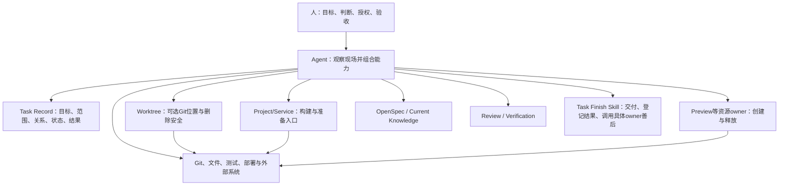

# 任务系统现状与依赖审查

> 本文记录2026-09-02完成的当前依赖收敛。历史审查与旧架构证据保留在归档文档和已归档OpenSpec Change中，不作为当前实现依据。

## 当前结论

Buildr只维护任务记录和少量有独立消费者的专业结果，不再拥有统一任务研发、统一任务环境或统一工作许可。Agent从真实代码、Git、文件、进程、Project声明和外部系统重新观察现场，按需调用窄能力。

不存在统一`task next`、`proceed / blocked`、Environment `ready`或跨专业writer。局部失败只阻塞依赖该动作的工作，不能撤销已成立的任务结果、验证、交付或发布事实。

## 当前责任边界

| 责任 | 当前owner | 长期事实 |
|---|---|---|
| 目标、scope、父子关系、顶层状态与结果 | Task Record | Workspace SQLite |
| 独立Git位置、branch、HEAD、repository set、删除保护 | Worktree | 精确Worktree evidence；删除后移除 |
| 依赖安装、代码生成、构建与运行入口 | Project/Service | Project源声明和真实文件；Task不复制 |
| Node、CLI、cwd和环境变量 | 调用方与具体工具 | 使用前即时解析 |
| Preview进程、端口、PID、secret与owner | Preview | Preview自己的本机receipt |
| OpenSpec Change和当前认知 | OpenSpec / Current Knowledge | Git中的权威产物 |
| 审查和正式验证结论 | Task Review / Task Verification | 各自current结果 |
| 交付 | Git、部署或外部系统 | 各权威系统真实事实 |
| 收尾组合 | Agent与Task Finish Skill | 不新增运行数据库 |

## 已删除依赖

- Task Development、Task Candidate、Development Handoff、Planning Identity和旧Finish Application；
- Task Environment Application、Plan、Receipt、`ready / blocked / cleaned`、恢复和总cleanup；
- Environment CLI、HTTP、Buildr Web页签、Doctor声明检查和能力绑定；
- `task_development_current`、`task_finish_current`、`task_environment_current`及旧数据；
- Release、OpenSpec、Review、Verification、Finish和Overview对Environment read model的依赖。

删除项不保留兼容转发、双读或历史current表。已归档Change仍是历史设计证据，但不参与当前运行。

## 保留的安全价值

真正不可替代的是具体副作用保护：

- Worktree只删除精确owner、完整repository set、clean且source/delivered核验成立的目录和本地分支；
- Preview只允许matching owner停止并回收自己的进程与状态；
- Project/Service入口只在Agent确认当前动作需要时执行，不扫描或猜测步骤；
- Task完成状态、源提交存在或路径相似都不能代替交付与删除证明；
- 清理失败保留现场和诊断，不改写已经成立的结果。

## 普通使用

普通代码修改直接在已有工作区完成。需要隔离时创建Worktree；需要准备时调用对应Project/Service入口；需要Preview时由Preview能力启动和停止。Review、Verification、OpenSpec与交付始终可以在没有环境记录的情况下独立工作。

未来只有出现新的独立消费者、不可重新观察的长期事实或新的具体副作用风险时，才新增窄Application；不预先恢复统一任务环境。
