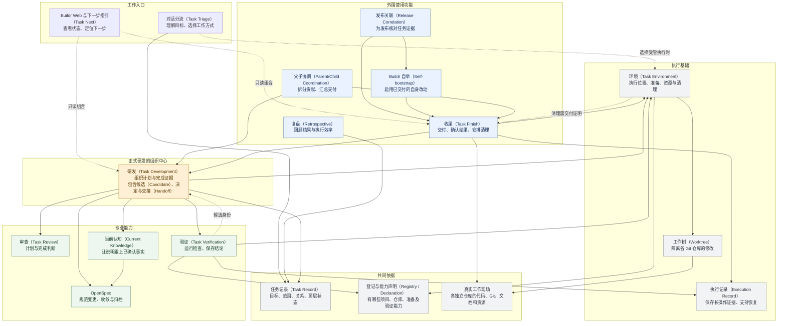
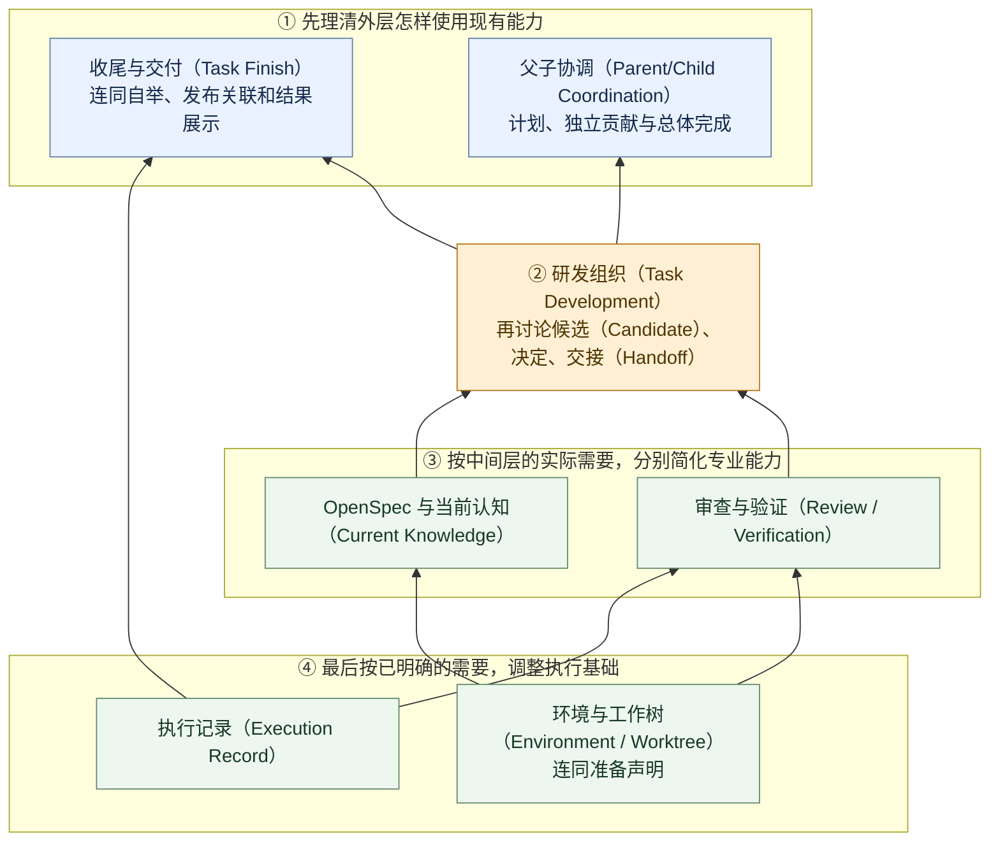

# 任务系统现状与依赖审查

> 当前事实核验于 2026-08-30；本版用于看清整体结构和讨论重构顺序。只研究从工作空间（Workspace）启动的场景，包括多项目（Project）、多独立 Git 仓库。不在这里决定模块去留、具体迁移任务或新架构。

**本轮范围已收小：极简收尾重构 + 设计方法沉淀，见第 4 节。** 第 1—3 节用于理解现状，不是本轮新增接口或模块清单。

**先看系统有哪些部分，再看谁依赖谁，最后决定先讨论哪一组。** 下面第一张图是现状，第二张图是可调整的重构顺序；两者不是同一件事。

## 1. 当前系统的整体架构

**统一读法：A → B 表示 A 依赖 B。** 实线表示主要依赖；虚线注明只读、条件或反馈关系。图从上面的使用者，逐步指向下面被使用的能力。

**最关键的结构：研发（Task Development）位于中间，收尾（Task Finish）和父子协调（Parent/Child Coordination）使用它，它再汇总下面的专业能力。** 因此，不能只看到它复杂，就从中间直接拆掉。

为保持可读，图没有把每条公共依赖都画出来：正式模块共用任务记录（Task Record），专业能力读取文件和真实状态；发布关联（Release Correlation）还核对环境与研发摘要，复盘（Retrospective）按需要读取各类证据。入口展示不拥有第二套任务状态。

图中的功能不要求每次全部执行；普通直接工作也不必经过整套正式完成流程。

### 各层大致负责什么

| 层次 | 要回答的问题 |
|---|---|
| 工作入口 | 用户要做什么？当前有哪些事实？下一步找谁？ |
| 外围使用功能 | 怎样交付、汇总多个贡献、启用改动、支持发布和复盘？ |
| 正式研发的组织中心 | 哪些计划、内容、审查和验证属于这一次正式完成？ |
| 专业能力 | 计划是否合理？检查是否通过？规范和说明是否一致？ |
| 执行基础 | 在哪里执行？依赖和资源是否具备？过程证据在哪里？ |
| 共同依据 | 是哪个任务、哪个项目和仓库？现场实际是什么？ |

准备声明与验证声明的发现、检查由声明发现（Declaration Intake）衔接；规划身份（Planning Identity）、内容目标（Content Target）和验证策略（Verification Policy）服务于研发（Task Development）的组织职责。它们在这张总图中归入所属部分，不再逐个展开成内部节点。

## 2. 从图中能看出的三个问题

1. **中间组织层牵涉很多模块。** 调整研发（Task Development）、候选（Candidate）或交接（Handoff），会影响收尾、父子协作、专业结果和展示。应先弄清外层究竟需要它提供什么。
2. **有些依赖形成了反馈。** 例如验证需要候选身份，研发又需要验证结果；交付需要环境，环境清理又需要交付证明。现状不是纯粹的有向无环图（DAG），不能机械排序，也不能把所有反馈都认定为错误。
3. **部分局部条件扩大了影响。** 已有交付对账（Reconciliation）恢复路径，会因旧临时交付目录不能清理而无法登记已证明的交付；父计划审查已完成后，还存在单独登记“已采用”的步骤。这些是后续对应模块的调查入口，不在本报告直接选定修复方案。

六条既有原则在这里主要帮助判断：哪些状态有用户价值、哪些事实应共享、哪些条件只该限制相关动作，以及简化是否真正减少重复工作。原则本身不重新设计。

## 3. 粗略重构顺序

**建议从外往里：先理清外层怎么用，再调整中间如何组织，最后按需要简化底层。**

下面仍用 **A → B 表示 A 依赖 B**。因此编号大的组指向建议先处理的组，**按 ①、②、③、④ 阅读顺序**；同一编号的分支可以分别推进。

这张图表达“后续简化之前，哪些使用关系应先理清”，不是要求所有模块必须重写，也不是以后每个任务都要经过的新流程。

**这只是讨论和收缩依赖的大致顺序。** 不必等①所有代码都重写完才研究②；但要删除②中某项能力，就应先明确①的对应使用者如何继续工作。循环关系需要放在同一次具体讨论中处理，不能假装它们天然可排序。

| 顺序 | 当前先讨论什么 | 为什么放在这里 |
|---|---|---|
| **① 收尾这一组，优先开始** | 用户说“完成”时，各个外层功能实际需要哪些事实？哪些维护问题应单独处理？ | 距离用户结果最近，已有真实阻塞线索；可以先明确需要什么，而不立即改动整个研发中心 |
| **① 父子协调这一组，可独立推进** | 哪些工作真需要独立子任务？总体完成需要什么证明？ | 它是研发中心的另一重要使用者，不宜等中间层改完才发现需求遗漏 |
| **② 研发组织** | 外层需求明确后，再讨论哪些组织职责必要，哪些状态重复 | 避免先删除候选或交接，再为每个消费者补兼容层 |
| **③ 专业能力** | 审查、验证、规范、当前认知分别需要怎样的输入和结果？ | 由真实使用需求决定简化边界，不预先合并成一个“大模块” |
| **④ 执行基础** | 哪些动作真正需要完整环境、隔离目录和执行证据？ | 被依赖最广；先知道消费者需要什么，才能判断哪些准备和约束可以减少 |

### 不必强行排进主线的部分

- **任务记录（Task Record）先保持稳定。** 它是共享身份和最小事实基础。目前没有证据表明应先推翻它；如果后续确有字段或状态语义变化，再单独处理。
- **复盘（Retrospective）可独立优化。** 它已经是条件触发的末端功能，不应成为其他重构的前置任务。
- **分流（Task Triage）、下一步指引（Task Next）和 Buildr Web 随相应模块同步调整。** 不单独建一条必须先完成的界面或入口重构线。
- **发布与自举只审查连接处。** 本轮不因此展开整个发布系统或新的智能体（Agent）适配重构。

## 4. 本轮只做两项：极简收尾与方法沉淀

当前实现职责集中见 [任务收尾](../../openspec/knowledge/flows/task-closeout.md)。前文架构图是审查时基线，不能替代该实现说明。

总体父任务（Parent Task）记录为 **“任务系统渐进重构”**，标识 `refactor-task-system`；本轮由 `simplify-task-closeout` 和 `capture-agent-first-design` 两个子任务承接。当前任务状态以任务记录为准，本报告保存审查、决定和成果导航。本节取代此前“先建设多类接口和应用”的建议，第 1—3 节仍保留为现状及依赖参考，不是本轮建设清单。

**本轮默认零新增接口、零新应用。** 先让智能体（Agent）依据短技能（Skill），使用 Git、系统工具和已有 Buildr 入口完成收尾。遇到真实、反复发生且现有工具无法安全解决的缺口，再单独证明是否需要增加最小能力。允许修改或删除旧实现，不以兼容现有任务链作为新设计目标。

| 交付项 | 包含的工作 | 明确不做 |
|---|---|---|
| **① 极简收尾重构** | 重写收尾技能（Skill）；解除强制候选、交接、完整环境及旧运行链依赖；只改阻碍新方式的必要旧入口/消费者；完成定向验证和真实案例对比 | 不先建交付应用、资源应用、统一查询接口或通用执行引擎；不把调查、设计、测试各自拆成一层任务 |
| **② 智能体优先设计（Agent-first Design）技能沉淀** | 保存已认可的完整范式、关系图、少量设计判断方法；以收尾改造作首个实践案例，在实施中修订 | 不复制一套原则到常驻 `AGENTS.md`；不变成所有开发工作的必读技能、打分体系或新门禁 |

这两项由同一个父任务承接；首项包含必要设计、实现、定向验证和效果复核，第二项随实践形成。不要预建后续所有模块的子任务，也不要再为本次总览提交单开任务。

### 首版收尾的实际范围

- **Git 负责 Git。** 本次内容的提交、集成、推送、远端回读，以及可安全删除的本地分支/工作树，优先使用原生工具和已有能力。不再默认创建专属交付目录。
- **已有任务入口只负责已有任务。** 匹配任务的目标已达成时，保存简短完成总结、交付位置/版本、必要验证依据与遗留事项。无任务不补造任务，无独立交付事实库或运行编号。
- **系统工具处理本次现场。** 只清理归属、内容保全及占用可确认的临时资源。Buildr 已登记资源仍通过其所有者的现有入口或对账能力处理；若旧入口有无关前置，改掉该前置，不手改数据库绕过。
- **验证复用已有依据。** 内容或相关条件改变时补相关检查，不因收尾默认全量验证。项目明确要求和影响目标的已知失败仍须处理。
- **特殊启用独立处理。** 普通文档和业务代码交到开发分支，不自动安装、部署或自举；明确属于交付目标的启用动作才调用已有专业能力。
- **失败按真实影响处理。** 无关清理或登记问题不撤销已确认交付；必要目标未达成则如实保留未完成，不靠备注宣称全部成功。

收尾不是把旧阶段藏到技能里重新跑一遍。新技能只保留目标、必要判断、边界与完成标准，不保留旧状态链，也不固定要求同一运行中的逐步登记。

### 旧系统如何处理

不维持旧流程、旧接口或旧门禁的兼容性。与新方式冲突的消费者直接修改或明确退役，不为它们增加新兼容层或维持长期双轨。具体退役影响在改动前说明。

**不兼容不等于丢工作。** 已有提交、任务历史和未交付内容保留；旧环境及临时目录按真实归属安全处置，不批量删除现场、不伪造成功。必要的数据安全处置是本次改造的一部分，不扩成通用迁移平台。

### 范式放在哪里

建议沉淀为一份按需使用的 **智能体优先设计（Agent-first Design）技能（Skill）**，用于产品/系统设计和流程重构。原则边界已由现有六条原则覆盖，本轮不增加 `AGENTS.md` 常驻内容，不让普通工作每轮多读一份理论。

完整范式、关系图与判断方法已沉淀到 [智能体优先设计技能](../../services/buildr/resources/workspace/skills/buildr/agent-first-design/SKILL.md)。本报告保留决策背景，不再复制完整方法正文。

### 本轮实施中已经观察到的反馈

- 收尾技能源文件由 74 行缩为 29 行；这是文件规模变化，不等于已测得耗时或词元（Token）收益。
- 包静态检查曾要求收尾技能包含旧交接、五阶段等固定文案，且至少 40 行、1500 字符。该检查已从候选实现删除，通用格式、发布资源及能力绑定检查保留。
- 任务完成与清理已拆开：完成不冒充机器交付证明，删除仍需逐仓核验当前内容保全。真实多独立仓库测试已验证部分集成时保留全部工作树，完整保留后再清理。
- 新接口、新应用、新交付数据库均为零。旧五阶段执行器仍可显式调用，但默认收尾不生成或消费它的状态；本次没有重写发布与专用父任务计划。
- 本轮直接收尾实际窗口为 116.022 秒，涵盖精确暂存至推送确认、任务登记、自举与环境清理，不含之前的实现、验证和规范归档。窗口不同，不能与旧例直接计算提升比例。详见 [真实案例](../../services/buildr/resources/workspace/skills/buildr/agent-first-design/references/task-closeout.md)。

### 最少的实践与交付安排

1. 复用下方近 18 分钟样本，以及既有多仓库问题线索。保留时间范围、动作、结果与原因，不强制补旧任务的完整复盘手续。
2. 在首个实际改造中检验无任务/有任务、单仓/多仓、已有工作树、部分成功和删除不安全等代表情况；用有界本地场景和合适的真实任务验证，不执行未经授权的生产操作。
3. 比较用户整个收尾请求的耗时、重复步骤和真实阻塞；词元（Token）仅在可靠可得时记录。条件和验证范围不同，不直接声称加速。
4. 一边改造，一边把有效判断写入设计技能（Skill）；本轮结束时得到可用的收尾能力和一份有实践依据的方法资产。

本文继续作为总导航和最小证据入口，随首项改造一起交付；设计技能（Skill）负责完整方法，不在多个文档和规则里重复维护。具体提交推送按后续明确的执行授权进行。

本轮重新梳理了范围，尚未改动规则、技能或应用。低风险且没有任何测试依据时是否允许直接交付，仍是待确认的具体策略，不因“从简从快”自动视为已同意。

首个真实样本：为什么一次收尾用了近 18 分钟

来源：[内联 Workspace 核心规则并退役 Core Rule 文件](codex://threads/01a050b4-c50a-7e31-9cc4-973460f54114)。收尾请求所在轮次为 `01a050cb-de87-75a2-ade1-95a53ddfe1f7`，工具返回总耗时 `1073302 ms`，约 **17 分 53 秒**。

以下按事件时间切分，时间均为 Asia/Shanghai。阶段区间包括其中的阅读、判断、命令与等待，不代表整段都在执行某条命令，更不能把未单独计时的部分都叫作浪费。

| 时段 | 约耗时 | 观察到的工作 |
|---|---:|---|
| 11:52:13—11:56:55 | 4 分 42 秒 | 恢复上下文、更新收尾授权表述、重新采用计划/审查、规范收敛归档、观察内容、生成验证计划、补准备、冻结候选 |
| 11:56:55—12:03:58 | 7 分 4 秒 | 一次正式验证，55 项；同时做了部分只读审查与状态观察 |
| 12:03:58—12:06:04 | 2 分 5 秒 | 登记验证结论和当前认知、完成审查、决定、交接、确认交付入口 |
| 12:06:04—12:07:03 | 59 秒 | 产品内部自动收尾：预检、准备、等价核验、交付、清理 |
| 12:07:03—12:07:53 | 50 秒 | 转入自举、执行同步与入口验证；包含自举命令的整条调用约 24.3 秒 |
| 12:07:53—12:10:06 | 2 分 13 秒 | 最后回查、确认归档/环境/远端与结果表述，返回最终回复 |

正式验证记录：`task-exec-76851e96-8d5e-45e3-bee5-831ecb7c8a04`。本轮经当前产品只读回查，`execution.durationMs=423524`，`timingSource=wrapper-measured`，结果 `passed`。自动收尾运行：`inline-workspace-core-rules-20260830040603-4e4bd732`，内部 `wallClockMs=59449`；对应整条命令调用耗时 `65135 ms`，两者覆盖范围不同。

自动收尾五阶段分别约 9.7、14.0、3.8、16.5、13.5 秒，均一次通过；没有重做正式验证，没有载体恢复或人工修复清单。因此，本例不能支持“清理恢复是十多分钟的主要原因”。

本轮读取到 72 条命令执行条目，其中 `task next` 6 次、验证计划 3 次、规划身份解析 2 次、执行记录回查 5 次；正式验证和自动收尾各执行一次。这些数量不是完整工具调用量，也不证明每次都多余。

已确认的成本原因与待判断之处：

1. **收尾请求接手了尚未完成的正式准备。** 前一轮只做了有界验证；没有正式候选、交接或已归档变更。用户看到的“已实现，待交付”仍包含后续正式工作。不能把旧测试通过直接冒充当前正式证明，但应审查阶段交界是否把过多工作集中到最后。
2. **测试选择因一行归属路径修改扩到全范围。** 交付提交 `d0d45f24` 把 `test/verification/ownership.mjs` 中 `resources/workspace/rules/buildr/core.md` 改为 `resources/workspace/AGENTS.md`。该文件又被整体归入 `ownership-authority-change`；规划器因此选入全部 `core` 范围，最终执行 55 项。这是现有保守策略的实际效果，尚不能断言这些检查都可删除。[触发规则](/Users/chenjun/Buildr/projects/product/services/buildr/test/verification/ownership.mjs:1341)；[扩展选择实现](/Users/chenjun/Buildr/projects/product/services/buildr/test/verification/planner.mjs:738)。
3. **存在输入与发现成本。** 首次验证计划带服务路径前缀，仅选出 5 项；修正为提供者接受的路径后重规划，再因准备完成重读计划。还出现 Node 版本不符和 `task finish inspect --task` 参数不支持。需要审查接口的路径与身份传递，不把这些尝试归为必要业务工作。
4. **聚合状态的采用与反复读取值得测量。** 多个研发动作都重新组合环境、内容、声明及专业结果；存在可见阅读和登记往返，但没有足够细的时间跨度把剩余耗时可靠分配给某一个原因。[聚合观察实现](/Users/chenjun/Buildr/projects/product/services/buildr/src/task/application/task-development-application.mjs:351)。
5. **产品内部计时不等于用户等待。** 本例自动收尾内部报告 `coverage=product-complete`、约 59 秒，用户实际等待约 17 分 53 秒。两者都可以是真实数据，但优化必须同时记录覆盖范围，不能只优化其中一个数字。

需要保留的安全约束：对象和版本正确、验证结论真实、目标远端明确、贡献不遗漏、不覆盖他人修改、删除有归属证明、发布另行授权。需要重新审查的流程条件：固定阶段、重复采用、无差别扩大检查、要求同一运行及与当前动作无关的完整环境条件。不能仅凭一个样本宣布全部删除。

本次没有可用的完整词元（Token）数据，也没有重新运行测试来制造比较数据。上述事实暂作为本文的调查记录，尚不是已写入源任务的正式复盘结果；后续应将正式复盘作为事实承载，本文保留摘要与入口。

证据入口与核验边界（需要追查时展开）

本次基于已核验的本地源码，当前 Git 提交为 `3ce532f5e7fe12b7e9b9aaa7bbb08c212c3094c9`。现状总图是主要依赖的归纳，不是完整代码导入图；重构顺序是建议，不是已批准计划。

| 支持的判断 | 文件与行号 |
|---|---|
| 研发中心组织专业事实、候选和交接 | [task-development-application.mjs:351](/Users/chenjun/Buildr/projects/product/services/buildr/src/task/application/task-development-application.mjs:351)，第 351—418、724—814 行 |
| 父子进度使用研发、交付与审查事实 | [parent-coordination-application.mjs:44](/Users/chenjun/Buildr/projects/product/services/buildr/src/task/application/parent-coordination-application.mjs:44)，第 44—63、183—213、290—297 行 |
| 收尾使用交接和执行环境；可独立重建交付上下文 | [task-finish-entry-readiness.mjs:145](/Users/chenjun/Buildr/projects/product/services/buildr/src/task/application/finish/task-finish-entry-readiness.mjs:145)，第 145—245 行 |
| 交付恢复仍可能等待旧目录清理 | [task-finish-delivery-reconciliation.mjs:291](/Users/chenjun/Buildr/projects/product/services/buildr/src/task/application/finish/task-finish-delivery-reconciliation.mjs:291)，第 291—410 行；[对应测试:489](/Users/chenjun/Buildr/projects/product/services/buildr/test/integration/task-finish-delivery-reconciliation.test.mjs:489)，第 489—521 行 |
| 环境拥有准备、执行位置和清理 | [task-environment-application.mjs:1312](/Users/chenjun/Buildr/projects/product/services/buildr/src/task/application/task-environment-application.mjs:1312)，第 1312—1417 行 |
| 验证使用候选、声明与执行证据 | [task-verification-application.mjs:423](/Users/chenjun/Buildr/projects/product/services/buildr/src/task/application/task-verification-application.mjs:423)，第 423—496 行 |
| 规范与当前认知衔接研发 | [task-development/SKILL.md:80](/Users/chenjun/Buildr/projects/product/services/buildr/resources/workspace/skills/buildr/task-development/SKILL.md:80)，第 80—94、126—139 行 |
| 自举和发布关联是外围消费者 | [自举技能:8](/Users/chenjun/Buildr/skills/buildr-self-bootstrap-sync/SKILL.md:8)，第 8—31 行；[release-task-evidence-correlation.mjs:201](/Users/chenjun/Buildr/projects/product/services/buildr/tools/release/release-task-evidence-correlation.mjs:201)，第 201—235 行 |
| 顶层记录、复盘和界面各有边界 | [task-record-application.mjs:361](/Users/chenjun/Buildr/projects/product/services/buildr/src/task/application/task-record-application.mjs:361)，第 361—408 行；[task-retrospective-application.mjs:155](/Users/chenjun/Buildr/projects/product/services/buildr/src/task/application/task-retrospective-application.mjs:155)，第 155—184 行；[task-overview-repository.mjs:7](/Users/chenjun/Buildr/projects/product/services/buildr/src/task/persistence/task-overview-repository.mjs:7)，第 7—58 行 |

集鲜本地样本中，两个独立仓库的本地引用已与保存的贡献来源对齐，任务记录仍保存旧收尾阻塞。远端查询超时，未证明当前远端状态，也未执行会写状态的恢复命令。因此它只是问题线索，不是“现版必然无法恢复”的结论。

本次及前面的审查均未运行产品测试、构建或生产操作；测试引用表示已阅读断言，不表示测试已通过。除本轮明确授权创建的父任务记录外，只修改本审查报告；讨论文档、规则、技能、规范和实现保持不变。

