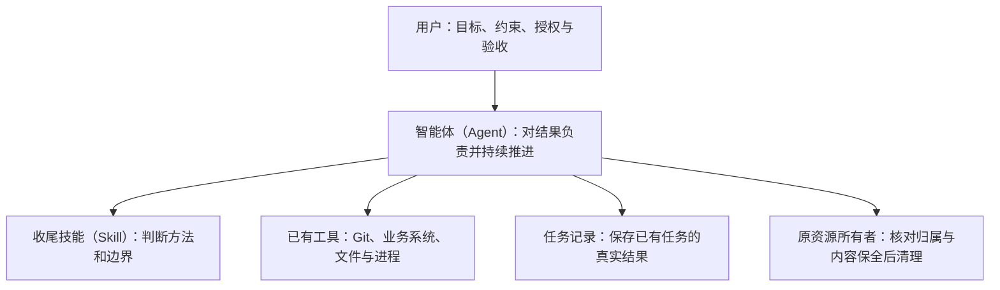

# 收尾与交付

收尾与交付在日常对话中可以表示同一目标：结束本轮工作，把成果交到约定位置，登记已有任务结果，处理可安全处理的临时资源，并交代遗留事项。

## 职责

这些是可组合能力，不是固定阶段。Agent按目标和真实现场选择实际需要的动作，Buildr不提供统一批准、交接或机器交付历史。

## 四种常见现场

| Buildr 任务 | Git 管理 | 收尾动作 |
|---|---|---|
| 有 | 无 | 按业务成果交付，登记已有任务，处理相关资源 |
| 无 | 有 | 按约定提交、集成、普通推送并回读，不补建任务 |
| 有 | 有 | 完成 Git 交付、已有任务登记与资源善后 |
| 无 | 无 | 完成成果自身的交付，不制造提交或任务 |

已有任务使用 `task inspect` 和 `task complete`；Task Worktree使用`worktree inspect|cleanup`，其他资源交给各自创建者或明确owner清理。这些命令不是每次必跑清单。没有对应任务或资源就不调用；多仓库按实际 Git 边界分别处理。

## 检查只保护具体动作

写入前检查对象、归属、版本、授权和范围；写入后回读真实结果；删除前检查资源归属、未保存内容以及成果仍被保留。业务请求成功不等于业务写入成功。

内容检查复用仍适用的结果；只有相关内容或条件变化、存在影响交付的已知问题或项目明确要求时，执行对应的最小检查。不因收尾重跑全量测试、全局诊断、完整审查，不补候选、交接或统一验证记录。未检查的部分如实说明，不能报通过。

## 已完成事实与后续动作

任务完成记录不等于机器交付证明。旧专业记录不可读时，完成状态仍由任务记录表达，相关异常单独显示；只有匹配历史证明才能展示 `delivered`。

发布支持任务的完成只证明记录关联；发布能力继续独立检查冻结源码、候选验证、唯一产物、目标与授权。父任务依据整体目标和真实子任务结果验收，只有明确用户授权才能完成。子任务收尾不授权完成父任务；详见[父任务协调](task-parent-coordination.md)。

已知、必要且已获授权的安全后续动作应继续做完。登记或清理失败不撤销已成立交付；必要成果未交付不能报整个目标完成。部署属于约定目标时必须完成部署；可选激活的遗留独立报告。Buildr 自举仍由原唯一脚本执行，普通业务工作空间不触发。

## 旧数据和资源

历史任务、旧运行和已有提交不迁移为虚假成功，不批量删除。已退役模块不再推进或提供兼容读取；仍由当前owner持有的资源按真实归属和删除安全处理。不能证明安全的资源保留并报告。

## 实现入口

- 方法：`services/buildr/resources/workspace/skills/buildr/task-finish/SKILL.md`
- 任务结果：`services/buildr/src/task/application/task-record-application.ts`
- Worktree资源安全：`services/buildr/src/task/infrastructure/git-worktree-provider.ts`
- 父任务协调：`services/buildr/src/task/application/parent-coordination-application.ts`
- 发布关联：`services/buildr/tools/release/release-task-evidence-correlation.ts`

首次实践及统计口径保留在设计技能的历史案例中；它不代表现行执行入口。

## 清理与必要补测

智能体（Agent）先核验本次成果完整进入约定位置，再向`worktree cleanup`成对提供逐仓`--expected-source <selector>=<完整源提交>`和`--delivered-ref <selector>=<完整交付提交>`。Git Worktree provider保护当前删除对象：源版本不变、没有未保存内容、交付提交仍由保留分支持有，随后删除工作树和本地任务分支。源提交编号不在目标历史中不再否定调用者已核验的交付；提交存在和任务完成状态都不能单独证明业务成果等价。不新增证明文件、流程或授权队列。

内容及相关运行条件未改变时复用已有验证。只有冲突处理、集成修改或已知问题实际影响行为时，才选择最小充分的已有检查，并在推进目标分支前执行且通过；不因进入收尾或生成新提交而重复验证。测试条数不代替风险与运行成本判断。
