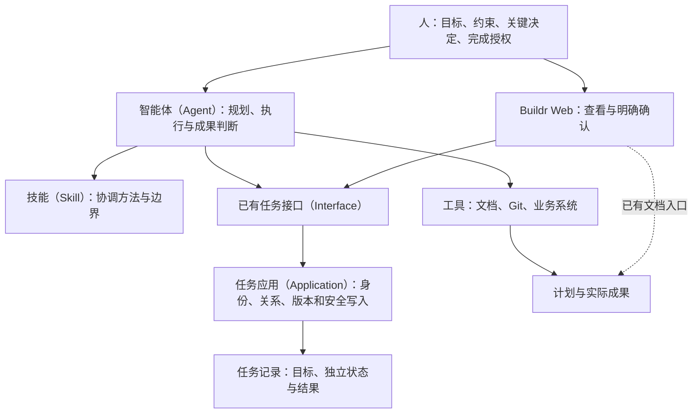

# 父任务协调（Task Parent Coordination）

**父任务组织整体目标与多个独立成果；智能体（Agent）负责推进，人明确授权父任务完成。** 子任务全部结束，也不自动完成父任务。

## 参与内容与职责

技能（Skill）提供方法，接口（Interface）提供可组合动作，应用（Application）保护当前事实和具体写入；软件不代替智能体（Agent）判断所有业务依赖，也不规定每个父任务经过同一研发流程。

| 内容 | 人看到什么 | 谁维护 |
|---|---|---|
| 父任务（Parent Task） | 总体目标、边界、计划入口、独立状态 | 已有任务记录 |
| 计划 | 分工、依赖、顺序、关键决定、验收标准与剩余工作 | 智能体（Agent）和人共同修改原文档或目标说明 |
| 子任务（Child Task） | 可独立交付的目标、范围、状态与结果 | 各自任务记录 |
| 成果（Artifact） | 代码、文档、数据或外部已生效结果 | Git、文件或实际系统 |
| 总体验收 | 总体目标是否达成，每个子任务成果或放弃范围如何处置 | 智能体（Agent）核对，人审阅；完成后随父任务结果保存 |
| 完成授权 | 谁在什么来源明确允许完成该父任务 | 原始用户指令或界面明确确认，随结果保存出处与原意 |

简单计划可直接放在目标说明。复杂或长期计划使用已有文档，通过任务说明中的链接发现；不强制创建新文档，不维护第二份计划数据库。计划文档与任务结果不能相互冒充。

## 日常工作方式

1. **建立整体目标。** 明确父任务范围、约束和验收标准。标记父任务身份，不因纯协调建立执行环境。
2. **规划独立成果。** 只把能独立交付的工作建为子任务；调查、设计、编码、测试等同一成果内步骤留在该任务中。
3. **按现场推进。** 智能体（Agent）重读当前计划和实际成果，在已有授权内选择、启动和接续子任务。每个子任务按自身需要选择工作位置、规范、审查和验证，不继承父任务的专业事实。
4. **处理变化。** 剩余、提前覆盖和被替代范围写清楚。调整总体目标、授权或验收边界时由人决定；不能因为当前一批子任务结束就缩小总体目标。
5. **准备总体验收。** 核对整体目标、真实成果和全部直接子任务。子任务记录为完成不等于机器证明交付；被放弃也不等于成果完成。
6. **明确授权完成。** 展示具体可审阅的结果。只有用户明确允许完成这个父任务，才更新其状态；没有授权时保留状态并说明待决定事项。

这是一种判断方法，不是产品内的固定执行链。嵌套父任务逐层独立；某一层完成不会递归结束其他任务。

## 完成的三个不同事实

| 事实 | 意义 | 是否改变父任务状态 |
|---|---|---|
| 子任务结束 | 子任务已完成或被明确放弃 | 否 |
| 总体验收通过 | 已核对总体目标、成果与遗留处置 | 否 |
| 用户明确授权且完成写入成功 | 当前结果符合已审阅内容，允许完成指定父任务 | 是 |

“继续开发”“把这个子任务收尾”“实现本次重构”都不是完成其父任务的授权。人已经明确授权完成指定父任务时，不必为每个内部步骤重复确认。

## 功能入口

- `task create --parent-task` 显式建立父任务；`task update --parent-task` 标记已有任务。父身份一旦成立保留，解除最后一个子任务也不取消保护。
- `task create --parent <id>` 或已有更新动作维护直接父子关系，拒绝循环、错误对象与已结束父任务的新关系。
- `task parent inspect` 返回整体目标、实际子任务及结果、同一次观察的 `recordDigest` 与完成观察身份、已保存完成依据与旧计划的只读内容。
- `task complete --parent-completion <json-file> --expected-record <recordDigest>` 复用已有完成写入，接收总体验收、逐子任务处置和明确授权来源。普通任务保持原有最小输入。
- Buildr Web 展示相同事实。父任务完成弹窗展示当前目标和全部直接子任务结果，填写总体验收、逐项处置并明确确认；成功后可查看完成时间与依据。

完成输入示例与操作边界由 `task-manager` 技能（Skill）维护，不在多个文档复制流程。

## 数据、并发与失败

任务记录保存最小 `isParent` 标记；完成依据保存在已有任务结果的 `parentCompletion` 中。没有新父任务状态表、计划数据库、授权队列或统一执行器。

完成观察身份来自同一次读取中的父任务目标、范围、关系和直接子任务当前结果。任务写事务内再次核对；目标、关系或结果发生变化时拒绝陈旧确认。界面刷新后需要重新核对和确认，不自动重放旧授权。仍有未结束直接子任务时拒绝完成，不替用户自动处置它们。

文档与外部系统由调用者在验收时重新读取。观察身份不证明所有外部成果未变，完成状态也不代替业务交付证据。授权来源是必须真实传递、可回查的声明；本机接口不宣称能够独立认证自然语言指令。

历史故障只影响相关历史展示；当前任务关系和结果继续可读。没有依据就不能宣称全部完成；清理或登记的局部问题不否定已经可核验的成果。

## 旧模式的处置

旧 `task parent record|reconcile|bind-child|refresh-planning|reconcile-child-delivery|accept` 及研发内对应写动作已退役。旧父计划只作为任务记录中的历史内容读取；旧贡献协调表及其数据已经删除，历史读取不重新启动旧流程、不补造新证据。

只有显式`isParent`或当前真实子关系建立父任务身份；旧父计划本身不再建立当前父身份。历史完成记录没有保存授权依据时，明确显示缺失，不回填、不重开、不改变原完成时间。改造前结构见[现状梳理](../../docs/archive/2026-08-30-parent-child-task-audit.md)。

## 简化与执行成本

智能体（Agent）按目标组合已有能力，技能（Skill）只保留必要方法和边界，不把旧应用流程改写成另一条必须逐步调用的长链。

- 协调不启动环境、研发、审查或旧交付流程；子任务批量读取，不逐个调用专业接口。
- 父任务确实进入自己的研发路径时，不读取用不到的父子摘要。
- 完成前一次父任务协调查询同时返回任务版本与完成观察身份，随后调用完成动作；结果已经返回时不重复读取同一事实。发生冲突或相关事实变化才重新核对。
- 旧关联查询、贡献登记存储实现、旧计划创建函数、未使用的前端写方法及失效指引已移除。旧接口不提供兼容转发；仅保留仍有消费者的`legacy_parent_plan_json`历史内容。

这些约束减少不必要的步骤和调用；没有同一场景的实测数据时，不宣称时间或词元（Token）的具体降幅。

## 实现与验证范围

- 身份与完成：`src/task/domain/task.ts`、`src/task/application/task-record-application.ts`、`src/task/persistence/task-repository.ts`及三个关系Repository。
- 当前摘要：`src/task/application/parent-coordination-application.ts`。
- 人类入口：`services/buildr-web/src/features/task/components/ParentCoordinationPanel.tsx`、`ParentCompletionFields.tsx`及任务详情。
- 智能体入口：随包 `task-manager`，由分流、研发、审查及收尾技能按职责引用。

关键验收覆盖无授权、普通与历史父任务、嵌套关系、未结束子任务、被放弃范围、结果漂移、明确完成、普通任务不回归和历史只读。具体执行结果由本次实际测试报告提供，不把文档列出案例当作已通过。

## 总任务的状态更正

阶段完成不代表整体目标完成。用户明确更正后，使用已有 `task update --status active --reason <原因> --expected-record <版本>` 恢复总任务；原阶段结果、目标、关系和时间保存在只读 `resultHistory`。已经完成的独立任务可通过同一更新入口补充父关系，保持原状态与成果，不重建执行环境。

更新接口可修订业务事实，但不能覆盖身份、系统时间、历史和专业证据；改为完成继续复用既有完成授权和版本检查。总计划维护剩余范围，只有整体目标验收并取得明确授权后才完成父任务。
