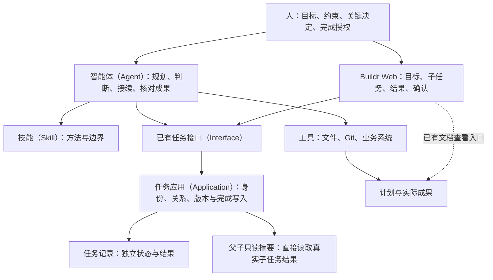

## Context

完整历史调查见[父子任务现状梳理](../../../../docs/archive/2026-08-30-parent-child-task-audit.md)。现有父子管理把协调事实嵌入研发记录，存在固定环境、审查采用和贡献交接链。收尾已改为智能体（Agent）组合已有能力，父子管理仍保留这些旧依赖。

用户明确要求：没有明确授权，智能体（Agent）不得完成父任务。本次重构授权不等于完成任何既有父任务的授权。

## Goals / Non-Goals

**Goals:** 让人看清总体目标、计划、真实子任务及结果；智能体（Agent）依据当前产物推进；父任务完成有明确授权和可回查依据；各任务独立、冲突显式、历史安全保留。

**Non-Goals:** 不建设通用规划引擎、自动任务调度、依赖状态机、审批平台或进度数据库；不重写独立任务研发和验证；不发布、不自动部署、不修正既有任务终态。

## Decisions

### 1. 产品由六类内容组成

| 内容 | 作用 | 权威来源 |
|---|---|---|
| 父任务（Parent Task） | 总目标、边界、计划入口与独立状态 | 已有任务记录 |
| 计划文档 | 分工、顺序、依赖、验收标准和重要决定 | 原文档，不复制到研发回执 |
| 子任务（Child Task） | 可独立交付的目标、范围与结果 | 各自任务记录及真实工作对象 |
| 成果（Artifact） | 代码、文档、数据或外部已生效结果 | Git、文件或实际业务系统 |
| 总体验收说明 | 整体目标达成、各子任务结果及遗留如何处置 | 完成前的可审阅报告；完成后保存于父任务结果 |
| 完成授权 | 人明确允许完成指定父任务 | 原始用户指令来源或界面显式确认，随结果保存 |

计划不是每个父任务强制新增的文档。简单目标可直接写在任务说明；复杂、长期工作使用已有文档并从目标链接。已接受的总体范围不能因当前一批子任务完成而自动缩小。

### 2. 职责和架构

智能体（Agent）决定怎么拆、先做什么、需要哪些检查，以及成果是否覆盖目标。技能（Skill）沉淀方法；软件保护对象、版本、关系和明确完成输入，不重新判断所有业务目标。

选择复用任务记录与文档，避免把旧研发链搬入新的父任务数据库。代价是依赖、覆盖和验收语义由智能体（Agent）和人判断；产品不把子任务数量当完成百分比，也不自动宣称业务目标通过。

### 3. 功能设计

1. 建立父任务：显式标记父任务身份，记录整体目标与验收边界；不自动准备执行环境。
2. 规划：读取或编写计划文档；只有真正独立交付的成果才创建子任务。调查、设计、测试等同一交付内步骤不自动拆成子任务。
3. 启动与接续：根据当前计划、成果和授权选择子任务；子任务拥有自己的范围与必要执行方式，不继承父任务环境或规范变更。
4. 变更范围：核对当前任务版本和计划内容；保持总体目标，明确剩余或替代关系；影响目标、授权或验收的调整需用户决定。子任务被替代不伪装为完成。
5. 查看进展：先显示整体目标、计划入口和直接子任务的真实状态、结果；子任务完成只说明其记录完成，不能推导整体交付或总体验收。
6. 总体验收：核对所有直接子任务及真实成果，形成整体结果、验证依据、遗留与处置说明。它不改变父任务状态。
7. 完成父任务：只有明确用户授权且当前结果仍匹配，才能使用既有完成动作；保存授权来源与验收依据。拒绝把“继续”“实现”“收尾某子任务”扩成父任务完成授权。

嵌套父任务同时是上级的子任务；必须逐层独立验收和授权。完成任何一层都不递归完成或放弃其他任务。

### 4. 最小数据与并发边界

任务增加显式父任务标记，首次关联子任务时也保留父任务身份，解除最后一个子任务后仍不丢失保护。历史有子任务或合法旧父计划的任务按父任务识别；不猜测标题、不改历史完成时间、不补造授权。

完成父任务要求：已观察任务版本、由当前父任务与直接子任务记录生成的观察身份、非空总体验收说明、逐子任务处置，以及明确授权来源和原意。新完成依据只进入既有任务结果，不创建单独授权队列或审批状态。

观察身份包含父任务目标、范围、关系及子任务当前结果；子任务增删、改归属、改目标或结果后，旧确认失效。计划文档的语义与外部成果由调用者在确认前重读核对；软件不扫描所有外部系统或伪称已核验文档内容。

检查必须位于任务写事务内，防止读取后关系或结果变化。仍有未结束的直接子任务时拒绝完成；被放弃子任务必须在整体验收中说明覆盖或剩余工作，不能只凭全部终态放行。明确授权是调用方必须真实传递的声明，不是智能体（Agent）可以自行制造的通行口令；本机接口无法独立证明自然语言指令的真实性，产品保证不默认为已授权并保留出处。

### 5. 入口设计

- `task create` 支持显式父任务身份；已有 `--parent` 继续表示子任务归属。
- `task inspect` 与父子只读摘要返回当前子任务结果、完成观察身份和已有完成依据。
- `task complete` 接收父任务完成依据文件；普通任务保持原有最小输入。
- `task parent inspect` 保留只读；旧 `record / reconcile / bind-child / refresh-planning / reconcile-child-delivery / accept` 写动作退役并给出有用说明，不暗中转为新的固定流程。
- Buildr Web 使用同一应用（Application）。父任务完成弹窗展示当前整体目标、全部直接子任务结果，要求总体验收说明与明确确认；冲突后必须刷新再确认。完成后显示授权来源、验收说明、记录时间；历史无授权记录如实标明“历史记录未保存授权依据”。
- `task next` 不再驱动父计划准备链；协调本身不要求环境和研发证据，实际代码开发继续适用独立任务的专业能力。

### 6. 退役与历史

旧父计划、绑定、交接、验收与贡献登记保存原状，历史查看不触发执行、不创建新记录。旧历史损坏只影响历史展示，不阻断当前任务关系和结果读取；已保存的父任务身份与真实子关系继续保护完成动作；历史记录损坏不取消父身份，也不扩大为无关工作的阻塞。

删除旧公开写入口和研发内父子写动作；保留历史结构的解码能力。新方法不同时维护计划文档与旧父计划，不为旧流程增加兼容执行器。修改所有实际消费者、随包技能与规范，不把新入口可用当作旧依赖全部移除。

## Risks / Trade-offs

- 依赖不再由专用状态机强制执行 → 智能体（Agent）和人依据计划与真实成果判断，接口不展示虚假的自动就绪。
- 旧使用者调用退役命令 → 返回明确退役原因及已有任务/文档入口；数据不删除。
- 调用方伪造授权来源 → 明确其是可追查声明而非密码学认证，技能（Skill）禁止编造；界面显式确认与命令不设默认授权。
- 任务版本一致不等于外部成果未变 → 总体验收必须重读相关外部成果并写明依据；不把观察身份冒充业务验证。
- 用户想完成某一阶段但总体尚未结束 → 不自动缩小父目标；明确阶段成果、遗留和是否另建后续任务，需用户决定总体范围。

## Migration Plan

先添加最小任务字段与只读历史兼容，再统一完成写入保护，替换父子摘要与界面，退役旧写入口和技能链。验证历史读取、普通/专用/嵌套父任务、无授权、结果漂移、部分完成、被放弃子任务与有授权完成。只在授权范围内交付源码；不自动执行历史任务状态迁移、发布或激活。

## Open Questions

当前没有阻止设计推进的问题。界面原型（UI Prototype）选择已询问，未确认不生成原型；不因此停止实现。父任务最终完成授权始终单独取得。
