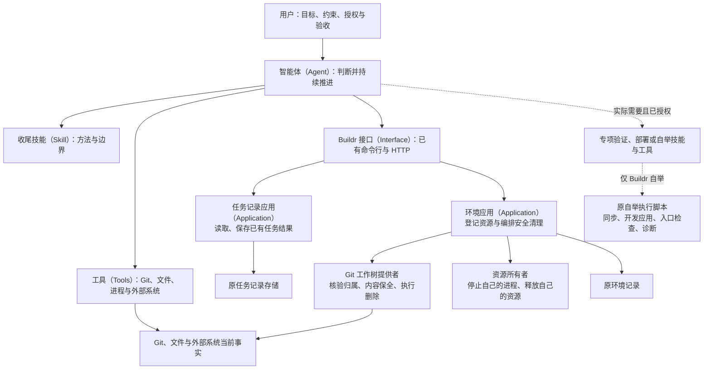

# 任务收尾：参与者、动作与边界

收尾由智能体（Agent）负责完成：交付本轮成果，保存已有任务的真实结果，处理可安全处理的临时资源，说明遗留事项。没有任务也能收尾；有任务不会自动增加一套交接流程。本文描述 `simplify-task-closeout` 的实现，所有命令和模块均已存在，不是一张未来模块建设清单。

## 一张图看清职责



箭头表示调用或消费关系，不是必须按顺序经过的流程。任务记录、Git 交付和环境清理分别成立，不存在一个统一收尾状态库。

## 谁具体做什么

| 参与方 | 实际职责 | 不承担什么 |
|---|---|---|
| 智能体（Agent） | 理解本轮目标，识别真实仓库与改动归属，选择工具、验证和顺序，处理局部失败，向用户解释结果 | 不伪造软件证明，不代替用户授权高风险动作 |
| 收尾技能（Skill），`task-finish` | 提供对象核对、交付、必要验证、已有任务登记、安全善后和专项动作的判断方法 | 不要求候选、交接、五阶段运行、完整环境或额外证明文件 |
| 工具（Tools） | Git 提交、集成、普通推送和远端查询；文件系统、进程及适用外部系统操作 | 工具成功不自动代表业务目标完成 |
| Buildr 接口（Interface） | 已有 `task inspect`、`task complete`、`task environment cleanup`；界面通过已有 HTTP 入口读写相同任务事实 | 不新增一个替智能体决定全部步骤的总入口 |
| 任务记录应用（Application） | 保存已有任务的结果摘要和 `noChange`，保护记录身份、终态与显式版本冲突 | 不验证 Git 交付，不创建正式测试或候选证明 |
| 完成投影 | 普通完成显示 `completed`；有匹配历史机器证据才显示 `delivered` | 不因缺少旧交接把正常完成贬为失败；不把 `completed` 冒充程序验证 |
| 环境应用（Application） | 读取已有受管资源，调用对应所有者，保存清理事实 | 不重新准备完整环境，不提交或推送，不决定任务是否完成 |
| Git 工作树提供者 | 逐仓核验工作树、分支、归属与未保存内容，证明全部任务提交仍由保留分支持有后删除 | 不猜远端目标，不把本地包含关系声称为远端交付，不自动证明语义等价 |
| 自举技能（Skill）及原执行脚本 | 只在 Buildr 自举且真实变化适用时，核验交付后同步工作资产、更新开发应用、检查开发入口和最终诊断 | 普通工作空间不触发；不反写任务完成或制造旧收尾运行 |

## 从哪里开始，到哪里结束

开始于用户要求结束当前这轮工作。智能体先确认成果和约定交付位置，不要求先补齐软件内部阶段。

- 成果尚有会影响交付的缺陷：在已有授权内完成修正和相关验证；未完成的必要成果不能报完成。
- Git 成果：按每个实际仓库的约定完成提交与集成，普通推送后核对目标引用。已包含的成果不再推送，多仓库不是原子事务。
- 文档、数据或其他成果：使用它们真实需要的交付方式，不制造 Git 提交或任务记录。
- 有匹配任务：目标完成后使用既有完成动作保存结果。清理遗留或可选激活遗留不撤销已经完成的目标；如果激活本身属于约定成果，未完成就不能宣称整个目标完成。
- 有临时资源：处理能证明安全的部分。未知资源或未交付内容保留并明确说明，不能因要把界面清空而强制删除。

结束时向用户交代成果、位置、相关验证和限制、任务记录及资源状态。不得在仍有安全且必要的工作可做时仅留下一句“建议继续”。

## 现有接口怎样使用

以下只是已有能力的示例，不是每次必须逐条执行的脚本：

```text
buildr task inspect <task-id> --target <workspace> --json
buildr task complete <task-id> --summary '<真实结果、交付位置、验证和遗留事项>' --target <workspace> --json
buildr task environment cleanup <task-id> --target <workspace> --json
```

没有成果变更时，完成动作使用 `--no-change`。没有匹配任务时，不调用上述任务写入。任务记录版本由应用维护；HTTP 调用可传已有版本约束，冲突后重读，不覆盖他人修改。

普通完成的环境清理以记录允许启动检查，但记录不充当删除证明。真正删除前，Git 提供者核验任务工作树与分支身份、未保存内容、保留仓库的当前非任务分支以及提交包含关系。没有旧收尾结果也能清理；不同历史或未保留内容会阻止相关删除。清理重试不会重复交付。

## 哪些检查保留，哪些退出默认路径

| 判断 | 保护的具体对象 | 对失败的处理 |
|---|---|---|
| 仓库、分支、远端、完整推送范围 | 防止交付到错误位置或带出他人内容 | 停止相关写入，明确最小决定 |
| 当前内容的相关验证与已知失败 | 防止交付已知错误、伪报通过 | 补做有必要的验证；如实说明缺口 |
| 资源身份、所有权和内容保全 | 防止误删工作或停止他人进程 | 保留相关资源，继续其他安全工作 |
| 任务版本与终态冲突 | 防止覆盖并发结果 | 重读后明确处理，不静默覆盖 |
| 候选、交接、五阶段、对账、完整环境就绪 | 不再是普通收尾的统一前置 | 默认不读取、不生成，也不补造 |
| 全量测试、全局诊断、发布、自举 | 只在与当前目标或实际变化相关时有价值 | 条件触发；不因一句收尾全量执行 |

静态检查保留通用格式、资源和能力绑定要求，已删除收尾专用的旧流程关键字及最低字数、行数门禁。

## 特殊场景和当前限制

- 多项目、多独立仓库：按实际 Git 根逐项核验和交付，不根据目录名称假设仓库边界。一个仓库失败不否定其他已交付仓库。
- 拣选、压缩或变基后提交不相等：Git 自动清理不声称语义等价。先保留，智能体依据真实内容和授权选择安全处置；没有新增通用等价证明框架。
- 内部结果登记失败：保留已交付事实，修复或重试登记，不重推业务代码。
- 原五阶段执行器仍可显式调用，历史数据保留。它原有候选、交接和恢复要求只约束该专用工具；默认技能不再消费它。
- 专用父任务计划与发布流程仍有自己的证据要求，本次没有重写。普通父子任务记录及本次两个独立交付不要求采用专用父计划。
- 自举的直接模式只接收已完成产品任务和明确 Git 基线/交付提交，由同一个脚本复核。其临时锁只协调该模式；不声称能够阻止所有外部 Git 客户端。并发变化必须在相关动作处检查，出现歧义保留现场。

## 从说明找到实现

以下均相对 `projects/product/`：

| 内容 | 当前源码 |
|---|---|
| 默认收尾方法 | `services/buildr/resources/workspace/skills/buildr/task-finish/SKILL.md` |
| 能力契约及可选依赖 | `services/buildr/resources/workspace/skills/contracts/buildr/task-finish/v1.md`、`services/buildr/resources/manifest.yml` |
| 任务接口及结果写入 | `services/buildr/src/task/interfaces/cli/task-record.mjs`、`services/buildr/src/task/application/task-record-application.mjs` |
| 完成投影与终态查询 | `services/buildr/src/task/application/task-terminal-delivery-application.mjs`、`services/buildr/src/task/application/task-entry-snapshot-application.mjs` |
| 受管环境清理 | `services/buildr/src/task/application/task-environment-application.mjs` |
| Git 删除安全 | `services/buildr/src/task/infrastructure/git-worktree-provider.mjs` |
| 界面完成文案 | `services/buildr-web/src/lib/taskLabels.ts`、`services/buildr-web/src/pages/task-detail/DevelopmentTab.tsx` |
| 自举技能与唯一脚本 | 工作空间根 `skills/buildr-self-bootstrap-sync/` |

验证来源：任务完成投影、环境控制器、终态查询和真实工作树测试；自举测试使用真实本地 Git 远端，模拟安装与诊断，不能冒充真实桌面应用验收。测试命令和本轮实际结果记录在变更说明中。


本次真实交付过程及计量边界见 [极简收尾实践案例](../../../services/buildr/resources/workspace/skills/buildr/agent-first-design/references/task-closeout.md)。设计方法独立按需使用，默认收尾不依赖它。
