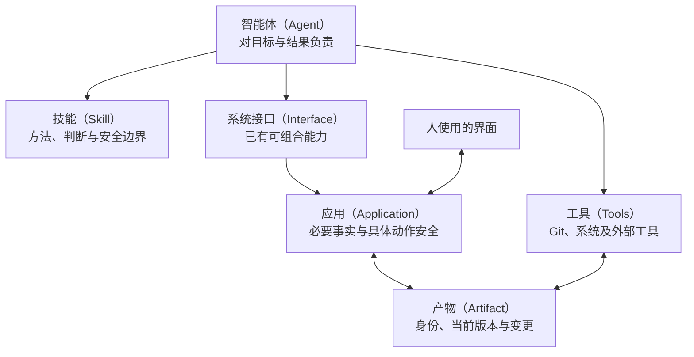

# 智能体优先设计

遵循当前工作空间（Workspace）的根规则：`AGENTS.md` 保存原则与边界，本技能（Skill）提供应用方法，不复制另一套原则，也不增设评分或批准门禁。

用于软件引入智能体（Agent）参与产品结果交付的设计，以及智能体工作系统的职责与流程改造。只用智能体写代码，不自动改变产品架构；已有软件渐进引入时，指导相关部分，保留其他功能的既有设计、业务规则、安全和授权边界。普通开发、验证或收尾不增加必读前置。

## 完整范式

**智能体（Agent）对目标负责，技能（Skill）提供方法和边界，接口（Interface）提供可组合能力，应用（Application）维护事实并保障具体动作的安全。**

智能体（Agent）依据现场选择、组合和调整工具，持续推进目标；软件不预先规定所有场景必须经过同一条流程。

技能（Skill）提供的方法本身可以是一种沉淀的工作流（Workflow）：把目标、判断方法、常见顺序和安全边界保留下来，让智能体按现场调整。能够由现有工具和这类方法可靠完成的工作，不必先写成应用中的固定流程。

接口（Interface）提供被设计系统的可组合能力，不等于每个动作都要新增接口。原生 Git、系统工具和外部工具已经提供的能力可以直接使用；只有确需统一维护事实或保护具体副作用时，才增加最小的应用能力。Buildr 收尾是一个实践案例，不是所有产品的架构模板。

**组合方式开放、事实可以重新观察、动作可以独立恢复、局部失败不扩散。**

图表达职责和使用关系，不要求每个功能建设全部模块。各入口对齐成果及当前事实；已有工具足够时，可以没有新的接口或应用，也无需把外部成果复制到统一数据库。

## 围绕产物接续工作

先找出本次产物（Artifact），包括中间成果与最终结果：例如 PPT、代码、Git 变更、数据记录和外部系统中已生效的结果。临时成果不因被生成或使用就自动成为长期受管工作资产（Work Asset）。

按实际场景检查：

- **共同对象在哪里？** 各入口如何识别同一成果，谁维护权威内容和当前版本？外部操作以实际系统的可核验结果为准，不用聊天声明或本地副本代替。
- **人修改后怎样继续？** 设计变化发现与重读当前版本的方式；智能体继续相关判断或修改前重新核对，写入时由能力边界校验版本并显式处理冲突。不固定通知技术，也不要求每次变化立即唤醒智能体。
- **智能体修改后人看到什么？** 人应能从界面查看同一成果及必要变化，无需阅读完整执行过程。缓存或副本尚未更新时，明确陈旧状态，避免把旧内容当作当前事实。
- **怎样证明目标完成？** 各入口版本一致只说明协作基础一致；质量、验证、交付及必要外部结果仍按用户目标验收。

## 按真实问题判断

先确认目标的开始、结束和用户得到的结果，查看当前实现、文档与实际案例。不要先列接口、状态或阶段清单。

围绕真正有争议的部分判断：

- **智能体决定什么？** 需要理解意图、选择工具、调整顺序或处理新场景的部分，先保留给智能体（Agent）。不让软件再次充当通用判断者。
- **方法沉淀在哪里？** 已有重复实践但需要按现场调整的组合，优先写成技能（Skill）。确实稳定、重复且必须统一控制副作用的组合，才考虑程序化。
- **已有工具够不够？** 先验证被设计系统的现有接口、系统及外部工具。新增接口（Interface）前，说清它解决的具体缺口和为何不能由已有能力承担；没有缺口就不新增。
- **哪些事实需要软件保存？** 找到真正的权威来源。能从 Git、文件或外部系统重新观察的事实，不重复保存成多个必须互相吻合的状态；必须保存的业务事实由唯一应用（Application）写入，并处理版本冲突。
- **检查保护什么？** 指出具体对象、不变量和放行伤害。授权、对象错误、覆盖工作、丢失内容或完成误报应阻止相关动作；流程偏好、内部登记缺口和自动化信心不足不能自动阻塞整个目标。
- **失败怎样继续？** 保留部分成功，重新观察当前事实，只恢复相关动作。不能证明安全删除时保留资源；不能证明完成时如实报告，不能用一条备注掩盖未完成目标。

给用户的设计说明先呈现一张职责图或简表，再说明保留、收窄或删除什么及原因。对确实会改变授权、产品承诺或不可逆风险的分歧再请用户决定；不把可自行核实的内部问题交回用户。

改造已有能力时，同时核对实际调用入口、消费者、契约、测试及当前说明。明确哪些随本次调整、哪些暂时保留及限制；保全历史和未交付内容，不把新路径可用当作旧依赖已经全部退役。

## 用实践修正方法

先交付一个可独立验证的小范围变化，再记录经历了哪些动作、哪些检查有价值、哪里失败及如何恢复。没有实测时间或词元（Token）数据就明确缺失；不同统计窗口不能直接比较。

需要了解首次实践和限制时，读取 [极简收尾案例](references/task-closeout.md)。案例不是所有任务的新标准流程；当前功能职责仍应回到案例所指的实现说明核对。
